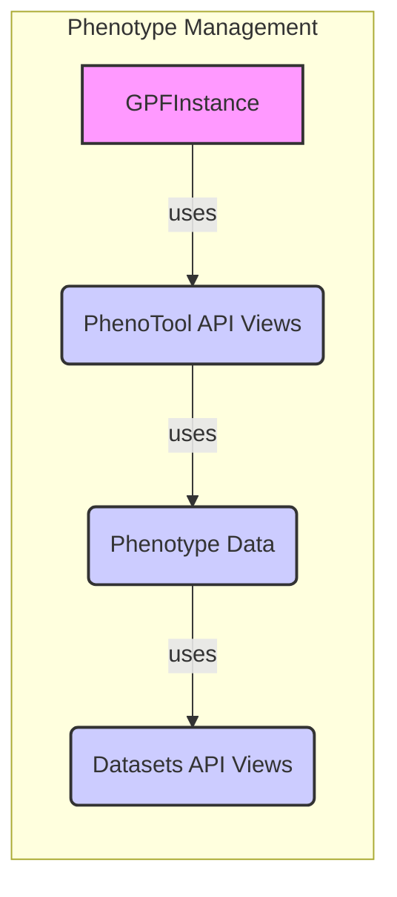

## Phenotype Management Component Overview

The Phenotype Management component is responsible for handling phenotype data associated with individuals and families within the GPF framework. It provides functionalities for loading, storing, querying, and integrating phenotype data with genotype data. The component relies heavily on the `dae.pheno` package and its related API views.

**Data Flow Diagram:**

**Component Descriptions:**

*   **GPFInstance:**
    *   *Description*: Provides access to various data and functionalities, including datasets and phenotype data.
    *   *Functionality*: Serves as a central point for accessing and managing genomic data, including phenotype information.
    *   *Interaction*: The `PhenoTool API Views` component uses the `GPFInstance` to retrieve phenotype data and related configurations.
    *   *Source Files*: `dae.gpf_instance.gpf_instance.GPFInstance`

*   **PhenoTool API Views:**
    *   *Description*: Handles API requests related to phenotype analysis, allowing users to explore associations between genotypes and phenotypes.
    *   *Functionality*: Provides endpoints for querying and downloading phenotype data, as well as performing statistical analysis.
    *   *Interaction*: Uses `GPFInstance` to access phenotype data and interacts with `Phenotype Data` to retrieve and process the requested information. `Datasets API Views` are used to retrieve dataset configurations.
    *   *Source Files*: `repos.gpf.wdae.wdae.pheno_tool_api.views.PhenoToolView`, `repos.gpf.wdae.wdae.pheno_tool_api.views.PhenoToolDownload`

*   **Phenotype Data:**
    *   *Description*: Manages the loading, storing, and querying of phenotype data.
    *   *Functionality*: Provides methods for accessing phenotype measures, instruments, and values associated with individuals and families.
    *   *Interaction*: Used by `PhenoTool API Views` to retrieve phenotype data based on user requests. It also interacts with `Datasets API Views` to get information about datasets.
    *   *Source Files*: `dae.pheno.phenotype_data`

*   **Datasets API Views:**
    *   *Description*: Provides API endpoints for accessing dataset configurations and pedigree information.
    *   *Functionality*: Allows retrieval of dataset metadata and family relationships, which are essential for understanding the structure of the data.
    *   *Interaction*: Used by `PhenoTool API Views` to retrieve dataset configurations required for phenotype analysis.
    *   *Source Files*: `repos.gpf.wdae.wdae.datasets_api.views.DatasetPedigreeView`, `repos.gpf.wdae.wdae.datasets_api.views.DatasetConfigView`
