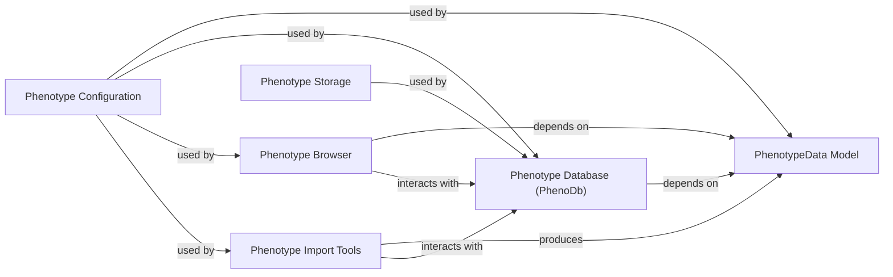

## Component Details

Analysis of the `PhenotypeData` subsystem in `gpf`

### PhenotypeData Model
This is the foundational data model that defines the structure for representing phenotype information. It encapsulates the concepts of `Instruments` (collections of measures) and `Measures` (individual phenotype data points), including their types, domains, and associated metadata. This model ensures consistency and provides a standardized interface for all phenotype-related operations.

**Related Classes/Methods**:

- <a href="https://github.com/iossifovlab/gpf/blob/master/dae/dae/pheno/pheno_data.py#L82-L98" target="_blank" rel="noopener noreferrer">`dae.dae.pheno.pheno_data.Instrument` (82:98)</a>
- <a href="https://github.com/iossifovlab/gpf/blob/master/dae/dae/pheno/pheno_data.py#L101-L236" target="_blank" rel="noopener noreferrer">`dae.dae.pheno.pheno_data.Measure` (101:236)</a>

### Phenotype Database (PhenoDb)
This component is responsible for the persistent storage and efficient retrieval of phenotype data. It acts as an abstraction layer over the actual database implementation, providing methods to query and manage the stored phenotype information.

**Related Classes/Methods**:

- <a href="https://github.com/iossifovlab/gpf/blob/master/dae/dae/pheno/db.py#L0-L0" target="_blank" rel="noopener noreferrer">`dae.dae.pheno.db` (0:0)</a>

### Phenotype Browser
This component focuses on the visualization and interactive exploration of phenotype data. It provides the user interface elements and logic to display instruments, measures, and individual-level data, enabling users to browse, filter, and analyze phenotype information.

**Related Classes/Methods**:

- <a href="https://github.com/iossifovlab/gpf/blob/master/dae/dae/pheno/browser.py#L0-L0" target="_blank" rel="noopener noreferrer">`dae.dae.pheno.browser` (0:0)</a>

### Phenotype Import Tools
This component handles the ingestion of raw phenotype data from external sources into the `gpf` system. It includes functionalities for parsing, validating, transforming, and loading the data into the `PhenotypeData Model` format, and then persisting it via the `Phenotype Database`.

**Related Classes/Methods**:

- <a href="https://github.com/iossifovlab/gpf/blob/master/dae/dae/pheno/pheno_import.py#L0-L0" target="_blank" rel="noopener noreferrer">`dae.dae.pheno.pheno_import` (0:0)</a>
- <a href="https://github.com/iossifovlab/gpf/blob/master/dae/dae/pheno/import_tools.py#L0-L0" target="_blank" rel="noopener noreferrer">`dae.dae.pheno.import_tools` (0:0)</a>

### Phenotype Storage
This component defines the low-level mechanisms and configurations for how phenotype data is physically stored. It provides an abstraction over the actual storage implementation, such as file paths or database schemas, allowing for flexibility in storage solutions.

**Related Classes/Methods**:

- <a href="https://github.com/iossifovlab/gpf/blob/master/dae/dae/pheno/storage.py#L0-L0" target="_blank" rel="noopener noreferrer">`dae.dae.pheno.storage` (0:0)</a>

### Phenotype Configuration
This component manages the various configuration settings related to phenotype data. This includes defining directory paths for phenotype databases and images, as well as potentially schema definitions and other parameters that influence how phenotype data is processed, stored, and displayed.

**Related Classes/Methods**:

- <a href="https://github.com/iossifovlab/gpf/blob/master/dae/dae/configuration/schemas/phenotype_data.py#L0-L0" target="_blank" rel="noopener noreferrer">`dae.dae.configuration.schemas.phenotype_data` (0:0)</a>
- <a href="https://github.com/iossifovlab/gpf/blob/master/dae/dae/pheno/pheno_data.py#L48-L61" target="_blank" rel="noopener noreferrer">`dae.dae.pheno.pheno_data.get_pheno_db_dir` (48:61)</a>
- <a href="https://github.com/iossifovlab/gpf/blob/master/dae/dae/pheno/pheno_data.py#L64-L79" target="_blank" rel="noopener noreferrer">`dae.dae.pheno.pheno_data.get_pheno_browser_images_dir` (64:79)</a>

### [FAQ](https://github.com/CodeBoarding/GeneratedOnBoardings/tree/main?tab=readme-ov-file#faq)