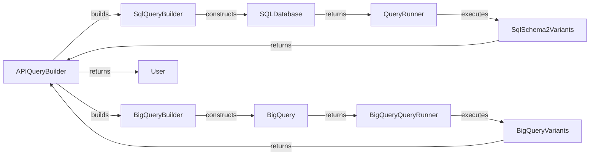

## Query API Overview

The Query API provides the logic for querying and accessing variant data. It transforms user queries into storage-specific queries and returns variant data. The following diagram illustrates the data flow within the Query API.

### Component Descriptions

- **APIQueryBuilder**
  - *Description*: Builds queries based on API requests, translating user input into a format suitable for querying variant data. It orchestrates the query building process and returns results to the user.
  - *Interaction*: Receives user requests, uses `SqlQueryBuilder` or `BigQueryBuilder` to construct storage-specific queries, and returns the results.
  - *Relevant source files*: `dae.query_variants.api.APIQueryBuilder`

- **SqlQueryBuilder**
  - *Description*: Constructs SQL queries from a schema, enabling the retrieval of variant data from SQL databases. It translates abstract queries into concrete SQL statements.
  - *Interaction*: Receives query parameters from `APIQueryBuilder`, constructs SQL queries, and interacts with `SQLDatabase`.
  - *Relevant source files*: `dae.query_variants.sql.schema2.sql_query_builder.SqlQueryBuilder`

- **BigQueryBuilder**
  - *Description*: Constructs BigQuery queries, enabling the retrieval of variant data from Google BigQuery. It translates abstract queries into concrete BigQuery statements.
  - *Interaction*: Receives query parameters from `APIQueryBuilder`, constructs BigQuery queries, and interacts with `BigQuery`.
  - *Relevant source files*: (Assuming similar structure to `SqlQueryBuilder`, but specific to BigQuery)

- **SQLDatabase**
  - *Description*: Represents a SQL database storing variant data. It provides an interface for executing SQL queries.
  - *Interaction*: Receives SQL queries from `SqlQueryBuilder` and returns the query results to `QueryRunner`.
  - *Relevant source files*: (Abstraction of database interaction)

- **BigQuery**
  - *Description*: Represents Google BigQuery storing variant data. It provides an interface for executing BigQuery queries.
  - *Interaction*: Receives BigQuery queries from `BigQueryBuilder` and returns the query results to `BigQueryQueryRunner`.
  - *Relevant source files*: (Abstraction of BigQuery interaction)

- **QueryRunner**
  - *Description*: Abstracts the execution of queries, providing a unified interface for running queries against different storage backends. It encapsulates the details of query execution and result retrieval.
  - *Interaction*: Receives queries from `SqlQueryBuilder`, executes them against `SqlSchema2Variants`, and returns the results to `APIQueryBuilder`.
  - *Relevant source files*: `dae.query_variants.query_runners.QueryRunner`

- **BigQueryQueryRunner**
  - *Description*: Executes queries against Google BigQuery, optimizing query execution for the BigQuery environment. It manages the communication with the BigQuery service and handles result retrieval.
  - *Interaction*: Receives queries from `BigQueryBuilder`, executes them against `BigQueryVariants`, and returns the results to `APIQueryBuilder`.
  - *Relevant source files*: `repos.gpf.gcp_storage.gcp_storage.bigquery_query_runner.BigQueryQueryRunner`

- **SqlSchema2Variants**
  - *Description*: Represents variants stored in a SQL database, providing an abstraction layer for accessing and manipulating variant data. It handles the mapping between the database schema and the variant data model.
  - *Interaction*: Receives queries from `QueryRunner` and interacts with `SQLDatabase` to retrieve variant data.
  - *Relevant source files*: `dae.query_variants.sql.schema2.base_variants.SqlSchema2Variants`

- **BigQueryVariants**
  - *Description*: Represents variants stored in Google BigQuery, providing an interface for querying and accessing variant data in BigQuery. It handles the specifics of interacting with the BigQuery API.
  - *Interaction*: Receives queries from `BigQueryQueryRunner` and interacts with `BigQuery` to retrieve variant data.
  - *Relevant source files*: `repos.gpf.gcp_storage.gcp_storage.bigquery_variants.BigQueryVariants`

- **User**
  - *Description*: Represents the end-user who initiates the query.
  - *Interaction*: Sends query requests to `APIQueryBuilder` and receives the results.
