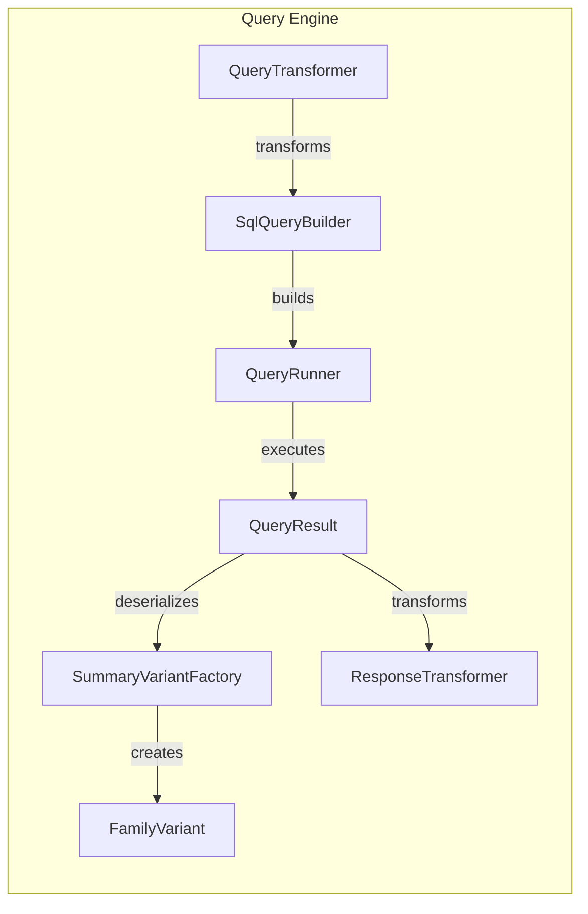

## Query Engine Overview

The Query Engine provides functionalities for querying genetic variants based on various criteria. It builds SQL queries, transforms queries, and deserializes variants, enabling users to efficiently retrieve relevant data. The following diagram illustrates the data flow within the Query Engine:

### Component Descriptions:

- **QueryTransformer**
    - *Description*: Transforms user queries into a format suitable for the query engine.
    - *Interaction*: Receives user queries, transforms them, and sends the transformed query to the `SqlQueryBuilder`.
    - *Relevant files*:
        - `dae.studies.query_transformer.QueryTransformer`

- **SqlQueryBuilder**
    - *Description*: Builds SQL queries for variant retrieval based on a schema and user-defined filters.
    - *Interaction*: Receives transformed queries from `QueryTransformer`, builds SQL queries, and passes them to `QueryRunner`.
    - *Relevant files*:
        - `dae.query_variants.sql.schema2.sql_query_builder.SqlQueryBuilder`

- **QueryRunner**
    - *Description*: Executes SQL queries against a data source.
    - *Interaction*: Receives SQL queries from `SqlQueryBuilder`, executes them, and sends the results to `QueryResult`.
    - *Relevant files*:
        - `dae.query_variants.query_runners.QueryRunner`

- **QueryResult**
    - *Description*: Manages and provides access to the results of a query.
    - *Interaction*: Receives results from `QueryRunner`, deserializes them using `SummaryVariantFactory`, transforms them using `ResponseTransformer` and provides access to the transformed results.
    - *Relevant files*:
        - `dae.query_variants.query_runners.QueryResult`

- **SummaryVariantFactory**
    - *Description*: Creates summary variants and alleles from raw variant data.
    - *Interaction*: Receives raw variant data from `QueryResult` and creates `FamilyVariant`.
    - *Relevant files*:
        - `dae.variants.variant.SummaryVariantFactory`

- **FamilyVariant**
    - *Description*: Represents a variant in the context of a family.
    - *Interaction*: Created by `SummaryVariantFactory` from summary variants and family-specific information.
    - *Relevant files*:
        - `dae.variants.family_variant.FamilyVariant`

- **ResponseTransformer**
    - *Description*: Transforms query results into a format suitable for the user.
    - *Interaction*: Receives query results from `QueryResult` and transforms them for presentation to the user.
    - *Relevant files*:
        - `dae.studies.response_transformer.ResponseTransformer`
