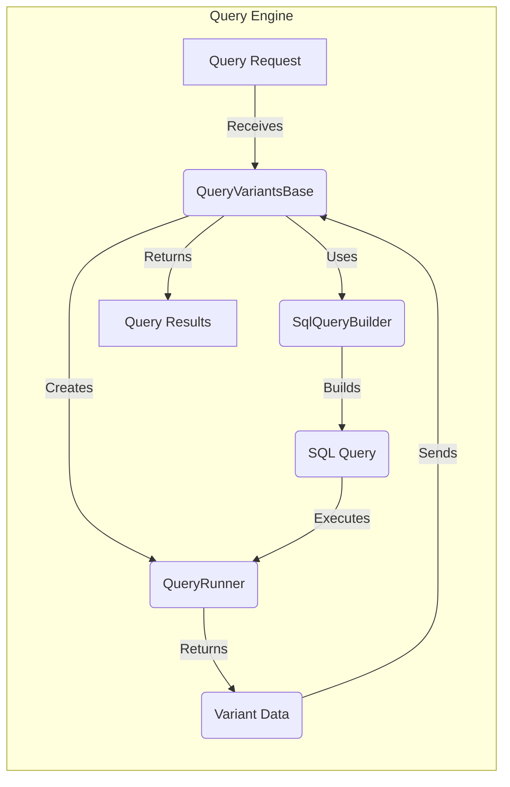

## Query Engine Overview

The Query Engine is responsible for handling variant queries, translating them into database queries, and returning results. It orchestrates the interaction between the `SqlQueryBuilder`, `QueryVariantsBase`, and `QueryRunner` components.

### Component Descriptions:

*   **Query Request:** Represents the initial query request. It triggers the query processing flow.

*   **QueryVariantsBase:** Serves as the entry point for querying variants. It receives the query request, utilizes the `SqlQueryBuilder` to construct the SQL query, creates a `QueryRunner` to execute the query, and returns the results.
    *   **Relevant source files:**
        *   `dae.query_variants.base_query_variants.QueryVariantsBase`

*   **SqlQueryBuilder:** Responsible for building the SQL query based on the query criteria. It translates high-level query parameters into a concrete SQL statement.
    *   **Relevant source files:**
        *   `dae.query_variants.sql.schema2.sql_query_builder.SqlQueryBuilder`

*   **SQL Query:** The generated SQL query that will be executed against the database.

*   **QueryRunner:** Manages the execution of the SQL query in a background thread. It retrieves the results and makes them available.
    *   **Relevant source files:**
        *   `dae.query_variants.query_runners.QueryRunner`

*   **Variant Data:** The raw variant data retrieved from the database.

*   **Query Results:** The final query results returned to the user.
