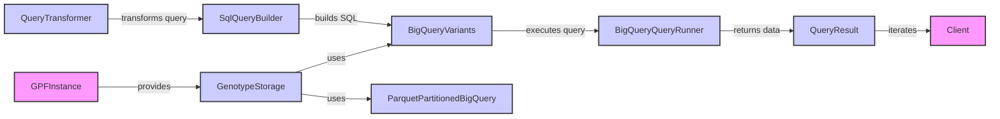

## Query Engine Overview

The Query Engine is responsible for providing a high-level interface to query and filter variants based on various criteria. It abstracts the underlying storage implementation and offers a unified way to explore and analyze data.

### Component Descriptions:

- **GPFInstance**
  - *Description*: Provides access to datasets, configurations, and resources.
  - *Interaction*: Provides `GenotypeStorage` instances.
  - *Relevant source files*: `dae.gpf_instance.gpf_instance.GPFInstance`

- **GenotypeStorage**
  - *Description*: Abstract base class for genotype storage implementations.
  - *Interaction*: Uses `BigQueryVariants` or other storage-specific classes to access data.
  - *Relevant source files*: `dae.genotype_storage.genotype_storage.GenotypeStorage`

- **BigQueryVariants**
  - *Description*: Represents variant data stored in Google BigQuery.
  - *Interaction*: Executes queries via `BigQueryQueryRunner`.
  - *Relevant source files*: `repos.gpf.gcp_storage.gcp_storage.bigquery_variants.BigQueryVariants`

- **ParquetPartitionedBigQuery**
  - *Description*: Loads variants from Parquet files in GCS and integrates them with BigQuery.
  - *Interaction*: Provides data to BigQuery.
  - *Relevant source files*: `repos.gpf.impala_storage.impala_storage.gcp_variants_loaders.ParquetPartitionedBigQuery`

- **QueryTransformer**
  - *Description*: Transforms user queries into a suitable format.
  - *Interaction*: Transforms queries and passes them to `SqlQueryBuilder`.
  - *Relevant source files*: `repos.gpf.wdae.wdae.studies.query_transformer.QueryTransformer`

- **SqlQueryBuilder**
  - *Description*: Builds SQL queries based on the transformed query.
  - *Interaction*: Builds SQL queries for `BigQueryVariants`.
  - *Relevant source files*: `dae.query_variants.sql.schema2.sql_query_builder.SqlQueryBuilder`

- **BigQueryQueryRunner**
  - *Description*: Executes SQL queries against BigQuery.
  - *Interaction*: Returns data to `QueryResult`.
  - *Relevant source files*: `repos.gpf.gcp_storage.gcp_storage.bigquery_query_runner.BigQueryQueryRunner`

- **QueryResult**
  - *Description*: Manages the results from the query runners.
  - *Interaction*: Provides an iterator for the client to access the results.
  - *Relevant source files*: `dae.query_variants.query_runners.QueryRunner`

- **Client**
  - *Description*: The user or application consuming the query results.
  - *Interaction*: Iterates through the `QueryResult` to access the data.
  - *Relevant source files*: N/A
