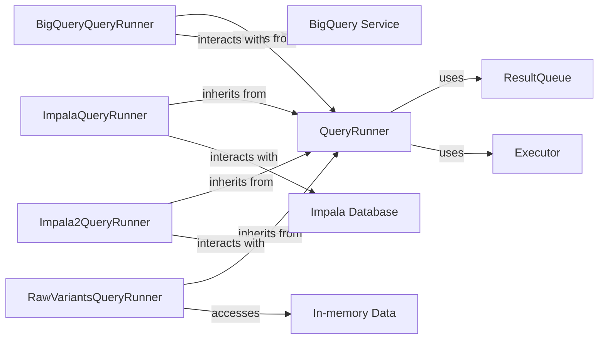

## Component Details

The `QueryRunner` subsystem is designed to abstract and manage the execution of various data queries, allowing for asynchronous processing and standardized result handling. It provides a flexible framework for integrating different data sources while maintaining a consistent interface for consumers of query results.

### QueryRunner
This is an abstract base class that defines the contract for executing queries asynchronously and iterating over their results. It manages the lifecycle of a query (start, close, status checks), handles result queuing, and provides mechanisms for deserialization and adaptation of results. It uses a `threading.RLock` for thread-safe status management.

**Related Classes/Methods**:

- `threading.RLock` (0:0)
- `QueryRunner:run` (0:0)

### BigQueryQueryRunner
A concrete implementation of `QueryRunner` specifically designed to execute queries against Google Cloud BigQuery. It extends the base `QueryRunner` functionality with BigQuery-specific logic for connecting, running queries, and fetching results. It overrides the `run` method to interact with the BigQuery client library.

**Related Classes/Methods**:

- `google.cloud.bigquery` (0:0)
- `BigQueryQueryRunner:run` (0:0)

### ImpalaQueryRunner
A concrete implementation of `QueryRunner` for interacting with Impala databases, likely using an older Impala client library or configuration. It encapsulates the specifics of connecting to Impala, executing SQL queries, and retrieving results from that particular Impala setup.

**Related Classes/Methods**:

- `impala.dbapi` (0:0)

### Impala2QueryRunner
A concrete implementation of `QueryRunner` for interacting with Impala databases, likely using a newer Impala client library or a distinct configuration from `ImpalaQueryRunner`. It manages the connection, query execution, and result retrieval for this specific Impala setup.

**Related Classes/Methods**:

- `impala.dbapi` (0:0)

### RawVariantsQueryRunner
A concrete implementation of `QueryRunner` designed for querying raw variant data. This runner likely accesses data held in-memory or directly from files, suggesting a simpler, non-database-backed data retrieval mechanism compared to the other query runners.

**Related Classes/Methods**: _None_

### ResultQueue
A standard Python `queue.Queue` instance used by `QueryRunner` implementations to deliver query results to consumers. It provides a thread-safe, blocking mechanism for inter-thread communication, enabling backpressure on the query runners if consumers are slow to process results.

**Related Classes/Methods**:

- `queue.Queue` (0:0)

### Executor
A component from Python's `concurrent.futures` module (e.g., `ThreadPoolExecutor` or `ProcessPoolExecutor`) used by `QueryRunner` to submit its `run` method for asynchronous execution. This allows the main application thread to remain responsive while queries are being processed in the background.

**Related Classes/Methods**:

- `concurrent.futures` (0:0)

### BigQuery Service
External service for BigQuery queries.

**Related Classes/Methods**: _None_

### Impala Database
External database for Impala queries.

**Related Classes/Methods**: _None_

### In-memory Data
In-memory or file-based data storage.

**Related Classes/Methods**: _None_

### [FAQ](https://github.com/CodeBoarding/GeneratedOnBoardings/tree/main?tab=readme-ov-file#faq)