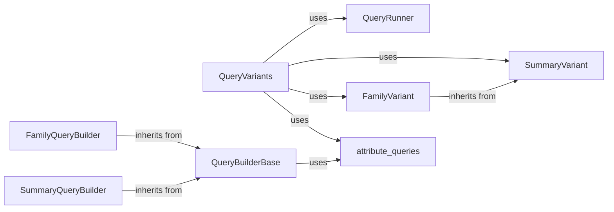

## Component Details

The `QueryVariants` component is a foundational abstract base class for all variant querying implementations. It establishes a common interface and provides core functionalities such as deserializing variant data from raw blobs into structured `SummaryVariant` and `FamilyVariant` objects. It ensures consistency across diverse storage backends. These components are fundamental because they collectively form the core of the variant querying system. `QueryVariants` acts as the central entry point and abstract interface, ensuring that all variant querying implementations adhere to a consistent contract. `QueryRunner` provides the mechanism for asynchronous query execution, which is crucial for performance and responsiveness in a data-intensive application. `FamilyQueryBuilder` and `SummaryQueryBuilder` are essential for constructing efficient and accurate SQL queries tailored to the specific needs of family and summary variant data, respectively. Their inheritance from `QueryBuilderBase` promotes code reuse and consistency in query construction. `QueryBuilderBase` provides the foundational logic for handling common query parameters and optimizations, such as gene region and bin calculations, which are critical for efficient data retrieval. `SummaryVariant` and `FamilyVariant` are the primary data models for representing genetic variants, providing a structured and consistent way to work with the queried data. The `attribute_queries` module is vital for enabling flexible and powerful filtering capabilities based on various variant attributes, allowing users to express complex queries in a human-readable format. Together, these components provide a robust, extensible, and efficient framework for querying and managing genetic variant data.

### QueryVariants
This is the abstract base class that defines the interface for querying both summary and family variants. It provides methods for building query runners and executing queries, handling common functionalities like transforming roles and tags into queryable formats.

**Related Classes/Methods**:

- <a href="https://github.com/iossifovlab/gpf/blob/master/dae/dae/query_variants/base_query_variants.py#L26-L181" target="_blank" rel="noopener noreferrer">`dae.query_variants.base_query_variants.QueryVariants` (26:181)</a>

### QueryRunner
An abstract base class for running queries in the background. It manages the lifecycle of a query, including starting, closing, and putting results into a queue. It also handles deserialization of query results.

**Related Classes/Methods**:

- <a href="https://github.com/iossifovlab/gpf/blob/master/dae/dae/query_variants/query_runners.py#L14-L121" target="_blank" rel="noopener noreferrer">`dae.query_variants.query_runners.QueryRunner` (14:121)</a>

### FamilyQueryBuilder
This component is responsible for constructing SQL queries specifically for family variants. It extends `BaseQueryBuilder` and handles joins and conditions relevant to family-specific data, such as `allele_in_members` and `pedigree` information.

**Related Classes/Methods**:

- <a href="https://github.com/iossifovlab/gpf/blob/master/dae/dae/query_variants/sql/schema2/family_builder.py#L15-L115" target="_blank" rel="noopener noreferrer">`dae.query_variants.sql.schema2.family_builder.FamilyQueryBuilder` (15:115)</a>

### SummaryQueryBuilder
This component is responsible for constructing SQL queries specifically for summary variants. It also extends `BaseQueryBuilder` and focuses on querying the summary allele table, handling filters relevant to summary data like regions, genes, and effect types.

**Related Classes/Methods**:

- <a href="https://github.com/iossifovlab/gpf/blob/master/dae/dae/query_variants/sql/schema2/summary_builder.py#L17-L117" target="_blank" rel="noopener noreferrer">`dae.query_variants.sql.schema2.summary_builder.SummaryQueryBuilder` (17:117)</a>

### QueryBuilderBase
A base class for building SQL queries, providing common functionalities like building gene regions and calculating coding and region bins for partitioning. It also includes static methods for checking roles and inheritance queries.

**Related Classes/Methods**:

- <a href="https://github.com/iossifovlab/gpf/blob/master/dae/dae/query_variants/sql/schema2/sql_query_builder.py#L85-L466" target="_blank" rel="noopener noreferrer">`dae.query_variants.sql.schema2.sql_query_builder.QueryBuilderBase` (85:466)</a>

### SummaryVariant
Represents a summary variant, which is a variant aggregated across all families in a study. It holds information about the reference and alternative alleles, their positions, and associated attributes like effects and frequencies.

**Related Classes/Methods**:

- <a href="https://github.com/iossifovlab/gpf/blob/master/dae/dae/variants/variant.py#L592-L850" target="_blank" rel="noopener noreferrer">`dae.variants.variant.SummaryVariant` (592:850)</a>

### FamilyVariant
Represents a variant within a specific family. It extends `SummaryVariant` and includes family-specific information such as genotype, best state, and inheritance patterns within family members.

**Related Classes/Methods**:

- <a href="https://github.com/iossifovlab/gpf/blob/master/dae/dae/variants/family_variant.py#L568-L871" target="_blank" rel="noopener noreferrer">`dae.variants.family_variant.FamilyVariant` (568:871)</a>

### attribute_queries
This module provides utilities for transforming human-readable attribute query strings into callable functions or SQL expressions. It defines a grammar for parsing these queries, supporting literals, compounds, negations, and logical operations (AND, OR).

**Related Classes/Methods**:

- <a href="https://github.com/iossifovlab/gpf/blob/master/dae/dae/query_variants/attribute_queries.py#L1-L1" target="_blank" rel="noopener noreferrer">`dae.query_variants.attribute_queries` (1:1)</a>

### [FAQ](https://github.com/CodeBoarding/GeneratedOnBoardings/tree/main?tab=readme-ov-file#faq)