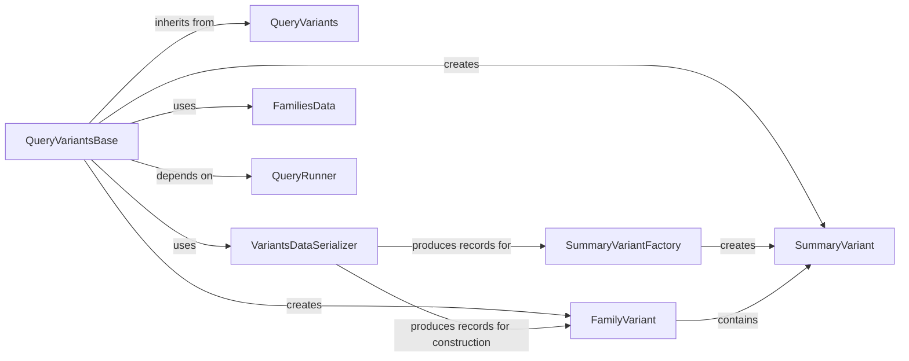

## Component Details

Analysis of the QueryVariantsBase component and its related components within the GPF system.

### QueryVariantsBase
This is the core abstract class that defines the basic framework for querying and deserializing genetic variants. It acts as an intermediary, orchestrating the deserialization of raw variant data into structured `SummaryVariant` and `FamilyVariant` objects. It relies on a `VariantsDataSerializer` for data transformation and `FamiliesData` for pedigree context.

**Related Classes/Methods**:

- <a href="https://github.com/iossifovlab/gpf/blob/master/dae/dae/query_variants/base_query_variants.py#L184-L239" target="_blank" rel="noopener noreferrer">`dae.dae.query_variants.base_query_variants.QueryVariantsBase` (184:239)</a>

### QueryVariants
The abstract base class from which `QueryVariantsBase` inherits. It likely defines the most general interface and common functionalities for any variant querying mechanism within the system.

**Related Classes/Methods**:

- <a href="https://github.com/iossifovlab/gpf/blob/master/dae/dae/query_variants/base_query_variants.py#L26-L181" target="_blank" rel="noopener noreferrer">`dae.dae.query_variants.base_query_variants.QueryVariants` (26:181)</a>

### VariantsDataSerializer
This component is responsible for the low-level serialization and deserialization of variant data. It converts raw byte blobs (e.g., from storage) into structured Python records that can then be used to construct `SummaryVariant` and `FamilyVariant` objects.

**Related Classes/Methods**:

- <a href="https://github.com/iossifovlab/gpf/blob/master/dae/dae/parquet/schema2/serializers.py#L251-L289" target="_blank" rel="noopener noreferrer">`dae.dae.parquet.schema2.serializers.VariantsDataSerializer` (251:289)</a>

### FamiliesData
This component manages and provides access to the pedigree information for all families within a study. It's essential for `QueryVariantsBase` to correctly construct `FamilyVariant` objects, as these require detailed family structure and individual relationships.

**Related Classes/Methods**:

- <a href="https://github.com/iossifovlab/gpf/blob/master/dae/dae/pedigrees/families_data.py#L115-L364" target="_blank" rel="noopener noreferrer">`dae.dae.pedigrees.families_data.FamiliesData` (115:364)</a>

### SummaryVariant
Represents a genetic variant at a summary level, containing information that is common across all families where the variant is observed. This includes details like chromosome, position, reference allele, alternative allele, and general variant attributes.

**Related Classes/Methods**:

- <a href="https://github.com/iossifovlab/gpf/blob/master/dae/dae/variants/variant.py#L592-L850" target="_blank" rel="noopener noreferrer">`dae.dae.variants.variant.SummaryVariant` (592:850)</a>

### FamilyVariant
Represents a genetic variant within the context of a specific family. It extends the `SummaryVariant` information with family-specific details such as genotypes of family members, best state, and inheritance patterns within that family.

**Related Classes/Methods**:

- <a href="https://github.com/iossifovlab/gpf/blob/master/dae/dae/variants/family_variant.py#L568-L871" target="_blank" rel="noopener noreferrer">`dae.dae.variants.family_variant.FamilyVariant` (568:871)</a>

### SummaryVariantFactory
A utility or factory class responsible for creating `SummaryVariant` objects from deserialized records. It encapsulates the logic for mapping raw data fields to the `SummaryVariant` object's attributes.

**Related Classes/Methods**:

- <a href="https://github.com/iossifovlab/gpf/blob/master/dae/dae/variants/variant.py#L853-L969" target="_blank" rel="noopener noreferrer">`dae.dae.variants.variant.SummaryVariantFactory` (853:969)</a>

### QueryRunner
An abstract class or interface that defines how the actual queries are executed against the underlying genotype storage. `QueryVariantsBase` declares a `RUNNER_CLASS` attribute, indicating that it expects a concrete implementation of this class to perform the data retrieval.

**Related Classes/Methods**:

- <a href="https://github.com/iossifovlab/gpf/blob/master/dae/dae/query_variants/query_runners.py#L14-L121" target="_blank" rel="noopener noreferrer">`dae.dae.query_variants.query_runners.QueryRunner` (14:121)</a>

### [FAQ](https://github.com/CodeBoarding/GeneratedOnBoardings/tree/main?tab=readme-ov-file#faq)