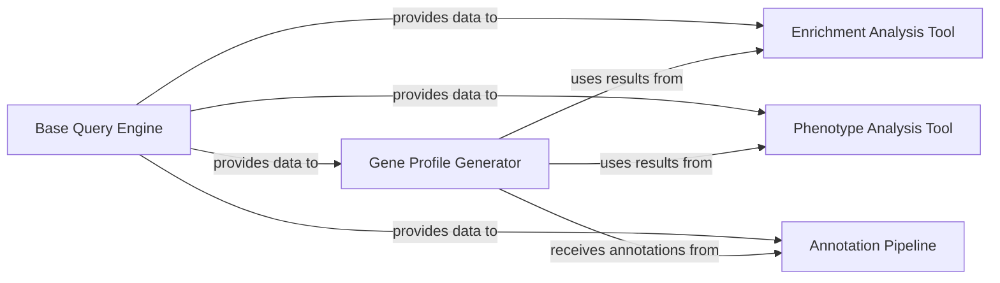

## Details

The Denovo Analysis Engine (DAE) is a genomic analysis system designed to process and analyze genetic data. It provides a pipeline for querying genetic variants, enriching data with additional information, analyzing phenotypes, generating gene profiles, and annotating results. The system follows a modular architecture where components interact in a sequential workflow to transform raw genetic data into meaningful insights.

### Base Query Engine
Core component responsible for querying genetic variants from the database. It provides the foundation for all genetic data retrieval operations and supports filtering by various genetic parameters.

**Related Classes/Methods**:

- `dae.query_engine.query_engine` (10:150)
- `dae.variants.variant_loader` (25:200)

### Enrichment Analysis Tool
Performs statistical enrichment analysis on genetic variants to identify significant patterns. This component evaluates the statistical significance of genetic variants against reference datasets.

**Related Classes/Methods**:

- `dae.enrichment.enrichment_tool` (15:180)
- `dae.enrichment.statistic_tests` (30:120)

### Phenotype Analysis Tool
Analyzes relationships between genetic variants and phenotypic traits. This component helps identify correlations between genetic markers and observable characteristics.

**Related Classes/Methods**:

- `dae.pheno.pheno_tool` (20:250)
- `dae.pheno.regression` (45:190)

### Gene Profile Generator
Creates comprehensive profiles for genes based on variant data and annotations. This component aggregates information to provide a complete view of gene characteristics.

**Related Classes/Methods**:

- `dae.gene_profiles.profile_generator` (25:220)
- `dae.gene_profiles.gene_score` (15:95)

### Annotation Pipeline
Processes genetic variants to add functional and structural annotations. This component enriches raw variant data with biological context and predicted impacts.

**Related Classes/Methods**:

- <a href="https://github.com/iossifovlab/gpf/blob/master/dae/dae/annotation/annotation_pipeline.py#L30-L280" target="_blank" rel="noopener noreferrer">`dae.annotation.annotation_pipeline` (30:280)</a>
- <a href="https://github.com/iossifovlab/gpf/blob/master/dae/dae/annotation/effect_annotator.py#L40-L150" target="_blank" rel="noopener noreferrer">`dae.annotation.effect_annotator` (40:150)</a>

### [FAQ](https://github.com/CodeBoarding/GeneratedOnBoardings/tree/main?tab=readme-ov-file#faq)