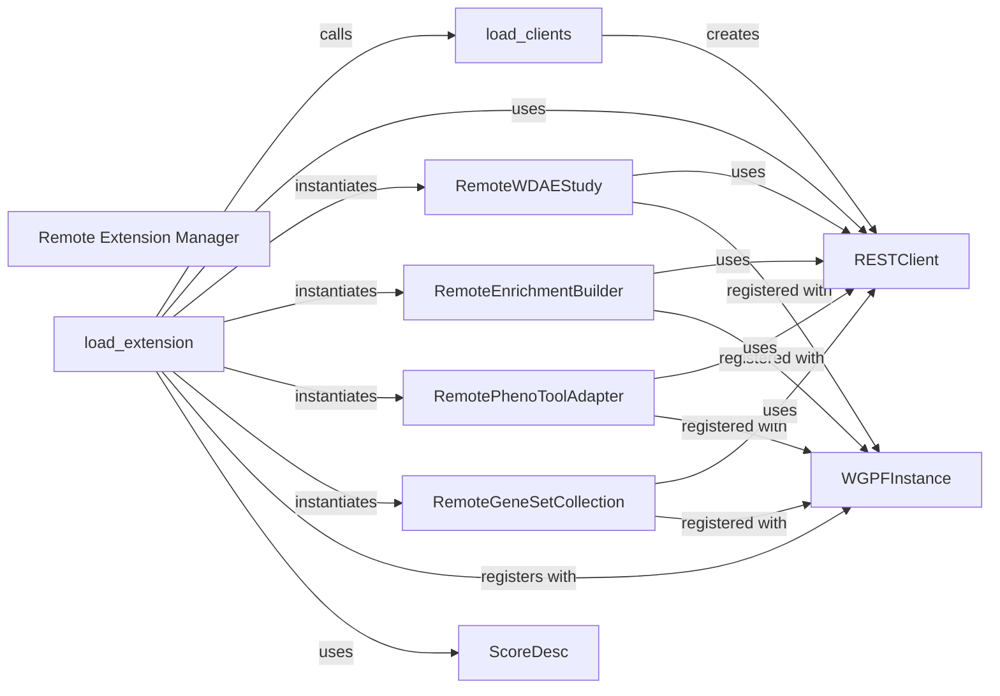

## Component Details

Component Overview: Remote Extension Manager

### Remote Extension Manager
The overarching subsystem responsible for orchestrating the discovery, loading, and management of functionalities (extensions) provided by remote GPF instances. It acts as the primary entry point for initiating federated operations.

**Related Classes/Methods**:

- <a href="https://github.com/iossifovlab/gpf/blob/master/federation/federation/remote_extension.py#L1-L1" target="_blank" rel="noopener noreferrer">`gpf.federation.federation.remote_extension` (1:1)</a>

### load_extension
This is the central orchestrator function within the `Remote Extension Manager`. It drives the entire process of fetching and integrating various remote GPF components (studies, enrichment builders, pheno tool adapters, gene set collections, and genomic scores) into the local `WGPFInstance`. It iterates through configured remote clients, retrieves their available data and functionalities, and registers them locally.

**Related Classes/Methods**:

- <a href="https://github.com/iossifovlab/gpf/blob/master/federation/federation/remote_extension.py#L48-L134" target="_blank" rel="noopener noreferrer">`gpf.federation.federation.remote_extension:load_extension` (48:134)</a>

### load_clients
This function is responsible for initializing and returning `RESTClient` instances for all remote GPF servers configured in the DAE configuration. It handles the initial connection setup to each remote instance, ensuring that communication channels are established before any data or functionality is fetched.

**Related Classes/Methods**:

- <a href="https://github.com/iossifovlab/gpf/blob/master/federation/federation/remote_extension.py#L22-L45" target="_blank" rel="noopener noreferrer">`gpf.federation.federation.remote_extension:load_clients` (22:45)</a>

### RESTClient
A robust client that facilitates communication with a remote GPF instance via its REST API. It manages HTTP requests (GET, POST) and provides specific methods to interact with various remote endpoints, such as fetching datasets, querying variants, retrieving families, gene sets, genomic scores, and performing enrichment/pheno tool operations. It acts as the primary communication bridge.

**Related Classes/Methods**:

- <a href="https://github.com/iossifovlab/gpf/blob/master/rest_client/rest_client/rest_client.py#L367-L613" target="_blank" rel="noopener noreferrer">`gpf.rest_client.rest_client.rest_client:RESTClient` (367:613)</a>

### WGPFInstance
Represents the core local GPF application instance. It acts as the central registry and manager for all genotype data, study wrappers, phenotypic data, gene set databases, and genomic scores. Crucially, it's the point where all federated (remote) components are registered and made accessible to the rest of the local GPF system.

**Related Classes/Methods**:

- <a href="https://github.com/iossifovlab/gpf/blob/master/wdae/wdae/gpf_instance/gpf_instance.py#L78-L311" target="_blank" rel="noopener noreferrer">`wdae.wdae.gpf_instance.gpf_instance:WGPFInstance` (78:311)</a>

### RemoteWDAEStudy
This adapter class wraps a remote study, making its data (variants, families) and functionalities compatible with the local GPF's `WDAEStudy` interface. It allows the local GPF to treat remote studies as if they were locally hosted, abstracting the remote access details.

**Related Classes/Methods**:

- <a href="https://github.com/iossifovlab/gpf/blob/master/federation/federation/remote_study_wrapper.py#L17-L138" target="_blank" rel="noopener noreferrer">`gpf.federation.federation.remote_study_wrapper:RemoteWDAEStudy` (17:138)</a>

### RemoteEnrichmentBuilder
An adapter that enables the local GPF instance to perform enrichment analyses on data from remote studies. It achieves this by forwarding the enrichment test requests to the corresponding remote GPF instance via the `RESTClient`, effectively extending local analysis capabilities to remote data.

**Related Classes/Methods**:

- <a href="https://github.com/iossifovlab/gpf/blob/master/federation/federation/remote_enrichment_builder.py#L9-L34" target="_blank" rel="noopener noreferrer">`gpf.federation.federation.remote_enrichment_builder:RemoteEnrichmentBuilder` (9:34)</a>

### RemotePhenoToolAdapter
This adapter allows the local GPF environment to utilize phenotypic tools available on remote GPF instances. It translates local phenotypic tool requests into API calls to the remote server via the `RESTClient`, integrating remote analytical capabilities.

**Related Classes/Methods**:

- <a href="https://github.com/iossifovlab/gpf/blob/master/federation/federation/remote_pheno_tool_adapter.py#L7-L27" target="_blank" rel="noopener noreferrer">`gpf.federation.federation.remote_pheno_tool_adapter:RemotePhenoToolAdapter` (7:27)</a>

### RemoteGeneSetCollection
Represents a collection of gene sets that are hosted on a remote GPF instance. This class allows local components to browse and retrieve these remote gene sets as if they were part of the local gene set database, facilitating federated gene set analysis. It uses the `RESTClient` to fetch gene set information.

**Related Classes/Methods**:

- <a href="https://github.com/iossifovlab/gpf/blob/master/federation/federation/gene_sets_db.py#L16-L98" target="_blank" rel="noopener noreferrer">`gpf.federation.federation.gene_sets_db:RemoteGeneSetCollection` (16:98)</a>

### ScoreDesc
A data descriptor class used for defining and deserializing the metadata associated with genomic scores. It is crucial for correctly interpreting and integrating genomic score information received from remote GPF instances into the local system, ensuring that remote scores are properly structured and usable.

**Related Classes/Methods**:

- <a href="https://github.com/iossifovlab/gpf/blob/master/dae/dae/genomic_scores/scores.py#L25-L72" target="_blank" rel="noopener noreferrer">`dae.dae.genomic_scores.scores:ScoreDesc` (25:72)</a>

### [FAQ](https://github.com/CodeBoarding/GeneratedOnBoardings/tree/main?tab=readme-ov-file#faq)