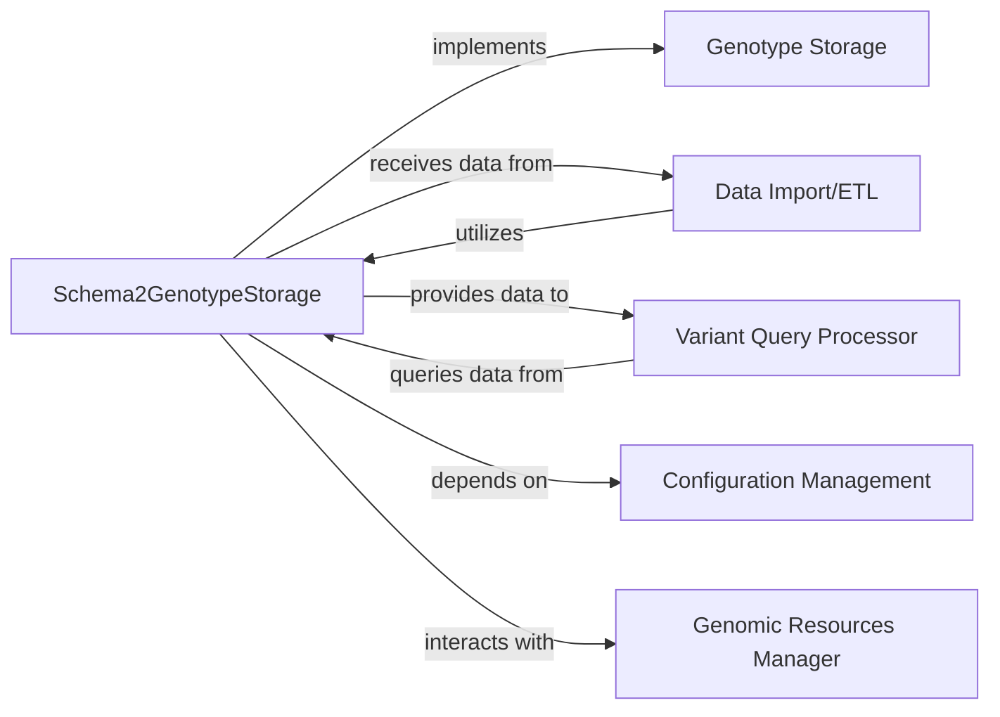

## Details

Analysis of the DAE (Genomic Data Warehouse) system focusing on the Schema2GenotypeStorage component and its interactions with other core components, including Genotype Storage, Data Import/ETL, Variant Query Processor, Configuration Management, and Genomic Resources Manager. This analysis highlights the modularity, extensibility, and efficient data handling crucial for a Bioinformatics Data Platform.

### Schema2GenotypeStorage [[Expand]](./Schema2GenotypeStorage.md)
Provides the concrete implementation for connecting to and interacting with genomic variant data stored in the "schema2" format. It adheres to the `GenotypeStorage` interface, enabling the system to utilize schema2-formatted data as a backend storage solution. It handles the specifics of reading and writing data according to the schema2 layout, which likely involves optimized data structures for genomic information.

**Related Classes/Methods**:

- `dae.schema2_storage` (1:1)
- <a href="https://github.com/iossifovlab/gpf/dae/dae/schema2_storage/schema2_import_storage.py#L1-L1" target="_blank" rel="noopener noreferrer">`dae.schema2_storage.schema2_import_storage` (1:1)</a>
- <a href="https://github.com/iossifovlab/gpf/dae/dae/schema2_storage/schema2_layout.py#L1-L1" target="_blank" rel="noopener noreferrer">`dae.schema2_storage.schema2_layout` (1:1)</a>

### Genotype Storage
This is an abstract interface that defines the contract for all genotype storage implementations within the DAE system. It specifies the methods and properties that any concrete storage backend (like `Schema2GenotypeStorage`) must implement, ensuring a consistent API for querying and managing genomic data regardless of the underlying storage technology. This component is crucial for the system's extensibility and modularity, allowing new storage formats or databases to be integrated easily.

**Related Classes/Methods**:

- <a href="https://github.com/iossifovlab/gpf/dae/dae/genotype_storage/genotype_storage.py#L1-L1" target="_blank" rel="noopener noreferrer">`dae.genotype_storage.genotype_storage` (1:1)</a>

### Data Import/ETL
This component is responsible for the Extract, Transform, Load (ETL) processes for genomic data. It handles the ingestion of raw data from various sources, its transformation into a standardized internal format (like schema2), and its loading into the appropriate genotype storage backend. This component ensures data quality and consistency before it becomes available for analysis.

**Related Classes/Methods**:

- <a href="https://github.com/iossifovlab/gpf/dae/dae/import_tools/import_tools.py#L1-L1" target="_blank" rel="noopener noreferrer">`dae.import_tools.import_tools` (1:1)</a>

### Variant Query Processor
This component is responsible for processing and optimizing queries against genomic variant data. It translates high-level user queries into efficient operations that can be executed against the underlying genotype storage. It leverages the specific capabilities of the storage backend (e.g., schema2's optimized layout) to retrieve results quickly.

**Related Classes/Methods**:

- <a href="https://github.com/iossifovlab/gpf/dae/dae/query_variants/sql/schema2/sql_query_builder.py#L1-L1" target="_blank" rel="noopener noreferrer">`dae.query_variants.sql.schema2.sql_query_builder` (1:1)</a>

### Configuration Management [[Expand]](./Configuration_Management.md)
This component centralizes the management of system configurations, including paths to data, database connection strings, and other operational parameters. It provides a consistent way for different components to access their necessary settings, promoting flexibility and ease of deployment.

**Related Classes/Methods**:

- <a href="https://github.com/iossifovlab/gpf/dae/dae/configuration/gpf_config_parser.py#L1-L1" target="_blank" rel="noopener noreferrer">`dae.configuration.gpf_config_parser` (1:1)</a>
- `dae.configuration.study_config` (1:1)

### Genomic Resources Manager
This component manages access to various genomic resources, such as reference genomes, gene models, and annotation databases. These resources are critical for interpreting genomic data, performing annotations, and ensuring data consistency across different analyses.

**Related Classes/Methods**:

- <a href="https://github.com/iossifovlab/gpf/dae/dae/genomic_resources/reference_genome.py#L1-L1" target="_blank" rel="noopener noreferrer">`dae.genomic_resources.reference_genome` (1:1)</a>
- <a href="https://github.com/iossifovlab/gpf/dae/dae/genomic_resources/gene_models/gene_models.py#L1-L1" target="_blank" rel="noopener noreferrer">`dae.genomic_resources.gene_models.gene_models` (1:1)</a>

### [FAQ](https://github.com/CodeBoarding/GeneratedOnBoardings/tree/main?tab=readme-ov-file#faq)