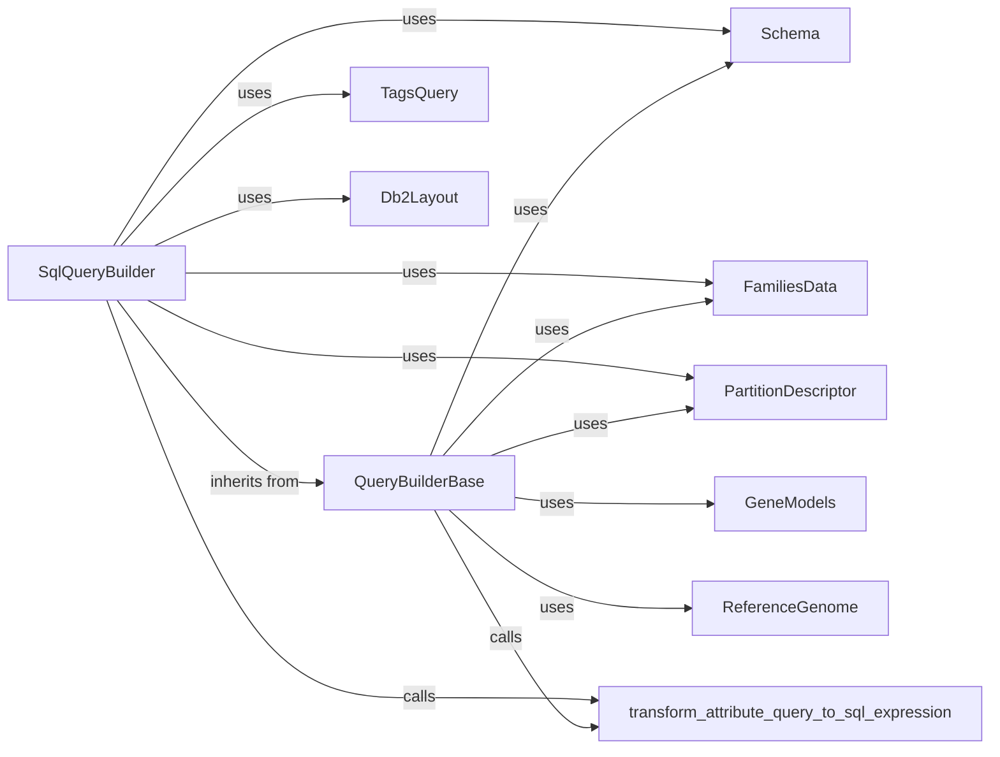

## Component Details

The SqlQueryBuilder component is a central part of the data access layer, specifically designed for constructing dynamic SQL queries for schema2 variant data. Its primary purpose is to translate high-level, user-defined query parameters (such as genomic regions, gene symbols, effect types, and various filters related to families and attributes) into precise SQL statements. It leverages the sqlglot library for robust SQL expression building and incorporates sophisticated partitioning heuristics to optimize query performance on large datasets.

### SqlQueryBuilder
The core component responsible for dynamically constructing SQL queries for both summary and family variants. It orchestrates the translation of high-level query parameters into SQL statements, applies partitioning heuristics, and manages the replacement of logical table names with actual database table names.

**Related Classes/Methods**:

- <a href="https://github.com/iossifovlab/gpf/blob/master/dae/dae/query_variants/sql/schema2/sql_query_builder.py#L469-L1287" target="_blank" rel="noopener noreferrer">`gpf.dae.dae.query_variants.sql.schema2.sql_query_builder.SqlQueryBuilder` (469:1287)</a>

### QueryBuilderBase
An abstract base class that provides foundational query building functionalities and heuristic calculations. SqlQueryBuilder inherits from this class, leveraging its methods for building gene region queries, calculating coding, region, frequency, and family bins, and checking attribute query values.

**Related Classes/Methods**:

- <a href="https://github.com/iossifovlab/gpf/blob/master/dae/dae/query_variants/sql/schema2/sql_query_builder.py#L85-L466" target="_blank" rel="noopener noreferrer">`gpf.dae.dae.query_variants.sql.schema2.sql_query_builder.QueryBuilderBase` (85:466)</a>

### TagsQuery
A Pydantic BaseModel that serves as a data structure to encapsulate selected and deselected family tags, along with a boolean flag indicating whether tags should be combined with OR or AND logic. SqlQueryBuilder uses instances of this class to resolve tag-based filters into SQL expressions.

**Related Classes/Methods**:

- <a href="https://github.com/iossifovlab/gpf/blob/master/dae/dae/query_variants/sql/schema2/sql_query_builder.py#L72-L75" target="_blank" rel="noopener noreferrer">`gpf.dae.dae.query_variants.sql.schema2.sql_query_builder.TagsQuery` (72:75)</a>

### transform_attribute_query_to_sql_expression
A utility function that converts abstract attribute queries (e.g., for roles, sexes, statuses, inheritance) into concrete SQL expressions. This function is crucial for translating high-level, human-readable query parameters into database-understandable conditions, often involving enum types and their aliases.

**Related Classes/Methods**:

- <a href="https://github.com/iossifovlab/gpf/blob/master/dae/dae/query_variants/attribute_queries.py#L0-L0" target="_blank" rel="noopener noreferrer">`gpf.dae.dae.query_variants.attribute_queries.transform_attribute_query_to_sql_expression` (0:0)</a>

### Db2Layout
This component provides the actual database table names (summary, family, pedigree) that correspond to the logical table names used during the query building process. SqlQueryBuilder uses this information to finalize the SQL queries by replacing placeholders with the correct table references.

**Related Classes/Methods**:

- `gpf.dae.dae.db.db_layout.Db2Layout` (0:0)

### Schema
This component defines the schema for the summary, family, and pedigree tables, providing access to column names and types. Both SqlQueryBuilder and QueryBuilderBase rely on this information to ensure correct and valid SQL query construction based on the underlying data structure.

**Related Classes/Methods**:

- `gpf.dae.dae.db.schema.Schema` (0:0)

### PartitionDescriptor
This component holds critical information about how the data is partitioned (e.g., into region, frequency, coding, and family bins). QueryBuilderBase uses this to calculate and apply partitioning heuristics, which are vital for optimizing queries and efficiently accessing large datasets.

**Related Classes/Methods**:

- `gpf.dae.dae.query_variants.partition_descriptor.PartitionDescriptor` (0:0)

### FamiliesData
This component provides access to family and person data, including mappings from person IDs to family IDs. It is used by QueryBuilderBase for calculating family bins and by SqlQueryBuilder for filtering variants based on family or person criteria.

**Related Classes/Methods**:

- `gpf.dae.dae.families.families_data.FamiliesData` (0:0)

### GeneModels
This component provides comprehensive gene model information. It is essential for QueryBuilderBase to accurately translate gene symbols provided in queries into specific genomic regions, which are then used to construct region-based SQL filters.

**Related Classes/Methods**:

- <a href="https://github.com/iossifovlab/gpf/blob/master/dae/dae/genomic_resources/gene_models/gene_models.py#L420-L573" target="_blank" rel="noopener noreferrer">`gpf.dae.dae.genomic_resources.gene_models.GeneModels` (420:573)</a>

### ReferenceGenome
This component provides information about the reference genome, including chromosome lengths. QueryBuilderBase utilizes this information when calculating region bins to ensure accurate genomic range partitioning and efficient query construction.

**Related Classes/Methods**:

- <a href="https://github.com/iossifovlab/gpf/blob/master/dae/dae/genomic_resources/reference_genome.py#L23-L268" target="_blank" rel="noopener noreferrer">`gpf.dae.dae.genomic_resources.reference_genome.ReferenceGenome` (23:268)</a>

### [FAQ](https://github.com/CodeBoarding/GeneratedOnBoardings/tree/main?tab=readme-ov-file#faq)