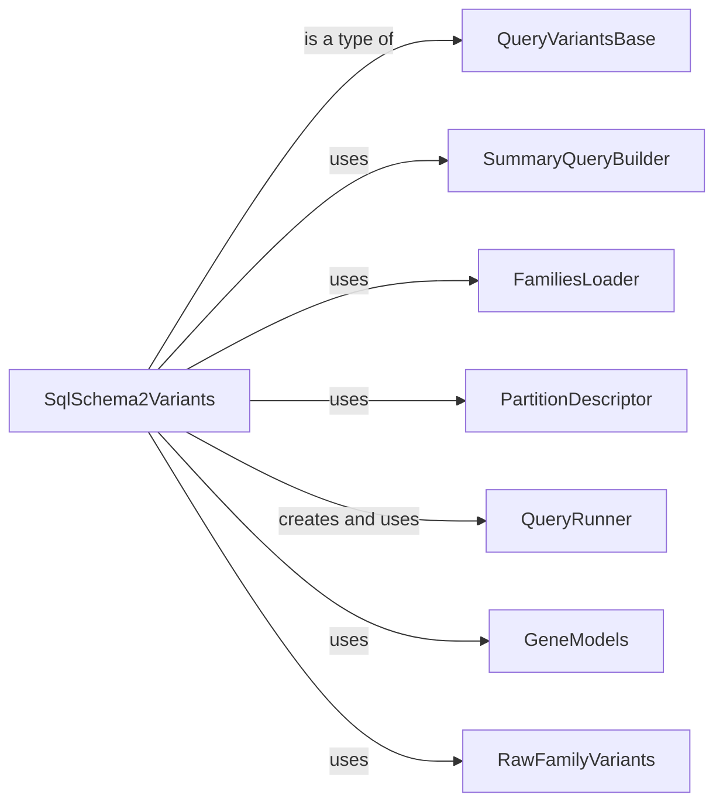

## Component Details

This analysis focuses on the SqlSchema2Variants component, an abstract class for querying genomic variants from SQL databases (Schema2). It details its role, structure, functionality, responsibilities, interactions, and relationships with other key components like QueryVariantsBase, SummaryQueryBuilder, FamiliesLoader, PartitionDescriptor, QueryRunner, GeneModels, and RawFamilyVariants.

### SqlSchema2Variants
Serves as the foundational abstract class for querying genomic variants stored in SQL-like databases, specifically designed for Schema2. It provides a standardized interface for interacting with variant data, handling the complexities of schema retrieval, pedigree loading, and query construction.

**Related Classes/Methods**:

- <a href="https://github.com/iossifovlab/gpf/blob/master/dae/dae/query_variants/sql/schema2/base_variants.py#L29-L436" target="_blank" rel="noopener noreferrer">`dae.query_variants.sql.schema2.base_variants.SqlSchema2Variants` (29:436)</a>

### QueryVariantsBase
The base class from which SqlSchema2Variants inherits, providing fundamental variant querying capabilities.

**Related Classes/Methods**: _None_

### SummaryQueryBuilder
A key component responsible for constructing SQL queries specifically for summary variants, used by SqlSchema2Variants.

**Related Classes/Methods**: _None_

### FamiliesLoader
Utilized by SqlSchema2Variants to load and process pedigree information, essential for family-based variant analysis.

**Related Classes/Methods**: _None_

### PartitionDescriptor
Manages the partitioning scheme of the variant data, which SqlSchema2Variants uses to optimize queries.

**Related Classes/Methods**: _None_

### QueryRunner
An abstract component representing the mechanism for executing the generated SQL queries against the database. SqlSchema2Variants relies on a concrete implementation of this runner.

**Related Classes/Methods**: _None_

### GeneModels
Provides gene model data, which can be integrated into variant queries for gene-centric filtering or annotation.

**Related Classes/Methods**: _None_

### RawFamilyVariants
Offers utility functions for filtering variants post-query, used by SqlSchema2Variants to refine results.

**Related Classes/Methods**: _None_

### [FAQ](https://github.com/CodeBoarding/GeneratedOnBoardings/tree/main?tab=readme-ov-file#faq)