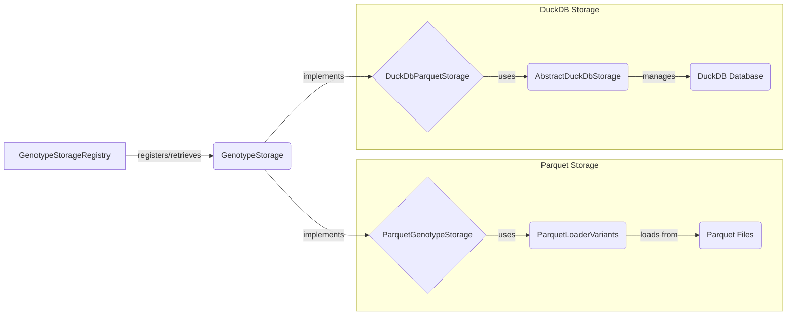

## Storage Abstraction Overview

This diagram illustrates the flow of data and interactions between the key components involved in the storage abstraction within the `{project_name}` project. It highlights how different storage implementations are managed and accessed through a unified interface.

### Component Descriptions:

- **GenotypeStorageRegistry**
  - *Description*: Manages the available genotype storage implementations. Allows registration, retrieval, and configuration of storage instances.
  - *Interaction*: Registers and retrieves `GenotypeStorage` instances based on configuration.
  - *Relevant source files*:
    - `dae.genotype_storage.genotype_storage_registry.GenotypeStorageRegistry`

- **GenotypeStorage**
  - *Description*: Abstract base class for genotype storage implementations. Defines the interface for accessing variant data and manages the lifecycle of storage backends.
  - *Interaction*: Implemented by concrete storage classes like `ParquetGenotypeStorage` and `DuckDbParquetStorage`.
  - *Relevant source files*:
    - `dae.genotype_storage.genotype_storage.GenotypeStorage`

- **ParquetGenotypeStorage**
  - *Description*: Genotype storage implementation for raw Parquet files. It handles the specifics of loading variant data from Parquet files and integrates with the `ParquetLoaderVariants`.
  - *Interaction*: Uses `ParquetLoaderVariants` to load variant data from Parquet files.
  - *Relevant source files*:
    - `dae.parquet_storage.storage.ParquetGenotypeStorage`

- **DuckDbParquetStorage**
  - *Description*: Genotype storage implementation for DuckDB, optimized for Parquet files. It manages connections to DuckDB databases and builds study layouts for efficient querying.
  - *Interaction*: Uses `AbstractDuckDbStorage` to manage DuckDB connections and interacts with DuckDB databases.
  - *Relevant source files*:
    - `dae.duckdb_storage.duckdb_genotype_storage.DuckDbParquetStorage`

- **ParquetLoaderVariants**
  - *Description*: A class that uses ParquetLoader to fetch variants from Parquet files. It builds query runners for both summary and family variants, applying filters based on regions, genes, and other criteria.
  - *Interaction*: Loads data directly from Parquet files.
  - *Relevant source files*:
    - `dae.parquet_storage.storage.ParquetLoaderVariants`

- **AbstractDuckDbStorage**
  - *Description*: Abstract base class for DuckDB storage implementations. It defines the connection management and provides a base for different DuckDB storage types.
  - *Interaction*: Manages connections to DuckDB databases.
  - *Relevant source files*:
    - `dae.duckdb_storage.duckdb_genotype_storage.AbstractDuckDbStorage`

- **DuckDB Database**
  - *Description*: In-memory or persistent database used by DuckDB storage.
  - *Interaction*: Managed by `AbstractDuckDbStorage`.
  - *Relevant source files*:
    - N/A (External database system)

- **Parquet Files**
  - *Description*: Storage format for variant data.
  - *Interaction*: Loaded by `ParquetLoaderVariants`.
  - *Relevant source files*:
    - N/A (Data files)
