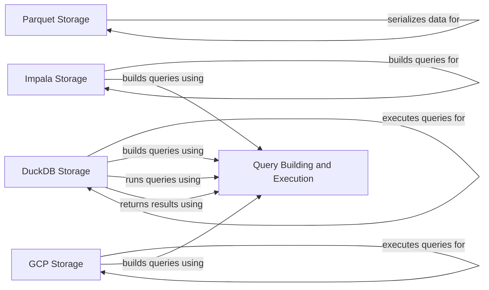

## Component Details

### Parquet Storage
This component handles writing and loading genomic data to and from Parquet files. It includes functionalities for serializing data according to a specified schema, partitioning the data, and efficiently reading the data as variants. It uses the `ParquetWriter` to write data, `ParquetLoader` to load data, `Schema2DatasetLayout` to define the dataset layout, and `AlleleParquetSerializer` to serialize allele data.
- **Related Classes/Methods**: `dae.parquet.parquet_writer.ParquetWriter`, `dae.variants_loaders.parquet.loader.ParquetLoader`, `dae.schema2_storage.schema2_layout.Schema2DatasetLayout`, `dae.parquet.schema2.serializers.AlleleParquetSerializer`

### Impala Storage
This component manages genotype data stored in Impala. It handles dataset import, table creation, and provides access to variant data through SQL queries. It uses `ImpalaGenotypeStorage` to manage the data, `ImpalaVariants` to represent variant data, `ImpalaQueryRunner` to execute queries, and `SummaryVariantsQueryBuilder` and `FamilyVariantsQueryBuilder` to build SQL queries.
- **Related Classes/Methods**: `impala_storage.schema1.impala_genotype_storage.ImpalaGenotypeStorage`, `impala_storage.schema1.impala_variants.ImpalaVariants`, `impala_storage.helpers.impala_query_runner.ImpalaQueryRunner`, `impala_storage.schema1.summary_variants_query_builder.SummaryVariantsQueryBuilder`, `impala_storage.schema1.family_variants_query_builder.FamilyVariantsQueryBuilder`

### GCP Storage
This component manages genotype data stored in Google Cloud Platform (GCP). It handles dataset import, data loading into BigQuery, and provides access to variant data. It uses `GcpGenotypeStorage` to manage the data, `BigQueryVariants` to represent variant data, and `BigQueryQueryRunner` to execute queries.
- **Related Classes/Methods**: `gcp_storage.gcp_genotype_storage.GcpGenotypeStorage`, `gcp_storage.bigquery_variants.BigQueryVariants`, `gcp_storage.bigquery_query_runner.BigQueryQueryRunner`

### DuckDB Storage
This component manages genotype data stored in DuckDB. It handles the creation of DuckDB tables and provides access to variant data. It uses `DuckDbStorage` to manage the data, `DuckDb2Variants` to represent variant data, and `DuckDb2Runner` to execute queries.
- **Related Classes/Methods**: `dae.duckdb_storage.duckdb_genotype_storage.DuckDbStorage`, `dae.duckdb_storage.duckdb2_variants.DuckDb2Variants`, `dae.duckdb_storage.duckdb2_variants.DuckDb2Runner`

### Query Building and Execution
This component provides the base classes and utilities for building and executing queries against the storage systems. It includes `QueryVariantsBase` for common query functionality, `SqlQueryBuilder` for building SQL queries, `QueryRunner` for executing queries, and `QueryResult` for representing the query results.
- **Related Classes/Methods**: `dae.query_variants.base_query_variants.QueryVariantsBase`, `dae.query_variants.sql.schema2.sql_query_builder.SqlQueryBuilder`, `dae.query_variants.query_runners.QueryRunner`, `dae.query_variants.query_runners.QueryResult`
