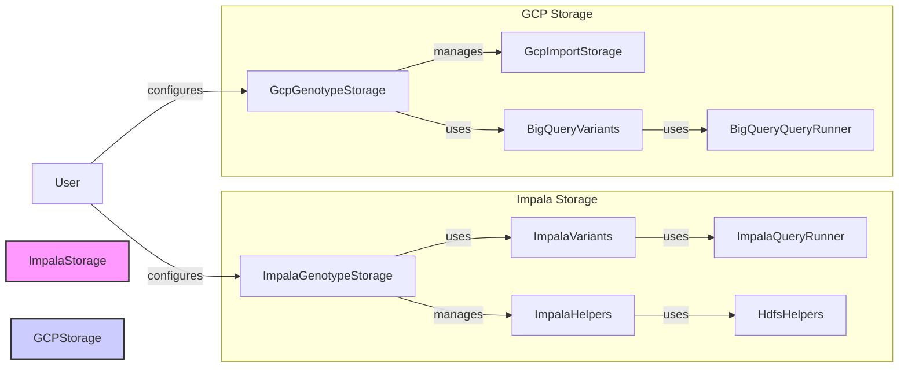

## Storage Component Overview

The `Storage` component is responsible for storing variant and pedigree data in a persistent storage solution. It supports different storage backends like Impala and Google Cloud Platform (GCP). The choice of backend depends on the specific deployment environment and data volume requirements.

Here's a high-level data flow diagram illustrating the interaction between the key components:



### Component Descriptions:

*   **ImpalaGenotypeStorage**: Manages the storage of genotype data in Impala. It handles the connection to Impala and HDFS, and manages the data import and query processes. It interacts with `ImpalaHelpers` and `HdfsHelpers` for data management and `ImpalaVariants` for querying.
    *   Relevant source files: `repos/gpf/impala_storage/impala_storage/schema1/impala_genotype_storage.py`

*   **ImpalaVariants**: Represents variants stored in Impala. It builds query runners for summary and family variants and fetches schema information. It uses `ImpalaQueryRunner` to execute queries and returns variant data.
    *   Relevant source files: `repos/gpf/impala_storage/impala_storage/schema1/impala_variants.py`

*   **ImpalaQueryRunner**: Executes queries against Impala. It manages the connection to Impala, executes queries, and retrieves results. It is used by `ImpalaVariants` to run queries and retrieve data.
    *   Relevant source files: `repos/gpf/impala_storage/impala_storage/helpers/impala_query_runner.py`

*   **ImpalaHelpers**: Provides helper functions for interacting with Impala, including importing data, building queries, and managing tables. It is used by `ImpalaGenotypeStorage` to manage data within Impala.
    *   Relevant source files: `repos/gpf/impala_storage/impala_storage/helpers/impala_helpers.py`

*   **HdfsHelpers**: Provides helper functions for interacting with HDFS, including creating directories, putting files, and checking file existence. It is used by `ImpalaHelpers` to manage files in HDFS during the import process.
    *   Relevant source files: `repos/gpf/impala_storage/impala_storage/helpers/hdfs_helpers.py`

*   **GcpGenotypeStorage**: Manages the storage of genotype data in Google Cloud Platform (GCP). It orchestrates the import of datasets into BigQuery and builds backends for querying the data. It interacts with `GcpImportStorage` for the import process and `BigQueryVariants`/`BigQueryQueryRunner` for querying.
    *   Relevant source files: `repos/gpf/gcp_storage/gcp_storage/gcp_genotype_storage.py`

*   **GcpImportStorage**: Handles importing datasets into GCP storage. It manages study configuration, generates import task graphs, and orchestrates the import process. It is triggered by `GcpGenotypeStorage` and uses BigQuery for data loading.
    *   Relevant source files: `repos/gpf/gcp_storage/gcp_storage/gcp_import_storage.py`

*   **BigQueryVariants**: Represents the variants stored in BigQuery. It handles the deserialization of summary and family variants retrieved from BigQuery. It is used by the query runners to convert the raw data into variant objects.
    *   Relevant source files: `repos/gpf/gcp_storage/gcp_storage/bigquery_variants.py`

*   **BigQueryQueryRunner**: Executes queries against BigQuery. It manages the query execution lifecycle, including finalization and result queuing. It interacts directly with BigQuery to run queries and provides results to `BigQueryVariants`.
    *   Relevant source files: `repos/gpf/gcp_storage/gcp_storage/bigquery_query_runner.py`

*   **User**: Represents the user configuring the storage. The user configures either `ImpalaGenotypeStorage` or `GcpGenotypeStorage` based on the desired storage backend.
```
