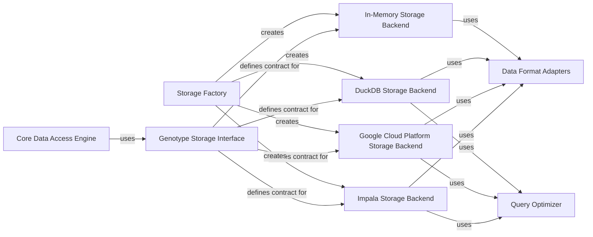

## Details

This architecture represents a flexible genomic data storage system with a pluggable backend design. The system follows the Strategy pattern, where the Genotype Storage Interface defines a common contract that multiple storage implementations fulfill. The Storage Factory creates appropriate backend instances based on configuration, allowing the system to work with different storage technologies (Impala, Google Cloud Platform, DuckDB, or in-memory storage) without changing the client code. Each backend leverages Data Format Adapters for data conversion and Query Optimizers for performance. The Core Data Access Engine serves as the main entry point for the application to interact with genomic data through the abstract interface.

### Genotype Storage Interface
Defines the core abstract interface that all storage implementations must follow, establishing a contract for genomic data operations.

**Related Classes/Methods**:

- `dae.genotype_storage.genotype_storage`

### Impala Storage Backend
Implementation of the storage interface for Apache Impala, optimized for distributed query processing on large genomic datasets.

**Related Classes/Methods**:

- `gpf.impala_storage.impala_storage`

### Google Cloud Platform Storage Backend
Implementation for Google Cloud Platform, leveraging BigQuery for genomic data storage and retrieval.

**Related Classes/Methods**:

- `gpf.gcp_storage.gcp_storage`

### DuckDB Storage Backend
Lightweight storage implementation using DuckDB, suitable for local development and smaller datasets.

**Related Classes/Methods**:

- `gpf.duckdb_storage.duckdb_genotype_storage`

### In-Memory Storage Backend
Implementation that keeps genomic data in memory, primarily used for testing and small-scale operations.

**Related Classes/Methods**:

- `dae.inmemory_storage.inmemory_genotype_storage`

### Storage Factory
Creates appropriate storage backend instances based on configuration.

**Related Classes/Methods**:

- `dae.genotype_storage`

### Data Format Adapters
Handles conversion between internal data representations and storage-specific formats.

**Related Classes/Methods**:

- `dae.genotype_storage.genotype_storage`

### Query Optimizer
Optimizes genomic data queries for specific storage backends.

**Related Classes/Methods**:

- `gpf.impala_storage.impala_storage`
- `gpf.gcp_storage.gcp_storage`

### Core Data Access Engine
Main component that interacts with the storage layer to access genomic data for the application.

**Related Classes/Methods**:

- `dae.genotype_storage`

### [FAQ](https://github.com/CodeBoarding/GeneratedOnBoardings/tree/main?tab=readme-ov-file#faq)