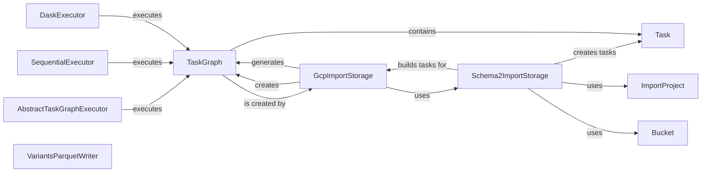

## Component Details

### TaskGraph
Represents a directed acyclic graph of tasks. It provides functionality to create and manage tasks, define dependencies between them, and execute them in a specific order. The TaskGraph orchestrates the execution of tasks by resolving dependencies and managing the overall workflow.
- **Related Classes/Methods**: `dae.task_graph.graph.TaskGraph`, `dae.task_graph.graph.TaskGraph.create_task`

### Task
Represents a single node within a TaskGraph, encapsulating the function to be executed, its arguments, dependencies on other tasks, and input files. Tasks are the fundamental units of work within the TaskGraph, and their execution is managed by the TaskGraph and its associated executors.
- **Related Classes/Methods**: `dae.task_graph.graph.Task`

### AbstractTaskGraphExecutor
Abstract base class for task graph executors. It provides common functionality for executing task graphs, including dependency resolution, task caching, and logging. Concrete executors, such as SequentialExecutor and DaskExecutor, inherit from this class and implement the actual task execution logic.
- **Related Classes/Methods**: `dae.task_graph.executor.AbstractTaskGraphExecutor`

### SequentialExecutor
A Task Graph Executor that executes tasks in sequential order. It is suitable for smaller task graphs or when debugging is required. It inherits from AbstractTaskGraphExecutor and provides a simple, single-threaded execution model.
- **Related Classes/Methods**: `dae.task_graph.executor.SequentialExecutor`

### DaskExecutor
Executes tasks in parallel using Dask to do the heavy lifting. It is suitable for large task graphs that require parallel processing. It inherits from AbstractTaskGraphExecutor and leverages Dask's distributed computing capabilities.
- **Related Classes/Methods**: `dae.task_graph.executor.DaskExecutor`

### GcpImportStorage
Handles importing data from Google Cloud Storage (GCS) into a format suitable for analysis within the Genotype and Phenotype Foundation (GPF). It orchestrates the creation of a task graph for the import process. It uses Schema2ImportStorage to build the tasks and generates a TaskGraph for execution.
- **Related Classes/Methods**: `gpf.gcp_storage.gcp_import_storage.GcpImportStorage`, `gpf.gcp_storage.gcp_import_storage.GcpImportStorage:generate_import_task_graph`

### Schema2ImportStorage
Abstract base class for storage implementations that use the schema2 data model. It provides common functionality for building tasks related to importing data based on a defined schema. It creates tasks for the TaskGraph based on the ImportProject and Bucket configurations.
- **Related Classes/Methods**: `dae.schema2_storage.schema2_import_storage.Schema2ImportStorage`, `dae.schema2_storage.schema2_import_storage.Schema2ImportStorage._build_all_parquet_tasks`

### ImportProject
Represents an import project, encapsulating the configuration and data sources required for importing data into GPF. It provides the necessary information for Schema2ImportStorage to build the import tasks.
- **Related Classes/Methods**: `dae.import_tools.import_tools.ImportProject`

### Bucket
Represents a bucket of variants to be processed during import. It contains information about the region and index of the variants. Schema2ImportStorage uses Bucket to partition the data and create tasks for each partition.
- **Related Classes/Methods**: `dae.import_tools.import_tools.Bucket`

### VariantsParquetWriter
Writes variants data to Parquet files, handling annotation and partitioning. It uses the PartitionDescriptor to determine how to partition the data and writes the data to Parquet files accordingly.
- **Related Classes/Methods**: `dae.parquet.schema2.parquet_io.VariantsParquetWriter`
