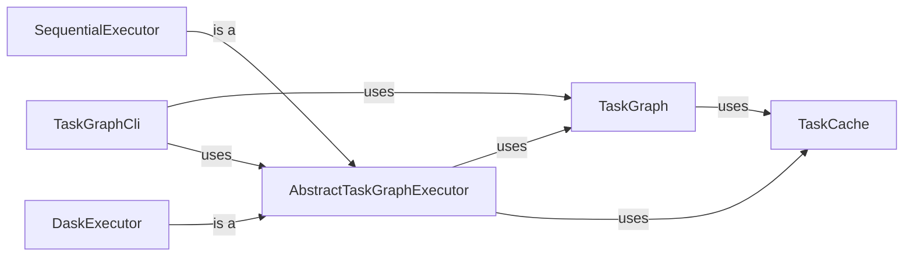

## Component Details

The Task Management component provides a framework for defining, scheduling, and executing complex tasks with dependencies. It uses a directed acyclic graph (DAG) to represent tasks and their relationships, allowing for efficient execution and caching of results. The system supports different execution backends, including sequential and distributed execution using Dask, making it suitable for a wide range of data processing pipelines.

### TaskGraph
Represents the directed acyclic graph of tasks. It provides methods to create tasks, define dependencies between them, and traverse the graph for execution. It holds the structure of the tasks and their relationships.
- **Related Classes/Methods**: `gpf.dae.dae.task_graph.graph.TaskGraph`

### TaskCache
Abstracts the caching mechanism for task results. It provides methods to load cached results and store new results. Different implementations like NoTaskCache and FileTaskCache provide different caching strategies.
- **Related Classes/Methods**: `gpf.dae.dae.task_graph.cache.TaskCache`, `gpf.dae.dae.task_graph.cache.NoTaskCache`, `gpf.dae.dae.task_graph.cache.FileTaskCache`

### AbstractTaskGraphExecutor
Abstract base class for task graph executors. It defines the interface for executing a task graph and handles dependency resolution and task submission. It provides common functionality for different executors.
- **Related Classes/Methods**: `gpf.dae.dae.task_graph.executor.AbstractTaskGraphExecutor`

### SequentialExecutor
Executes the task graph sequentially in a single process. It's a simple executor suitable for debugging and small-scale tasks.
- **Related Classes/Methods**: `gpf.dae.dae.task_graph.executor.SequentialExecutor`

### DaskExecutor
Executes the task graph using the Dask distributed computing framework. It allows for parallel execution of tasks on a cluster, enabling efficient processing of large datasets.
- **Related Classes/Methods**: `gpf.dae.dae.task_graph.executor.DaskExecutor`

### TaskGraphCli
Command-line interface for creating and processing task graphs. It provides tools for defining tasks, specifying dependencies, and running the graph with different executors.
- **Related Classes/Methods**: `gpf.dae.dae.task_graph.cli_tools.TaskGraphCli`
