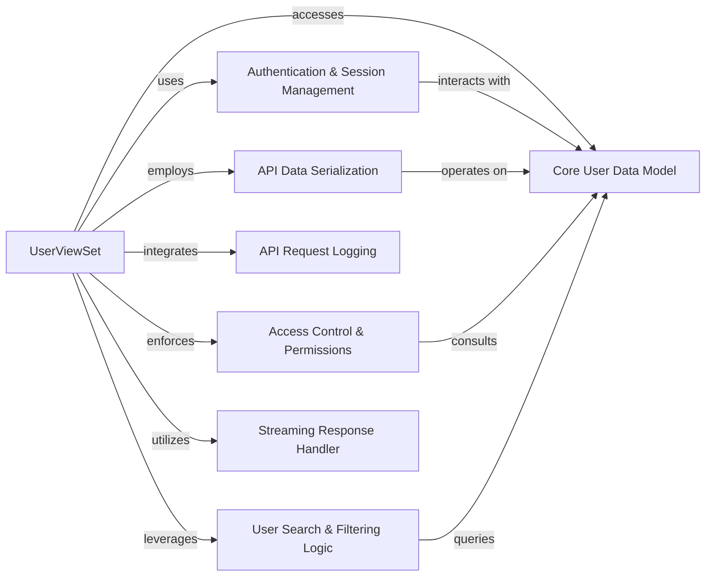

## Component Details

The UserViewSet is a central component within the gpf project, specifically designed to manage user-related API operations. It acts as the primary interface for interacting with user accounts, providing a comprehensive set of functionalities from basic CRUD (Create, Read, Update, Delete) operations to more advanced features like password resets and streaming search. Its design emphasizes security and administrative control, making it a critical part of the user management infrastructure.

### UserViewSet
This is the core API endpoint responsible for handling all HTTP requests related to user accounts. It orchestrates the flow of data and logic, delegating specific tasks to other components. It exposes methods for listing, creating, retrieving, updating, and deleting users, as well as specialized actions for password resets and streaming search.

**Related Classes/Methods**:

- <a href="https://github.com/iossifovlab/gpf/blob/master/wdae/wdae/users_api/views.py#L83-L203" target="_blank" rel="noopener noreferrer">`wdae.users_api.views.UserViewSet` (83:203)</a>

### Authentication & Session Management
This component is responsible for verifying the identity of users making API requests and managing their sessions or tokens. UserViewSet explicitly relies on this system (SessionAuthenticationWithoutCSRF, GPFOAuth2Authentication) to secure its endpoints, ensuring that only authenticated users can access protected resources.

**Related Classes/Methods**:

- `SessionAuthenticationWithoutCSRF` (1:1)
- `GPFOAuth2Authentication` (1:1)

### Core User Data Model
This fundamental component defines the structure and persistence of user-related data within the application. It represents the actual user accounts, including attributes like email, name, and group memberships. It also encapsulates methods for managing user state, such as reset_password() and deauthenticate().

**Related Classes/Methods**:

- `reset_password` (1:1)
- `deauthenticate` (1:1)

### API Data Serialization
This component handles the conversion of complex Python objects (like instances of the Core User Data Model) into simpler, transferable formats (e.g., JSON) for API responses, and vice-versa for incoming API requests. UserSerializer and UserWithoutEmailSerializer ensure data integrity and proper formatting during communication.

**Related Classes/Methods**:

- `UserSerializer` (1:1)
- `UserWithoutEmailSerializer` (1:1)

### Access Control & Permissions
This component enforces authorization policies, determining which users are allowed to perform specific actions on user resources. UserViewSet utilizes permissions.IsAdminUser to restrict most operations to administrative users, playing a critical role in maintaining the security and integrity of user data.

**Related Classes/Methods**:

- <a href="https://github.com/iossifovlab/gpf/blob/master/wdae/wdae/datasets_api/permissions.py#L1-L1" target="_blank" rel="noopener noreferrer">`permissions.IsAdminUser` (1:1)</a>

### API Request Logging
This component is responsible for capturing and recording details of API requests made to the UserViewSet. The @request_logging decorator ensures that each interaction is logged, which is crucial for monitoring, debugging, auditing, and understanding API usage patterns.

**Related Classes/Methods**:

- `request_logging` (1:1)

### User Search & Filtering Logic
This component provides the underlying mechanisms for efficiently searching and filtering user data. It leverages Django REST Framework's filters.SearchFilter and Django's Q objects to enable complex queries based on user attributes like email, name, and group names, particularly for the streaming_search functionality.

**Related Classes/Methods**:

- `filters.SearchFilter` (1:1)
- `Q` (1:1)

### Streaming Response Handler
This component is specialized in handling and delivering large datasets efficiently, particularly for the streaming_search endpoint. It uses StreamingHttpResponse and iterator_to_json to stream results, which helps in reducing memory consumption and improving responsiveness for large queries.

**Related Classes/Methods**:

- `StreamingHttpResponse` (1:1)
- `iterator_to_json` (1:1)

### [FAQ](https://github.com/CodeBoarding/GeneratedOnBoardings/tree/main?tab=readme-ov-file#faq)