## Variant Annotation Pipeline Overview

The Variant Annotation Pipeline annotates genetic variants with functional effects and other relevant information. It uses configurable annotation pipelines to integrate data from various sources. The pipeline relies on genomic resources like reference genomes and gene models to accurately predict the impact of variants.

```mermaid
graph LR
    A[Variant Data] -- Requires --> B(Reference Genome) 
    A -- Requires --> C(Gene Models)
    D(Annotation Pipeline) -- Uses --> B
    D -- Uses --> C
    D -- Applies --> A
    E(Effect Types Mixin) -- Manages --> D
    F(WDAE Configuration) -- Configures --> D
    G(Reannotation Tool) -- Reannotates --> A
    H(WDAE Run Command) -- Executes --> G













































































































































































































































































































































































































































































































































































































































































































































































































































































































































































































































































































































































































































































































































































































































































































































































































































































































































































































































































































































































































































































































































































































































































































































































































































































































































































































































































































































































































































































































































































































































































































































































































































































































































































































































































```

