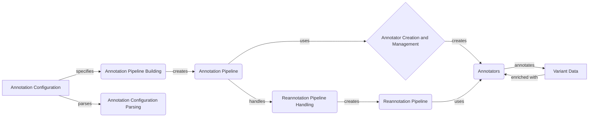

## Variant Annotation Pipeline Overview

This document provides an overview of the Variant Annotation Pipeline, a crucial component for annotating genetic variants with functional effects and other relevant information. The pipeline enriches variant data by integrating annotations from diverse sources, enabling a deeper understanding of the potential impact of genetic variations.

Given the complexity and the number of interacting components, a component flow diagram is the most suitable representation.

### Component Descriptions

*   **Annotation Configuration:** This component represents the configuration files (e.g., YAML) that define the structure and behavior of the annotation pipeline. It specifies the annotators to be used, their parameters, and the order in which they should be applied.

    *   **Purpose:** Defines the annotation pipeline.
    *   **Functionality:** Specifies annotators, parameters, and order.
    *   **Interaction:** Specifies the configuration for `Annotation Pipeline Building` and is parsed by `Annotation Configuration Parsing`.
    *   **Relevant source files:** N/A

*   **Annotation Pipeline Building:** This component is responsible for constructing the annotation pipeline based on the provided configuration. It parses the configuration, instantiates the necessary annotators, and arranges them in the correct order.

    *   **Purpose:** Builds the annotation pipeline from configuration.
    *   **Functionality:** Parses configurations, creates annotators, manages pipeline flow.
    *   **Interaction:** Receives configuration from `Annotation Configuration`, creates `Annotation Pipeline`, and uses `Annotator Creation and Management`.
    *   **Relevant source files:** `dae.annotation.annotation_factory.build_annotation_pipeline`, `dae.annotation.annotation_config.AnnotationConfigParser.parse_raw`, `dae.annotation.annotation_pipeline.AnnotationPipeline`, `dae.annotation.annotation_pipeline.AnnotationPipeline.add_annotator`, `dae.annotation.annotation_factory.load_pipeline_from_file`, `dae.annotation.annotation_factory.load_pipeline_from_yaml`

*   **Annotation Pipeline:** This component represents the core annotation pipeline, which consists of a sequence of annotators. It manages the flow of variant data through the annotators and aggregates the resulting annotations.

    *   **Purpose:** Manages the sequence of annotators and the flow of variant data.
    *   **Functionality:** Applies annotators to variant data, aggregates annotations.
    *   **Interaction:** Created by `Annotation Pipeline Building`, uses `Annotators`, and is handled by `Reannotation Pipeline Handling`.
    *   **Relevant source files:** `dae.annotation.annotation_pipeline.AnnotationPipeline`

*   **Annotator Creation and Management:** This component handles the creation and management of individual annotators. It uses a factory pattern to instantiate annotators based on their type and may decorate them with additional functionalities.

    *   **Purpose:** Creates and manages individual annotators.
    *   **Functionality:** Instantiates annotators, decorates annotators.
    *   **Interaction:** Used by `Annotation Pipeline Building` and `Reannotation Pipeline Handling` to create `Annotators`.
    *   **Relevant source files:** `dae.annotation.annotation_factory.get_annotator_factory`, `dae.annotation.annotation_pipeline.Annotator`, `dae.annotation.annotation_pipeline.InputAnnotableAnnotatorDecorator`, `dae.annotation.annotation_pipeline.ValueTransformAnnotatorDecorator`

*   **Annotators:** These are the individual annotation modules that perform specific annotation tasks. Examples include annotators for functional effects, conservation scores, and allele frequencies.

    *   **Purpose:** Performs specific annotation tasks.
    *   **Functionality:** Annotates variant data with functional effects, conservation scores, allele frequencies, etc.
    *   **Interaction:** Created and managed by `Annotator Creation and Management`, used by `Annotation Pipeline` and `Reannotation Pipeline` to annotate `Variant Data`.
    *   **Relevant source files:** `dae.annotation`, `dae.effect_annotation`, `repos.gpf.spliceai_annotator`, `repos.gpf.external_vep_annotator`

*   **Variant Data:** This component represents the input variant data that needs to be annotated. It could be in various formats, such as VCF or TSV.

    *   **Purpose:** Represents the input variant data.
    *   **Functionality:** Stores variant information.
    *   **Interaction:** Annotated by `Annotators`.
    *   **Relevant source files:** N/A

*   **Reannotation Pipeline Handling:** This component deals with creating pipelines for reannotation, which involves loading existing pipelines and creating new pipelines based on them. It supports both full and partial reannotation.

    *   **Purpose:** Creates pipelines for reannotation.
    *   **Functionality:** Loads existing pipelines, creates new pipelines based on existing ones, supports full and partial reannotation.
    *   **Interaction:** Uses `Annotator Creation and Management` and creates `Reannotation Pipeline`.
    *   **Relevant source files:** `dae.annotation.annotation_pipeline.ReannotationPipeline`, `dae.annotation.annotation_pipeline.FullReannotationPipeline`, `dae.annotation.annotation_factory.copy_annotation_pipeline`, `dae.annotation.annotation_factory.copy_reannotation_pipeline`

*   **Reannotation Pipeline:** This component represents a pipeline specifically designed for reannotating variant data. It may reuse existing annotators or incorporate new ones to update or refine previous annotations.

    *   **Purpose:** Manages the reannotation process.
    *   **Functionality:** Reuses or updates existing annotations, incorporates new annotators.
    *   **Interaction:** Created by `Reannotation Pipeline Handling` and uses `Annotators`.
    *   **Relevant source files:** `dae.annotation.annotation_pipeline.ReannotationPipeline`

*   **Annotation Configuration Parsing:** This component handles the parsing of annotation configurations, including attributes and parameters, from YAML or other formats. It also performs checks for unused parameters and repeated attributes.

    *   **Purpose:** Parses annotation configurations.
    *   **Functionality:** Parses YAML configurations, checks for unused parameters and repeated attributes.
    *   **Interaction:** Parses `Annotation Configuration`.
    *   **Relevant source files:** `dae.annotation.annotation_config.AnnotationConfigParser`, `dae.annotation.annotation_config.AnnotationConfigParser.parse_raw_attributes`, `dae.annotation.annotation_config.AnnotationConfigParser.parse_raw_attribute_config`, `dae.annotation.annotation_factory.check_for_unused_parameters`, `dae.annotation.annotation_factory.check_for_repeated_attributes_in_annotator`, `dae.annotation.annotation_factory.check_for_repeated_attributes_in_pipeline`, `dae.annotation.annotation_factory.resolve_repeated_attributes`