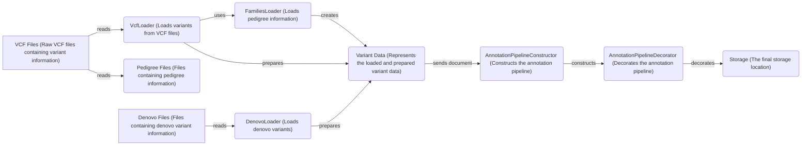

```mermaid
graph LR
    A["VCF Files (Raw VCF files containing variant information)"] -- reads --> B("VcfLoader (Loads variants from VCF files)") -- uses --> C("FamiliesLoader (Loads pedigree information)") -- creates --> D("Variant Data (Represents the loaded and prepared variant data)") 
    A["VCF Files (Raw VCF files containing variant information)"] -- reads --> E("Pedigree Files (Files containing pedigree information)")
    B("VcfLoader (Loads variants from VCF files)") -- prepares --> D("Variant Data (Represents the loaded and prepared variant data)")
    D("Variant Data (Represents the loaded and prepared variant data)") -- sends document --> F("AnnotationPipelineConstructor (Constructs the annotation pipeline)") -- constructs --> G("AnnotationPipelineDecorator (Decorates the annotation pipeline)") -- decorates --> H("Storage (The final storage location)")
    I["Denovo Files (Files containing denovo variant information)"] -- reads --> J("DenovoLoader (Loads denovo variants)") -- prepares --> D("Variant Data (Represents the loaded and prepared variant data)")


click A href "https://github.com/CodeBoarding/GeneratedOnBoardings/blob/main/gpf//Variant Loader.md"
click B href "https://github.com/CodeBoarding/GeneratedOnBoardings/blob/main/gpf//Variant Loader.md"
click C href "https://github.com/CodeBoarding/GeneratedOnBoardings/blob/main/gpf//Pedigree Loader.md"
click D href "https://github.com/CodeBoarding/GeneratedOnBoardings/blob/main/gpf//GPF Instance.md"
click E href "https://github.com/CodeBoarding/GeneratedOnBoardings/blob/main/gpf//Pedigree Loader.md"
click F href "https://github.com/CodeBoarding/GeneratedOnBoardings/blob/main/gpf//Annotation Pipeline.md"
click G href "https://github.com/CodeBoarding/GeneratedOnBoardings/blob/main/gpf//Annotation Pipeline.md"
click H href "https://github.com/CodeBoarding/GeneratedOnBoardings/blob/main/gpf//Storage.md"
click I href "https://github.com/CodeBoarding/GeneratedOnBoardings/blob/main/gpf//Variant Loader.md"
click J href "https://github.com/CodeBoarding/GeneratedOnBoardings/blob/main/gpf//Variant Loader.md"
```
