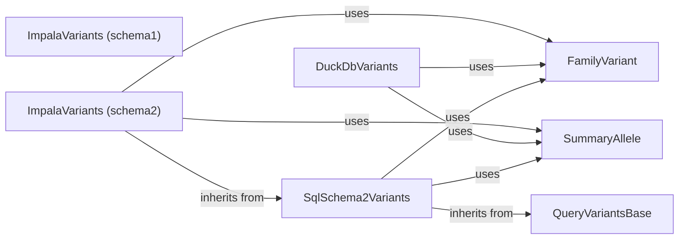

## Component Details

The Variant Querying and Retrieval component is responsible for fetching genomic variant data from various storage backends. It abstracts the underlying storage implementation, allowing users to query variants without needing to know the specifics of how the data is stored. The component supports different storage schemas and provides functionalities for querying both summary and family variants, transforming query parameters, building SQL queries, and deserializing variant data.

### QueryVariantsBase
Abstract base class defining the interface for querying variants. It provides common methods for deserializing summary and family variants and serves as a foundation for different variant querying implementations.
- **Related Classes/Methods**: `gpf.dae.dae.query_variants.base_query_variants.QueryVariantsBase`

### SqlSchema2Variants
A class for querying variants stored in a SQL database using schema version 2. It handles fetching schemas, building query runners, and querying variants from SQL-based storage backends. It uses FamilyVariant and SummaryAllele to represent the variants.
- **Related Classes/Methods**: `gpf.dae.dae.query_variants.sql.schema2.base_variants.SqlSchema2Variants`

### FamilyVariant
Represents a variant in the context of a family. It encapsulates family-specific information about the variant, such as the alleles present in each member of the family and the best state.
- **Related Classes/Methods**: `gpf.dae.dae.variants.family_variant.FamilyVariant`

### SummaryAllele
Represents a summary allele, providing access to details, effects, and frequency information for a single allele across all individuals in the dataset.
- **Related Classes/Methods**: `gpf.dae.dae.variants.variant.SummaryAllele`

### DuckDbVariants
A class for querying variants stored in a DuckDB database. It implements the variant querying interface for DuckDB, handling schema retrieval, pedigree information, and variant deserialization specific to DuckDB. It uses FamilyVariant and SummaryAllele to represent the variants.
- **Related Classes/Methods**: `gpf.dae.dae.duckdb_storage.duckdb_variants.DuckDbVariants`

### ImpalaVariants (schema1)
A class for querying variants stored in Impala using schema version 1. It provides the variant querying interface for Impala, building query runners and querying variants based on the schema version 1.
- **Related Classes/Methods**: `gpf.impala_storage.impala_storage.schema1.impala_variants.ImpalaVariants`

### ImpalaVariants (schema2)
A class for querying variants stored in Impala using schema version 2. It extends SqlSchema2Variants and implements the variant querying interface for Impala, handling schema retrieval, pedigree information, and variant deserialization specific to Impala schema version 2. It uses FamilyVariant and SummaryAllele to represent the variants.
- **Related Classes/Methods**: `gpf.impala2_storage.impala2_storage.schema2.impala_variants.ImpalaVariants`
