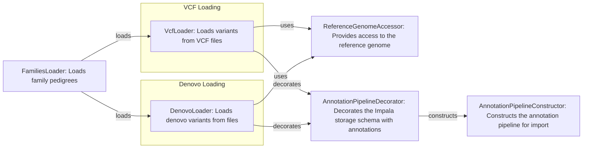

## Variants Loader Overview

The Variants Loader component is responsible for loading variant data from various file formats, such as VCF and DAE, and transforming it into a unified internal representation suitable for further processing and analysis. It handles pedigree information, genomic regions, and various parameters to control the loading process.

### Data Flow Diagram

### Component Descriptions

*   **FamiliesLoader**
    *Description*: Loads family pedigrees, representing the relationships between individuals in families and their affected status. It is crucial for variant filtering and analysis.
    *Interaction*: Provides family information to `VcfLoader` and `DenovoLoader`.
    *Source Files*: `dae.pedigrees.loader.FamiliesLoader`

*   **VcfLoader**
    *Description*: Loads variants from VCF files, transforming them into internal representation. It handles genotype data, variant positions, and INFO fields.
    *Interaction*: Uses `ReferenceGenomeAccessor` to access the reference genome and `AnnotationPipelineDecorator` to add annotations. Receives family information from `FamiliesLoader`.
    *Source Files*: `dae.variants_loaders.vcf.loader.VcfLoader`

*   **DenovoLoader**
    *Description*: Loads denovo variants, which are variants that appear spontaneously in offspring and are not present in either parent. These variants are important for studying genetic disorders.
    *Interaction*: Uses `ReferenceGenomeAccessor` to access the reference genome and `AnnotationPipelineDecorator` to add annotations. Receives family information from `FamiliesLoader`.
    *Source Files*: `dae.variants_loaders.dae.loader.DenovoLoader`

*   **ReferenceGenomeAccessor**
    *Description*: Provides access to the reference genome, allowing the loaders to map variant positions to specific locations on the chromosomes and retrieve reference alleles.
    *Interaction*: Used by `VcfLoader` and `DenovoLoader` to retrieve reference genome information.
    *Source Files*: `gpf_instance_2019.reference_genome`

*   **AnnotationPipelineDecorator**
    *Description*: Decorates the Impala storage schema with annotations, enriching the variant data with additional information from annotation databases.
    *Interaction*: Decorates the output of `VcfLoader` and `DenovoLoader` with annotations. Uses `AnnotationPipelineConstructor` to construct the annotation pipeline.
    *Source Files*: `impala_storage.schema1.annotation_decorator.AnnotationPipelineDecorator`

*   **AnnotationPipelineConstructor**
    *Description*: Constructs the annotation pipeline for import, defining the steps and resources used to annotate variants during the import process.
    *Interaction*: Used by `AnnotationPipelineDecorator` to construct the annotation pipeline.
    *Source Files*: `dae.import_tools.import_tools.construct_import_annotation_pipeline`