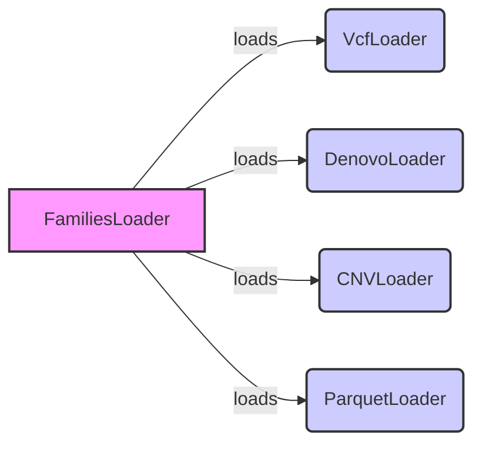

## Variants Loaders Component Overview

This component is responsible for loading variant data from various file formats into a unified internal representation. It handles parsing, validation, and transformation of raw data into a format suitable for querying and analysis.

### Data Flow Diagram

### Component Descriptions

#### FamiliesLoader

*   **Purpose:** Loads pedigree data from various formats. Responsible for parsing and validating family relationships.
*   **Functionality:** Reads pedigree information from a file, validates the data, and creates a `FamiliesData` object representing the family relationships.
*   **Interaction:** Provides family information to the variant loaders (VcfLoader, DenovoLoader, CNVLoader, ParquetLoader) to associate variants with specific families.
*   **Relevant source files:** `dae.pedigrees.loader.FamiliesLoader`

#### VcfLoader

*   **Purpose:** Loads variants data from VCF files. Handles parsing VCF format, extracting variant information, and transforming it into a unified representation.
*   **Functionality:** Parses VCF files, extracts variant information, and transforms it into a unified representation. It also handles pedigree information to associate variants with specific families.
*   **Interaction:** Uses `FamiliesLoader` to obtain family information. Outputs `SummaryVariant` and `FamilyVariant` objects.
*   **Relevant source files:** `dae.variants_loaders.vcf.loader.VcfLoader`

#### DenovoLoader

*   **Purpose:** Loads denovo variants data. Specifically designed for loading variants that arise de novo in individuals.
*   **Functionality:** Reads denovo variant data from a file, parses the data, and creates `SummaryVariant` and `FamilyVariant` objects representing the denovo variants.
*   **Interaction:** Uses `FamiliesLoader` to obtain family information. Outputs `SummaryVariant` and `FamilyVariant` objects.
*   **Relevant source files:** `dae.variants_loaders.dae.loader.DenovoLoader`

#### CNVLoader

*   **Purpose:** Loads copy number variants data. Deals with loading and processing data related to variations in the number of copies of specific DNA segments.
*   **Functionality:** Reads CNV data from a file, parses the data, and creates `SummaryVariant` and `FamilyVariant` objects representing the CNVs.
*   **Interaction:** Uses `FamiliesLoader` to obtain family information. Outputs `SummaryVariant` and `FamilyVariant` objects.
*   **Relevant source files:** `dae.variants_loaders.cnv.loader.CNVLoader`

#### ParquetLoader

*   **Purpose:** Loads variants data from Parquet files. Optimized for reading data stored in the Parquet columnar storage format.
*   **Functionality:** Reads variant data from Parquet files, deserializes the data, and creates `SummaryVariant` and `FamilyVariant` objects.
*   **Interaction:** Uses `FamiliesLoader` to obtain family information. Outputs `SummaryVariant` and `FamilyVariant` objects.
*   **Relevant source files:** `dae.variants_loaders.parquet.loader.ParquetLoader`