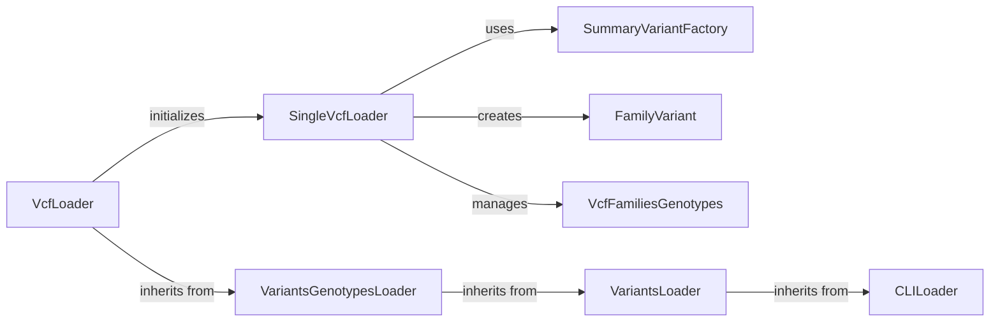

## Component Details

### VcfLoader
The VcfLoader class is responsible for loading variants data from VCF files. It orchestrates the loading process by initializing SingleVcfLoaders for individual files or batches of files, and handles file filtering and pedigree management. It inherits from VariantsGenotypesLoader, providing a specialized implementation for VCF files.
- **Related Classes/Methods**: `dae.variants_loaders.vcf.loader.VcfLoader`

### SingleVcfLoader
The SingleVcfLoader class handles the loading of variants from a single VCF file. It manages VCF readers, matches pedigree information to samples, iterates through variants in the file, and calculates allele frequencies. It uses SummaryVariantFactory to create summary variants and FamilyVariant to represent variants in the context of a family.
- **Related Classes/Methods**: `dae.variants_loaders.vcf.loader.SingleVcfLoader`

### VcfFamiliesGenotypes
The VcfFamiliesGenotypes class manages family genotypes for VCF variants. It collects genotypes for each family from the VCF records and provides an iterator for family genotypes. This class is used by SingleVcfLoader to organize and access genotype data for families.
- **Related Classes/Methods**: `dae.variants_loaders.vcf.loader.VcfFamiliesGenotypes`

### VariantsGenotypesLoader
The VariantsGenotypesLoader class provides the base functionality for loading variants and their genotypes. It handles argument parsing, region resetting, and calculation of genetic models and best states. It inherits from VariantsLoader and uses CLILoader for command-line argument parsing.
- **Related Classes/Methods**: `dae.variants_loaders.raw.loader.VariantsGenotypesLoader`

### VariantsLoader
The VariantsLoader class serves as a base class for variant loaders, providing common functionalities such as handling families data, filenames, genome, and attributes. It inherits from CLILoader and provides a foundation for more specialized loaders like VariantsGenotypesLoader.
- **Related Classes/Methods**: `dae.variants_loaders.raw.loader.VariantsLoader`

### CLILoader
The CLILoader class handles command-line interface argument parsing for variant loaders. It defines methods for adding arguments, building argument strings, and parsing arguments from the command line. This class is inherited by VariantsLoader and VariantsGenotypesLoader to manage command-line options.
- **Related Classes/Methods**: `dae.variants_loaders.raw.loader.CLILoader`

### SummaryVariantFactory
The SummaryVariantFactory class is responsible for creating summary variants from VCF records or other data sources. It encapsulates the logic for constructing summary variants, which represent the basic variant information without family-specific data. It is used by SingleVcfLoader.
- **Related Classes/Methods**: `dae.variants.variant.SummaryVariantFactory`

### FamilyVariant
The FamilyVariant class represents a variant in the context of a family, combining summary variant information with family-specific genotype data. It is created by SingleVcfLoader and encapsulates the complete variant information for a family.
- **Related Classes/Methods**: `dae.variants.family_variant.FamilyVariant`
