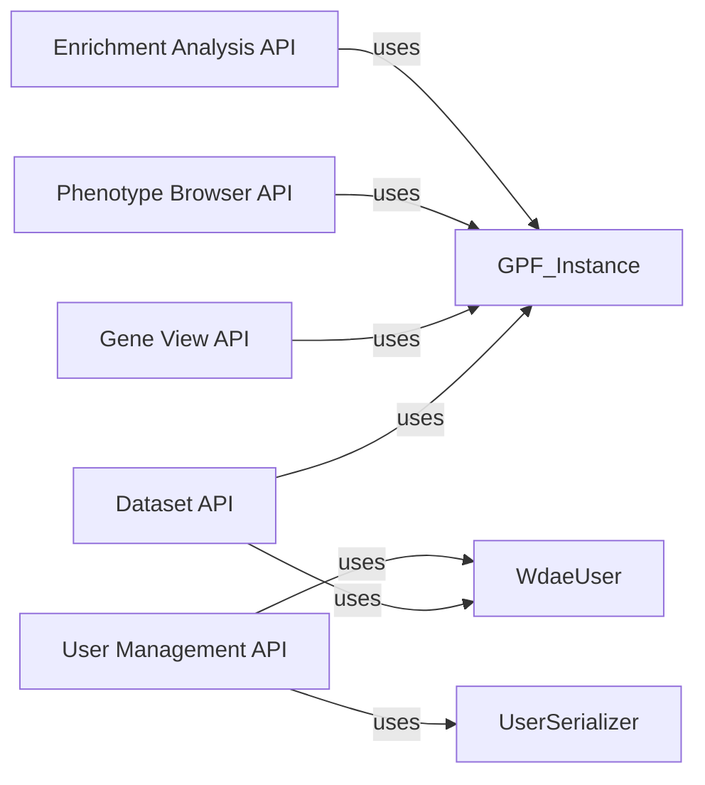

## Component Details

### Dataset API
Handles dataset-related requests, providing dataset summaries and configurations. It interacts with the GPF instance to retrieve dataset metadata and uses permission checks to ensure user access rights.
- **Related Classes/Methods**: `wdae.wdae.datasets_api.views.DatasetView`, `wdae.wdae.datasets_api.permissions.IsDatasetAllowed`

### User Management API
Manages user-related operations, including creating, retrieving, updating, and deleting users. It uses serializers to handle user data and interacts with the WdaeUser model for user information.
- **Related Classes/Methods**: `wdae.wdae.users_api.views.UserViewSet`, `wdae.wdae.users_api.models.WdaeUser`, `wdae.wdae.users_api.serializers.UserSerializer`

### Gene View API
Provides endpoints for gene view functionality, including retrieving configurations and querying variants. It interacts with the GPF instance to access gene-related data.
- **Related Classes/Methods**: `wdae.wdae.gene_view.views.ConfigView`, `wdae.wdae.gene_view.views.QueryVariantsView`

### Phenotype Browser API
Offers functionalities for the phenotype browser, such as retrieving configurations, measures, and measure values. It interacts with the GPF instance to access phenotype data.
- **Related Classes/Methods**: `wdae.wdae.pheno_browser_api.views.PhenoConfigView`, `wdae.wdae.pheno_browser_api.views.PhenoMeasuresView`, `wdae.wdae.pheno_browser_api.views.PhenoMeasureValues`

### Enrichment Analysis API
Provides endpoints for enrichment analysis, including retrieving models and performing enrichment tests. It interacts with the GPF instance and enrichment helper to conduct the analysis.
- **Related Classes/Methods**: `wdae.wdae.enrichment_api.views.EnrichmentModelsView`, `wdae.wdae.enrichment_api.views.EnrichmentTestView`
