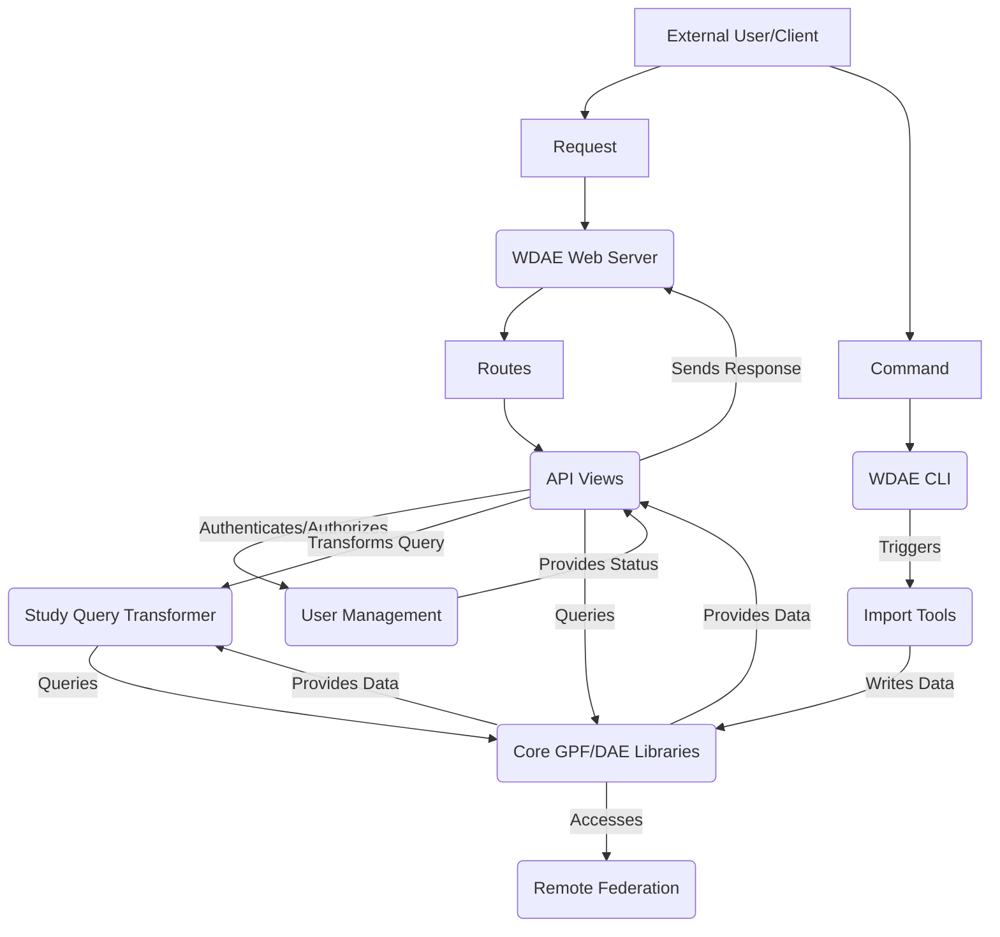

# WDAE Platform Overview

The WDAE Platform serves as the web application layer for the GPF ecosystem, providing a user interface, REST API, user management, and orchestrating interactions with the core GPF/DAE components. It acts as the bridge between external users/clients and the underlying genomic data and analysis capabilities.

## High-Level Data Flow Diagram

## Component Descriptions

**WDAE CLI**
*   **Description**: The command-line interface entry point for the WDAE Platform, used for starting the web server, running database migrations, and executing various management commands.
*   **Functionality**: Parses command-line arguments and invokes the appropriate platform initialization or execution logic.
*   **Interactions**: Initiates the **WDAE Web Server** process and can trigger the **Import Tools**.
*   **Relevant Files**: `repos.gpf.wdae.wdae.wdae.wgpf.cli`

**WDAE Web Server**
*   **Description**: The core web application component, built using Django and Django REST Framework, responsible for receiving incoming HTTP requests from external clients and routing them to the correct API endpoint handlers.
*   **Functionality**: Manages the web server lifecycle, handles request/response cycles, and applies middleware (e.g., authentication, permissions).
*   **Interactions**: Started by the **WDAE CLI**, receives requests from **External User/Client**, routes requests to **API Views**, and sends responses back to the client.
*   **Relevant Files**: `repos.gpf.wdae.wdae.wdae.wgpf`

**API Views**
*   **Description**: Implement the various REST API endpoints provided by the WDAE Platform, handling specific types of requests (e.g., user authentication, gene model lookup, study data queries).
*   **Functionality**: Process request data, interact with other WDAE components and the Core GPF/DAE Libraries to fulfill the request, and format the response data.
*   **Interactions**: Receive requests from the **WDAE Web Server**, interact with the **User Management Subsystem** for authentication and authorization, utilize the **Study Query Transformer** for complex study data queries, and directly call **Core GPF/DAE Libraries** for data access and analysis. They return responses to the **WDAE Web Server**.
*   **Relevant Files**: `repos.gpf.wdae.wdae.genomes_api.views`, `repos.gpf.wdae.wdae.users_api.views`

**User Management Subsystem**
*   **Description**: A comprehensive set of components responsible for managing user accounts, handling authentication (login/logout), authorization (permissions), user registration, password management, and storing user-specific state.
*   **Functionality**: Provides models for users and related data, implements authentication backends, handles password hashing and verification, manages user sessions, and provides API views and management commands for user administration.
*   **Interactions**: Provides authentication and authorization services to **API Views**.
*   **Relevant Files**: `repos.gpf.wdae.wdae.users_api`

**Study Query Transformer**
*   **Description**: Responsible for taking user-friendly query parameters received via the API and transforming them into the specific query structures and parameters required by the underlying Core GPF/DAE Libraries for filtering and retrieving study data.
*   **Functionality**: Parses and validates query parameters, maps web-based filters/options to GPF/DAE equivalents, and constructs the final query object or parameters.
*   **Interactions**: Used by **API Views** to prepare study data queries. Calls **Core GPF/DAE Libraries** during the transformation process to resolve references or validate parameters.
*   **Relevant Files**: `repos.gpf.wdae.wdae.studies.query_transformer.QueryTransformer`

**Remote Federation Integration**
*   **Description**: Enables the WDAE Platform to access and integrate data and functionalities from remote GPF instances, allowing users to query data distributed across multiple GPF deployments.
*   **Functionality**: Provides client implementations (e.g., REST clients) and adapter/wrapper classes to interact with remote GPF APIs and represent remote studies, gene sets, etc., within the local WDAE environment.
*   **Interactions**: Used by **Core GPF/DAE Libraries** when a requested resource (like a study) is located on a remote instance.
*   **Relevant Files**: `repos.gpf.federation.federation.remote`

**Import Tools**
*   **Description**: A set of command-line tools and underlying logic for importing new genomic and phenotypic datasets into the Core GPF/DAE Libraries, often involving complex data transformation and validation steps.
*   **Functionality**: Reads data from various sources, validates its format and content, transforms it into the internal GPF/DAE representation, and loads it into the data storage layer. Uses a task graph for managing import steps.
*   **Interactions**: Can be triggered by the **WDAE CLI** or potentially via API calls handled by **API Views**. Writes imported data into the **Core GPF/DAE Libraries**.
*   **Relevant Files**: `dae.import_tools.cli`
