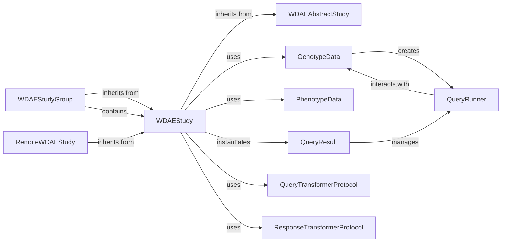

## Component Details

The WDAE system is built around a core abstraction, `WDAEStudy`, which provides a unified interface for interacting with genetic and phenotypic datasets. It supports various study types including individual studies (`WDAEStudy`), grouped studies (`WDAEStudyGroup`), and remote studies (`RemoteWDAEStudy`). Data access is managed through `GenotypeData` and `PhenotypeData`, with queries executed by `QueryRunner` and results aggregated by `QueryResult`. The system also employs `QueryTransformerProtocol` and `ResponseTransformerProtocol` for standardizing query input and output.

### WDAEAbstractStudy
This is the abstract base class that defines the common interface and foundational properties for all study wrappers in WDAE. It establishes the contract for how studies are configured, accessed, and queried, promoting consistency and reusability across different study implementations (local, grouped, or remote).

**Related Classes/Methods**:

- <a href="https://github.com/iossifovlab/gpf/blob/master/dae/dae/studies/study.py#L1-L1" target="_blank" rel="noopener noreferrer">`dae.studies.study.WDAEAbstractStudy` (1:1)</a>

### WDAEStudy
A concrete implementation of `WDAEAbstractStudy`, serving as a wrapper for individual genotype and phenotype datasets. It manages study configuration, initializes data sources (`GenotypeData`, `PhenotypeData`), and orchestrates variant queries by utilizing `QueryRunner` instances. It's the primary component for interacting with a single study.

**Related Classes/Methods**:

- <a href="https://github.com/iossifovlab/gpf/blob/master/dae/dae/studies/study.py#L1-L1" target="_blank" rel="noopener noreferrer">`dae.studies.study.WDAEStudy` (1:1)</a>

### WDAEStudyGroup
A specialized `WDAEStudy` that aggregates multiple `WDAEStudy` instances. It allows the WDAE application to treat a collection of studies as a single logical unit, delegating queries and operations to its constituent studies. This enables querying across multiple datasets seamlessly.

**Related Classes/Methods**:

- <a href="https://github.com/iossifovlab/gpf/blob/master/dae/dae/studies/study.py#L1-L1" target="_blank" rel="noopener noreferrer">`dae.studies.study.WDAEStudyGroup` (1:1)</a>

### RemoteWDAEStudy
An extension of `WDAEStudy` designed to interact with studies hosted on remote WDAE instances, typically through a federation service. It adapts the standard study interface to communicate with remote data sources, using a REST client and specific transformers for remote data.

**Related Classes/Methods**:

- <a href="https://github.com/iossifovlab/gpf/blob/master/federation/federation/remote_study.py#L1-L1" target="_blank" rel="noopener noreferrer">`federation.federation.remote_study.RemoteWDAEStudy` (1:1)</a>

### GenotypeData
An abstract component representing the source of raw genotype data. It defines the interface for accessing genetic variants and is responsible for creating `QueryRunner` instances tailored to its specific data storage mechanism (e.g., local files, Impala, DuckDB).

**Related Classes/Methods**:

- <a href="https://github.com/iossifovlab/gpf/blob/master/dae/dae/genotype_storage/genotype_storage.py#L1-L1" target="_blank" rel="noopener noreferrer">`dae.genotype_storage.genotype_storage.GenotypeData` (1:1)</a>

### PhenotypeData
An abstract component representing the source of raw phenotype data. It provides methods for retrieving phenotypic information associated with individuals within a study, allowing for phenotype-based filtering and analysis.

**Related Classes/Methods**:

- <a href="https://github.com/iossifovlab/gpf/blob/master/dae/dae/pheno/pheno_data.py#L239-L745" target="_blank" rel="noopener noreferrer">`dae.pheno.pheno_data.PhenotypeData` (239:745)</a>

### QueryRunner
An abstract concept or interface for executing a specific variant query against a single data source (e.g., a `GenotypeData` instance). Concrete implementations handle the specifics of querying different data backends (e.g., Impala, DuckDB, in-memory).

**Related Classes/Methods**:

- <a href="https://github.com/iossifovlab/gpf/blob/master/dae/dae/query_variants/query_runners.py#L14-L121" target="_blank" rel="noopener noreferrer">`dae.query_variants.query_runners.QueryRunner` (14:121)</a>

### QueryResult
A component responsible for managing and executing a collection of `QueryRunner` instances. It aggregates results from multiple runners, applies limits, and provides an iterable interface for consuming the combined variant data. This is particularly important for `WDAEStudyGroup` which combines results from multiple studies.

**Related Classes/Methods**:

- <a href="https://github.com/iossifovlab/gpf/blob/master/dae/dae/query_variants/query_runners.py#L124-L236" target="_blank" rel="noopener noreferrer">`dae.query_variants.query_runners.QueryResult` (124:236)</a>

### QueryTransformerProtocol
An interface that defines methods for transforming incoming query arguments into a standardized format suitable for the underlying data sources. This promotes flexibility in how queries are constructed and processed, allowing for different query syntaxes to be normalized.

**Related Classes/Methods**:

- <a href="https://github.com/iossifovlab/gpf/blob/master/wdae/wdae/studies/query_transformer.py#L1-L1" target="_blank" rel="noopener noreferrer">`wdae.wdae.studies.query_transformer.QueryTransformerProtocol` (1:1)</a>

### ResponseTransformerProtocol
An interface that defines methods for transforming raw variant query results into a structured, application-specific format for display or download. This ensures consistent output formatting across different study types and data sources.

**Related Classes/Methods**:

- <a href="https://github.com/iossifovlab/gpf/blob/master/wdae/wdae/studies/response_transformer.py#L1-L1" target="_blank" rel="noopener noreferrer">`wdae.wdae.studies.response_transformer.ResponseTransformerProtocol` (1:1)</a>

### [FAQ](https://github.com/CodeBoarding/GeneratedOnBoardings/tree/main?tab=readme-ov-file#faq)