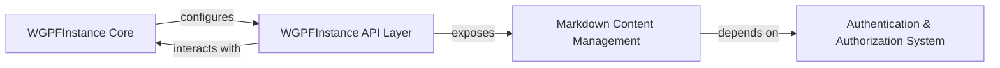

## Component Details

The `WGPFInstance` subsystem is designed to manage and expose the core functionalities and content of a Web Genomic Phenotype Federation (WGPF) instance. It provides an API for interacting with instance-specific information, including dynamic content like "About" or "Description" pages, while incorporating necessary security measures.

### WGPFInstance Core
This component represents the foundational logic and configuration for a Web Genomic Phenotype Federation (WGPF) instance. While its direct source code couldn't be retrieved as a single entity (suggesting it's a module rather than a class/function), its role as the central `gpf_instance` module indicates it orchestrates the instance's functionalities and manages its core data. It is the conceptual heart of the `WGPFInstance` subsystem.

**Related Classes/Methods**:

- <a href="https://github.com/iossifovlab/gpf/blob/master/wdae/wdae/gpf_instance/gpf_instance.py#L1-L1" target="_blank" rel="noopener noreferrer">`gpf.wdae.wdae.gpf_instance.gpf_instance` (1:1)</a>

### Markdown Content Management
This component is specifically responsible for handling the display and modification of markdown-formatted content, such as the application's "About" or "Description" pages. It provides API endpoints (`get` for retrieval and `post` for updates) and incorporates permission checks to ensure only authorized users (staff or when permissions are disabled) can make changes.

**Related Classes/Methods**:

- <a href="https://github.com/iossifovlab/gpf/blob/master/wdae/wdae/gpf_instance/views.py#L42-L100" target="_blank" rel="noopener noreferrer">`gpf.wdae.wdae.gpf_instance.views.MarkdownFileView` (42:100)</a>

### WGPFInstance API Layer
This component defines the external web API endpoints for the `WGPFInstance` subsystem. It acts as the interface through which external clients (e.g., a front-end application) interact with the WGPF instance, routing incoming requests to the appropriate internal components (like `Markdown Content Management`). It is composed of the URL routing definitions and the view classes that handle API requests.

**Related Classes/Methods**:

- <a href="https://github.com/iossifovlab/gpf/blob/master/wdae/wdae/gpf_instance/urls.py#L1-L1" target="_blank" rel="noopener noreferrer">`gpf.wdae.wdae.gpf_instance.urls` (1:1)</a>
- <a href="https://github.com/iossifovlab/gpf/blob/master/wdae/wdae/gpf_instance/views.py#L1-L1" target="_blank" rel="noopener noreferrer">`gpf.wdae.wdae.gpf_instance.views` (1:1)</a>

### Authentication & Authorization System
This is a cross-cutting concern responsible for verifying user identities and controlling access to protected resources and operations within the WGPF application. It provides mechanisms for checking user permissions (e.g., `is_staff`) and is crucial for maintaining data integrity and security by restricting sensitive actions to authorized users.

**Related Classes/Methods**: _None_

### [FAQ](https://github.com/CodeBoarding/GeneratedOnBoardings/tree/main?tab=readme-ov-file#faq)