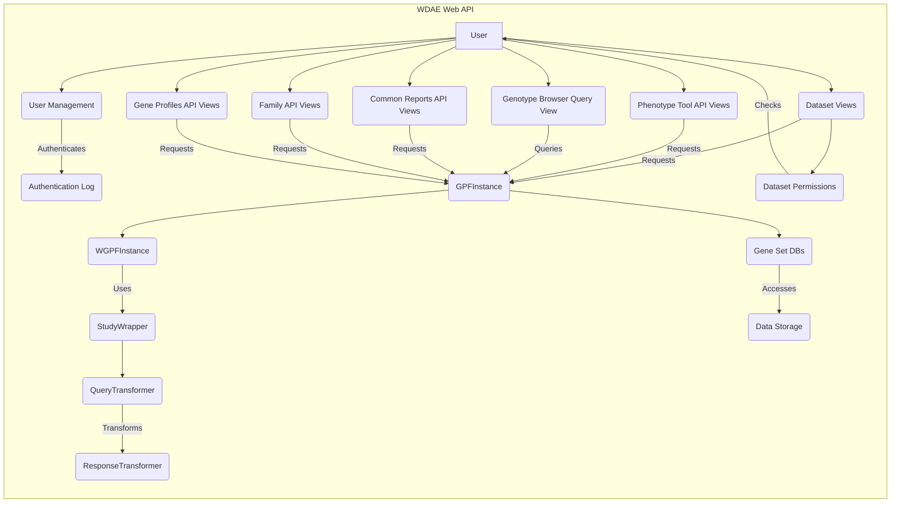

### Component Descriptions:

- **User Management**:
  - *Description*: Handles user authentication, authorization, and group management.
  - *Interaction*: Authenticates users and interacts with the Authentication Log.
  - *Relevant Source Files*: `repos.gpf.wdae.wdae.users_api`

- **Authentication Log**:
  - *Description*: Logs authentication attempts and manages user lockout.
  - *Interaction*: Receives authentication data from User Management.
  - *Relevant Source Files*: `repos.gpf.wdae.wdae.users_api.models.AuthenticationLog`

- **Dataset Views**:
  - *Description*: Handles requests for dataset information, including summaries, descriptions, and hierarchy.
  - *Interaction*: Receives requests from users and retrieves data from GPFInstance.
  - *Relevant Source Files*: `repos.gpf.wdae.wdae.datasets_api.views`

- **GPFInstance**:
  - *Description*: Represents the GPF instance and provides access to datasets, gene sets, and other resources.
  - *Interaction*: Provides data to Dataset Views, Phenotype Tool API Views, Genotype Browser Query View, Common Reports API Views, Family API Views and Gene Profiles API Views. Uses WGPFInstance.
  - *Relevant Source Files*: `dae.gpf_instance.gpf_instance.GPFInstance`, `gpf_instance.gpf_instance.GPFInstance`

- **WGPFInstance**:
  - *Description*: Represents the WDAE-specific GPF instance, extending the base GPFInstance with WDAE-related functionalities.
  - *Interaction*: Used by GPFInstance to access WDAE-specific data. Uses StudyWrapper.
  - *Relevant Source Files*: `gpf_instance.gpf_instance.WGPFInstance`

- **StudyWrapper**:
  - *Description*: Wraps a study and provides methods for querying variants and transforming data.
  - *Interaction*: Used by WGPFInstance to query variants. Uses QueryTransformer and ResponseTransformer.
  - *Relevant Source Files*: `studies.study_wrapper.StudyWrapper`, `studies.study_wrapper.StudyWrapperBase`

- **QueryTransformer**:
  - *Description*: Transforms query parameters for variant queries.
  - *Interaction*: Transforms queries for StudyWrapper.
  - *Relevant Source Files*: `studies.query_transformer.QueryTransformer`

- **ResponseTransformer**:
  - *Description*: Transforms the response data from variant queries.
  - *Interaction*: Transforms responses from StudyWrapper.
  - *Relevant Source Files*: `studies.response_transformer.ResponseTransformer`

- **Gene Set DBs**:
  - *Description*: Provides access to gene sets, including denovo and pre-defined gene sets.
  - *Interaction*: Accessed by GPFInstance to retrieve gene sets. Interacts with Data Storage.
  - *Relevant Source Files*: `dae.gene_sets.denovo_gene_sets_db.DenovoGeneSetsDb`, `dae.gene_sets.gene_sets_db.GeneSetsDb`

- **Phenotype Tool API Views**:
  - *Description*: Handles requests related to phenotype tool analysis.
  - *Interaction*: Receives requests from users and retrieves data from GPFInstance.
  - *Relevant Source Files*: `repos.gpf.wdae.wdae.pheno_tool_api.views`

- **Genotype Browser Query View**:
  - *Description*: Handles genotype browser queries.
  - *Interaction*: Receives queries from users and retrieves data from GPFInstance.
  - *Relevant Source Files*: `repos.gpf.wdae.wdae.genotype_browser.views`

- **Common Reports API Views**:
  - *Description*: Handles requests for common reports data.
  - *Interaction*: Receives requests from users and retrieves data from GPFInstance.
  - *Relevant Source Files*: `repos.gpf.wdae.wdae.common_reports_api.views`

- **Family API Views**:
  - *Description*: Handles requests for family-related data.
  - *Interaction*: Receives requests from users and retrieves data from GPFInstance.
  - *Relevant Source Files*: `repos.gpf.wdae.wdae.family_api.views`

- **Gene Profiles API Views**:
  - *Description*: Handles requests for gene profiles data.
  - *Interaction*: Receives requests from users and retrieves data from GPFInstance.
  - *Relevant Source Files*: `repos.gpf.wdae.wdae.gene_profiles_api.views`

- **Dataset Permissions**:
  - *Description*: Manages dataset permissions and access control.
  - *Interaction*: Checks user permissions against datasets. Interacts with User.
  - *Relevant Source Files*: `repos.gpf.wdae.wdae.datasets_api.permissions`

- **Data Storage**:
  - *Description*: Stores datasets, gene sets, and other resources.
  - *Interaction*: Provides data to Gene Set DBs.
  - *Relevant Source Files*: N/A (Represents the underlying data storage system)
