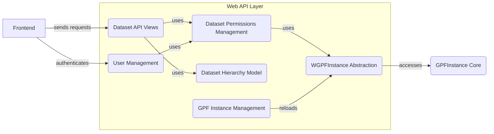

## Web API Layer Overview

The Web API Layer provides RESTful API endpoints for accessing data and functionalities within the Genotype and Phenotype in Families (GPF) project. It acts as the interface between the backend and the frontend, handling requests for datasets, gene views, and reports. This layer is crucial for exposing the data and functionalities of GPF to external applications and users.

### Data Flow Diagram

### Component Descriptions

#### 1. Dataset API Views

*   **Purpose:** Defines the API endpoints for accessing dataset information, including summaries, single dataset details, pedigree data, configurations, and descriptions.
*   **Functionality:** Handles incoming HTTP requests related to datasets, retrieves data from the underlying layers, and formats the data into appropriate responses.
*   **Interaction:**
    *   Receives requests from the Frontend.
    *   Uses Dataset Permissions Management to check user permissions.
    *   Uses Dataset Hierarchy Model to manage hierarchical relationships between datasets.
    *   Relies on WGPFInstance Abstraction to access the actual data.
*   **Relevant Source Files:** `wdae.datasets_api.views.DatasetView`

#### 2. Dataset Permissions Management

*   **Purpose:** Handles dataset-level permissions, including checking user permissions, retrieving allowed datasets, and managing dataset groups.
*   **Functionality:** Determines whether a user has access to a specific dataset based on their roles and group memberships.
*   **Interaction:**
    *   Used by Dataset API Views to authorize requests.
    *   Uses User Management to retrieve user information and group memberships.
    *   Uses WGPFInstance Abstraction to access dataset metadata.
*   **Relevant Source Files:** `wdae.datasets_api.permissions`

#### 3. WGPFInstance Abstraction

*   **Purpose:** Abstraction layer to access GPFInstance, providing a unified interface for accessing genotype and phenotype data, managing study wrappers, and handling permissions within the WDAE context.
*   **Functionality:** Provides a consistent way to interact with the GPFInstance, hiding the complexities of data access and management.
*   **Interaction:**
    *   Used by Dataset API Views and Dataset Permissions Management to access data.
    *   Accesses GPFInstance Core to retrieve genotype and phenotype data.
*   **Relevant Source Files:** `wdae.gpf_instance.gpf_instance`

#### 4. GPFInstance Core

*   **Purpose:** Core component for accessing and managing genotype and phenotype data. It handles loading data, retrieving datasets, and building configurations.
*   **Functionality:** Provides the fundamental data access and management capabilities for the GPF project.
*   **Interaction:**
    *   Accessed by WGPFInstance Abstraction to retrieve data.
*   **Relevant Source Files:** `dae.gpf_instance.gpf_instance`

#### 5. Dataset Hierarchy Model

*   **Purpose:** Manages the hierarchical relationships between datasets, including parent-child relationships and dataset properties.
*   **Functionality:** Stores and retrieves information about the dataset hierarchy, enabling the API to navigate and present datasets in a structured manner.
*   **Interaction:**
    *   Used by Dataset API Views to retrieve dataset hierarchy information.
*   **Relevant Source Files:** `wdae.datasets_api.models.DatasetHierarchy`

#### 6. User Management

*   **Purpose:** Handles user authentication, permissions, and password management.
*   **Functionality:** Provides the ability to create, manage, and authenticate users, as well as manage their permissions.
*   **Interaction:**
    *   Used by Dataset Permissions Management to retrieve user information.
    *   Interacts with the Frontend for user authentication and management.
*   **Relevant Source Files:** `wdae.users_api.models`

#### 7. GPF Instance Management

*   **Purpose:** Provides functions for accessing and managing GPF instances, including reloading datasets and updating permissions.
*   **Functionality:** Allows administrators to manage the GPF instance, such as reloading datasets and updating permissions.
*   **Interaction:**
    *   Reloads WGPFInstance when datasets are updated.
*   **Relevant Source Files:** `wdae.gpf_instance.gpf_instance`