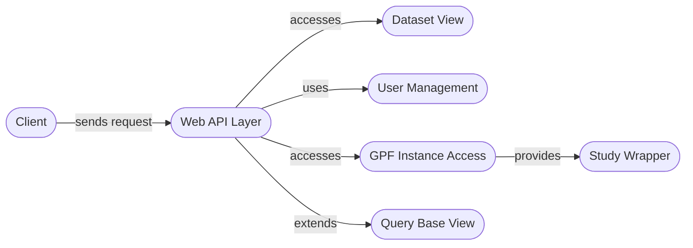

## Web API Layer Overview

The Web API layer serves as the entry point for external requests, providing RESTful endpoints to access data and functionalities within the system. It handles requests related to datasets, gene views, reports, and user management, orchestrating interactions between various backend components.

## Components

**1. Web API Layer (API)**

*   **Description:** The central component that exposes RESTful API endpoints. It receives requests from clients, routes them to the appropriate backend components, and returns responses.
*   **Functionality:** Handles request routing, authentication, authorization, and data serialization/deserialization.
*   **Interactions:**
    *   Receives requests from the Client.
    *   Accesses Dataset View, User Management, and GPF Instance Access components.
    *   Extends Query Base View for common query handling functionalities.
*   **Relevant Source Files:** `wdae`, `wdae.datasets_api`, `wdae.gene_view`, `wdae.genotype_browser`, `wdae.pheno_tool_api`, `wdae.gene_profiles_api`, `wdae.enrichment_api`, `wdae.genomes_api`, `wdae.family_api`, `wdae.measures_api`, `wdae.genomic_scores_api`, `wdae.users_api`

**2. Dataset View (DatasetView)**

*   **Description:** Handles requests for dataset information, including summaries and configurations.
*   **Functionality:** Retrieves dataset details from the GPF instance, augments them with access rights and group information.
*   **Interactions:**
    *   Accessed by the Web API Layer.
    *   Uses GPF Instance Access to retrieve dataset information.
*   **Relevant Source Files:** `wdae.datasets_api.views.DatasetView`, `wdae.datasets_api.views.DatasetPedigreeView`, `wdae.datasets_api.views.DatasetConfigView`, `wdae.datasets_api.views.DatasetDescriptionView`, `wdae.datasets_api.views.DatasetPermissionsView`, `wdae.datasets_api.views.DatasetPermissionsSingleView`, `wdae.datasets_api.views.DatasetHierarchyView`, `wdae.datasets_api.views.VisibleDatasetsView`

**3. User Management (UserManagement)**

*   **Description:** Manages user accounts, authentication, and permissions.
*   **Functionality:** Provides functionalities for creating, updating, and authenticating users, as well as managing their group memberships and permissions.
*   **Interactions:**
    *   Accessed by the Web API Layer for authentication and authorization.
*   **Relevant Source Files:** `wdae.users_api.models.WdaeUser`, `wdae.users_api.models.WdaeUserManager`, `wdae.users_api.models.BaseVerificationCode`, `wdae.users_api.models.SetPasswordCode`, `wdae.users_api.models.ResetPasswordCode`, `wdae.users_api.models.AuthenticationLog`

**4. GPF Instance Access (GPFInstance)**

*   **Description:** Provides access to the GPF instance, which manages datasets, configurations, and other resources.
*   **Functionality:** Offers methods for retrieving dataset wrappers, configurations, and available data IDs.
*   **Interactions:**
    *   Accessed by the Web API Layer and Dataset View.
    *   Provides Study Wrapper.
*   **Relevant Source Files:** `dae.gpf_instance.gpf_instance.GPFInstance`, `dae.gpf_instance.gpf_instance.WGPFInstance`, `dae.gpf_instance.gpf_instance.get_wgpf_instance`

**5. Study Wrapper (StudyWrapper)**

*   **Description:** Wraps study data (both genotype and phenotype) for easier access and management.
*   **Functionality:** Provides a unified interface for accessing study metadata, configurations, and data.
*   **Interactions:**
    *   Provided by GPF Instance Access.
*   **Relevant Source Files:** `studies.study_wrapper.StudyWrapper`, `studies.study_wrapper.WDAEStudy`

**6. Query Base View (QueryBase)**

*   **Description:** Base view for handling queries, providing common functionalities such as permission checks and request handling.
*   **Functionality:** Implements common query processing logic.
*   **Interactions:**
    *   Extended by the Web API Layer.
*   **Relevant Source Files:** `query_base.query_base.QueryBaseView`