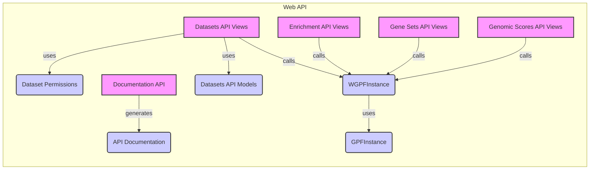

### Component Descriptions:

- **Datasets API Views**
  - *Description*: Handles requests for datasets, including listing, retrieving configurations, and managing permissions. It interacts with `Dataset Permissions` to enforce access control and `WGPFInstance` to fetch dataset information.
  - *Relevant source files*:
    - `wdae.datasets_api.views.DatasetView`
    - `wdae.datasets_api.views.DatasetPedigreeView`
    - `wdae.datasets_api.views.DatasetConfigView`
    - `wdae.datasets_api.views.DatasetDescriptionView`
    - `wdae.datasets_api.views.DatasetPermissionsView`
    - `wdae.datasets_api.views.DatasetPermissionsSingleView`
    - `wdae.datasets_api.views.DatasetHierarchyView`
    - `wdae.datasets_api.views.VisibleDatasetsView`

- **Dataset Permissions**
  - *Description*: Manages dataset permissions and access control, ensuring that users only access authorized datasets. It is used by `Datasets API Views` to validate user access.
  - *Relevant source files*:
    - `repos.gpf.wdae.wdae.datasets_api.permissions.IsDatasetAllowed`
    - `repos.gpf.wdae.wdae.datasets_api.permissions.user_has_permission`
    - `repos.gpf.wdae.wdae.datasets_api.permissions.get_allowed_genotype_studies`
    - `repos.gpf.wdae.wdae.datasets_api.permissions.get_dataset_info`

- **WGPFInstance**
  - *Description*: Represents a WDAE GPF instance, providing access to datasets and configurations. It is called by various API views to retrieve data and interacts with `GPFInstance` for core GPF functionality.
  - *Relevant source files*:
    - `repos.gpf.wdae.wdae.gpf_instance.gpf_instance.WGPFInstance`
    - `dae.gpf_instance.gpf_instance.GPFInstance`
    - `studies.study_wrapper.StudyWrapper`
    - `repos.gpf.wdae.wdae.gpf_instance.gpf_instance.WGPFInstance.make_wdae_wrapper`
    - `repos.gpf.wdae.wdae.gpf_instance.gpf_instance.WGPFInstance.get_wdae_wrapper`
    - `repos.gpf.wdae.wdae.gpf_instance.gpf_instance.WGPFInstance.get_available_data_ids`
    - `repos.gpf.wdae.wdae.gpf_instance.gpf_instance.WGPFInstance.get_visible_datasets`
    - `repos.gpf.wdae.wdae.gpf_instance.gpf_instance.WGPFInstance.prepare_gp_configuration`

- **Enrichment API Views**
  - *Description*: Handles enrichment analysis requests, calling `WGPFInstance` to access data and perform enrichment calculations.
  - *Relevant source files*:
    - `repos.gpf.wdae.wdae.enrichment_api.views.EnrichmentModelsView`
    - `repos.gpf.wdae.wdae.enrichment_api.views.EnrichmentTestView`
    - `dae.enrichment_tool.enrichment_helper.EnrichmentHelper`
    - `dae.gpf_instance.gpf_instance.GPFInstance.get_enrichment_builder`

- **Gene Sets API Views**
  - *Description*: Handles gene sets requests, calling `WGPFInstance` to retrieve gene set information.
  - *Relevant source files*:
    - `repos.gpf.wdae.wdae.gene_sets.views.GeneSetsView`
    - `repos.gpf.wdae.wdae.gene_sets.views.GeneSetDownloadView`
    - `dae.gene_sets.denovo_gene_sets_db.DenovoGeneSetsDb`
    - `dae.gene_sets.gene_sets_db.GeneSetsDb`

- **Genomic Scores API Views**
  - *Description*: Handles genomic scores requests, calling `WGPFInstance` to access genomic scores data.
  - *Relevant source files*:
    - `repos.gpf.wdae.wdae.genomic_scores_api.views.GenomicScoresView`
    - `repos.gpf.wdae.wdae.genomic_scores_api.views.GenomicScoreDescsView`
    - `dae.genomic_scores.scores.GenomicScoresRegistry`

- **Documentation API**
  - *Description*: Generates API documentation, providing information about available endpoints and data structures.
  - *Relevant source files*:
    - `repos.gpf.wdae.wdae.docs.api_docs_generator`

- **Datasets API Models**
  - *Description*: Models for representing datasets and their hierarchy.
  - *Relevant source files*:
    - `datasets_api.models.Dataset`
    - `datasets_api.models.DatasetHierarchy`

- **GPFInstance**
  - *Description*: Represents a GPF instance, providing access to genotype and phenotype data. It is used by `WGPFInstance` for core GPF functionality.
  - *Relevant source files*:
    - `dae.gpf_instance.gpf_instance.GPFInstance`
    - `dae.gpf_instance.gpf_instance.GPFInstance.get_genotype_data`
    - `dae.gpf_instance.gpf_instance.GPFInstance.get_phenotype_data`
    - `dae.gpf_instance.gpf_instance.GPFInstance.get_gp_configuration`
