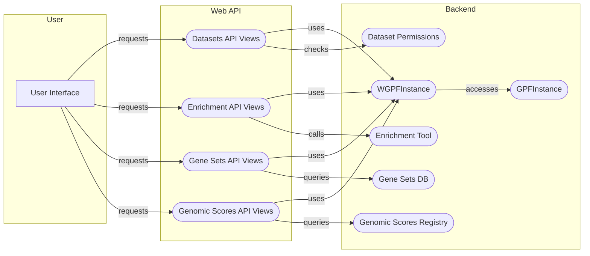

## Web API Component Overview

The Web API component serves as the entry point for accessing and querying data, generating reports, and managing users within the WDAE system. It exposes a set of RESTful API endpoints that facilitate communication between the frontend and the backend. The API leverages Django REST Framework for building the views and serializers.

### Component Descriptions:

*   **User Interface (UI):** The frontend application that interacts with the Web API to display data, generate reports, and manage users.
    *   Interaction: Sends requests to the Datasets API, Enrichment API, Gene Sets API, and Genomic Scores API.

*   **Datasets API Views (DA):** Handles requests related to datasets, including listing datasets, retrieving dataset configurations, pedigree data, descriptions, and permissions.
    *   Purpose: Provides endpoints for accessing dataset information and managing dataset permissions.
    *   Interaction: Uses `WGPFInstance` to retrieve dataset information and interacts with `Dataset Permissions` to check user access rights.
    *   Relevant source files: `wdae.datasets_api.views.DatasetView`, `wdae.datasets_api.views.DatasetConfigView`, `wdae.datasets_api.views.DatasetHierarchyView`

*   **Enrichment API Views (EA):** Handles requests for enrichment analysis, allowing users to perform enrichment tests and retrieve enrichment models.
    *   Purpose: Provides endpoints for performing enrichment analysis.
    *   Interaction: Uses `WGPFInstance` to access genotype data and calls the `Enrichment Tool` to perform the analysis.
    *   Relevant source files: `wdae.enrichment_api.views.EnrichmentTestView`

*   **Gene Sets API Views (GS):** Handles requests for gene sets, enabling users to retrieve and download gene sets.
    *   Purpose: Provides endpoints for accessing and downloading gene sets.
    *   Interaction: Uses `WGPFInstance` to access gene set databases and queries the `Gene Sets DB` to retrieve gene sets.
    *   Relevant source files: `wdae.gene_sets.views.GeneSetsView`

*   **Genomic Scores API Views (GSA):** Handles requests for genomic scores, providing access to genomic scores and their descriptions.
    *   Purpose: Provides endpoints for accessing genomic scores.
    *   Interaction: Uses `WGPFInstance` to access the `Genomic Scores Registry` and queries it to retrieve genomic scores and their descriptions.
    *   Relevant source files: `wdae.genomic_scores_api.views.GenomicScoresView`

*   **WGPFInstance (W):** Represents a WDAE GPF instance, handling datasets and configurations.
    *   Purpose: Provides access to datasets and configurations.
    *   Interaction: Accessed by the Datasets API, Enrichment API, Gene Sets API, and Genomic Scores API to retrieve data and configurations. It accesses `GPFInstance` to get core GPF functionalities.
    *   Relevant source files: `wdae.gpf_instance.gpf_instance.WGPFInstance`

*   **GPFInstance (GP):** Represents a GPF instance, providing access to genotype and phenotype data.
    *   Purpose: Provides access to genotype and phenotype data.
    *   Interaction: Accessed by `WGPFInstance` to retrieve genotype and phenotype data.
    *   Relevant source files: `dae.gpf_instance.gpf_instance.GPFInstance`

*   **Dataset Permissions (DP):** Handles dataset permissions and access control.
    *   Purpose: Determines which datasets a user can access.
    *   Interaction: Used by the Datasets API to check user access rights.
    *   Relevant source files: `wdae.datasets_api.permissions`

*   **Enrichment Tool (EnT):** Performs enrichment analysis.
    *   Purpose: Conducts enrichment tests based on user requests.
    *   Interaction: Called by the Enrichment API to perform enrichment analysis.
    *   Relevant source files: `dae.enrichment_tool.enrichment_helper.EnrichmentHelper`

*   **Gene Sets DB (GnS):** Stores and manages gene sets.
    *   Purpose: Provides access to gene sets.
    *   Interaction: Queried by the Gene Sets API to retrieve gene sets.
    *   Relevant source files: `dae.gene_sets.gene_sets_db.GeneSetsDb`

*   **Genomic Scores Registry (GSc):** Stores and manages genomic scores.
    *   Purpose: Provides access to genomic scores and their descriptions.
    *   Interaction: Queried by the Genomic Scores API to retrieve genomic scores and their descriptions.
    *   Relevant source files: `dae.genomic_scores.scores.GenomicScoresRegistry`