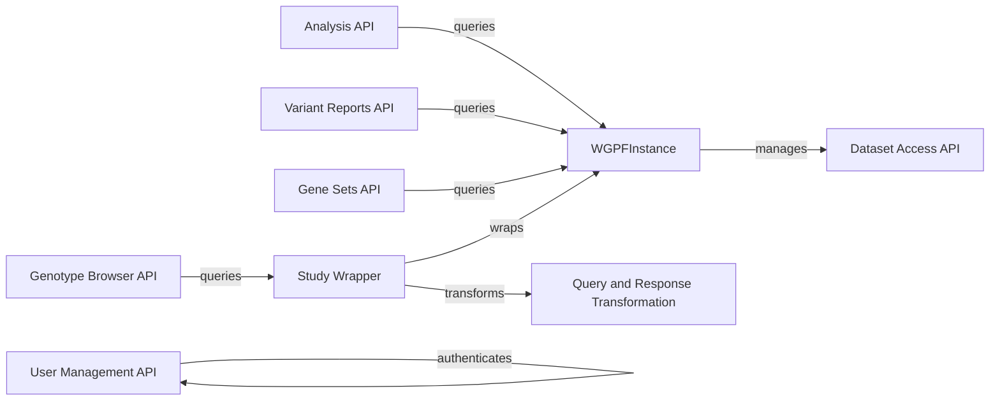

## Component Details

The Web API component provides a user-friendly interface for accessing and visualizing genomic data within the GPF/WDAE ecosystem. It handles user authentication and authorization, manages datasets, facilitates variant queries, enables gene set exploration, and supports enrichment analysis. The API acts as the entry point for users to interact with the underlying genomic data and analysis tools, providing a comprehensive platform for genomic research and exploration.

### WGPFInstance
The WGPFInstance component represents a WDAE GPF instance, serving as a central point for managing configuration and access to datasets. It handles permissions and data wrappers, providing a unified interface for accessing genomic data within the WDAE system. It is responsible for building and managing the available datasets and their configurations.
- **Related Classes/Methods**: `gpf.wdae.wdae.gpf_instance.gpf_instance.WGPFInstance.__init__`, `gpf.wdae.wdae.gpf_instance.gpf_instance.WGPFInstance.build`, `gpf.wdae.wdae.gpf_instance.gpf_instance.WGPFInstance.make_wdae_wrapper`, `gpf.wdae.wdae.gpf_instance.gpf_instance.WGPFInstance.get_wdae_wrapper`, `gpf.wdae.wdae.gpf_instance.gpf_instance.WGPFInstance.get_available_data_ids`, `gpf.wdae.wdae.gpf_instance.gpf_instance.WGPFInstance.get_visible_datasets`, `gpf.wdae.wdae.gpf_instance.gpf_instance.WGPFInstance.get_wdae_gp_configuration`, `gpf.wdae.wdae.gpf_instance.gpf_instance.WGPFInstance.prepare_gp_configuration`

### Dataset Access API
This component encompasses the DatasetView and IsDatasetAllowed components. It manages requests for dataset information, including summaries and details, while enforcing access control through the IsDatasetAllowed permission class. This ensures that users only access datasets they have permission to view, maintaining data security and privacy.
- **Related Classes/Methods**: `gpf.wdae.wdae.datasets_api.views.DatasetView:_collect_datasets_summary`, `gpf.wdae.wdae.datasets_api.views.DatasetView:_collect_single_dataset`, `gpf.wdae.wdae.datasets_api.views.DatasetView.get`, `gpf.wdae.wdae.datasets_api.permissions.IsDatasetAllowed.has_permission`, `gpf.wdae.wdae.datasets_api.permissions.IsDatasetAllowed.has_object_permission`, `gpf.wdae.wdae.datasets_api.permissions.IsDatasetAllowed.permitted_datasets`

### Analysis API
This component includes EnrichmentTestView and PhenoToolView. It handles requests for enrichment analysis and pheno tool analysis, respectively. It takes parameters, performs the analysis using the underlying GPF instance, and returns the results to the user. These views provide access to statistical and phenotypic analyses of genomic data.
- **Related Classes/Methods**: `gpf.wdae.wdae.enrichment_api.views.EnrichmentTestView.__init__`, `gpf.wdae.wdae.enrichment_api.views.EnrichmentTestView.enrichment_description`, `gpf.wdae.wdae.enrichment_api.views.EnrichmentTestView.post`, `gpf.wdae.wdae.pheno_tool_api.views.PhenoToolView.post`

### Variant Reports API
The VariantReportsView component provides access to variant reports, which summarize the variants found in a dataset. It retrieves and formats the reports for display, providing users with an overview of variant characteristics. This component allows users to quickly assess the variant landscape of a dataset.
- **Related Classes/Methods**: `gpf.wdae.wdae.common_reports_api.views.VariantReportsView.get`, `gpf.wdae.wdae.common_reports_api.views.VariantReportsFullView.get`

### Gene Sets API
The GeneSetsView component provides access to gene sets, allowing users to retrieve and download gene sets for further analysis. It interacts with the underlying GPF instance to retrieve gene set information. This component enables users to explore and utilize predefined or custom gene sets in their analyses.
- **Related Classes/Methods**: `gpf.wdae.wdae.gene_sets.views.GeneSetsView.post`, `gpf.wdae.wdae.gene_sets.views.GeneSetDownloadView.post`, `gpf.wdae.wdae.gene_sets.views.GeneSetDownloadView._build_response`, `gpf.wdae.wdae.gene_sets.views.GeneSetDownloadView.get`, `gpf.wdae.wdae.gene_sets.views.GeneSetsHasDenovoView.get`

### Genotype Browser API
The GenotypeBrowserQueryView component handles genotype browser queries, allowing users to search for variants based on specific criteria. It transforms the user query and interacts with the StudyWrapper to retrieve variant data. This component provides a powerful interface for exploring and filtering variants within a dataset.
- **Related Classes/Methods**: `gpf.wdae.wdae.genotype_browser.views.GenotypeBrowserQueryView.post`

### User Management API
This component encompasses the UserViewSet and WdaeLoginView components. It manages user accounts, including creation, retrieval, update, and deletion, as well as handling password resets and user authentication. The WdaeLoginView handles user login requests, authenticating users against the UserViewSet and establishing sessions. This component provides a comprehensive user management and authentication system.
- **Related Classes/Methods**: `gpf.wdae.wdae.users_api.views.UserViewSet.list`, `gpf.wdae.wdae.users_api.views.UserViewSet.create`, `gpf.wdae.wdae.users_api.views.UserViewSet.retrieve`, `gpf.wdae.wdae.users_api.views.UserViewSet.update`, `gpf.wdae.wdae.users_api.views.UserViewSet.partial_update`, `gpf.wdae.wdae.users_api.views.UserViewSet.destroy`, `gpf.wdae.wdae.users_api.views.UserViewSet.streaming_search`, `gpf.wdae.wdae.users_api.views.UserViewSet.password_reset`, `gpf.wdae.wdae.users_api.views.WdaeLoginView.get`, `gpf.wdae.wdae.users_api.views.WdaeLoginView.post`

### Query and Response Transformation
This component includes QueryTransformer and ResponseTransformer. The QueryTransformer transforms user queries into a format suitable for the underlying data storage, while the ResponseTransformer transforms the raw data from the data storage into a format suitable for the API response. These components ensure that user queries are correctly translated and that the data is presented in a user-friendly and informative manner.
- **Related Classes/Methods**: `gpf.wdae.wdae.studies.query_transformer.QueryTransformer.__init__`, `gpf.wdae.wdae.studies.query_transformer.QueryTransformer._transform_filters_to_ids`, `gpf.wdae.wdae.studies.query_transformer.QueryTransformer._transform_filters_to_ids_beta`, `gpf.wdae.wdae.studies.query_transformer.QueryTransformer._handle_person_set_collection`, `gpf.wdae.wdae.studies.query_transformer.QueryTransformer.transform_kwargs`, `gpf.wdae.wdae.studies.response_transformer.ResponseTransformer.__init__`, `gpf.wdae.wdae.studies.response_transformer.ResponseTransformer._get_all_pheno_values`, `gpf.wdae.wdae.studies.response_transformer.ResponseTransformer._get_gene_scores_values`, `gpf.wdae.wdae.studies.response_transformer.ResponseTransformer._get_wdae_member`, `gpf.wdae.wdae.studies.response_transformer.ResponseTransformer._generate_pedigree`, `gpf.wdae.wdae.studies.response_transformer.ResponseTransformer._add_additional_columns_summary`, `gpf.wdae.wdae.studies.response_transformer.ResponseTransformer.build_variant_row`, `gpf.wdae.wdae.studies.response_transformer.ResponseTransformer._gene_view_summary_download_variants_iterator`, `gpf.wdae.wdae.studies.response_transformer.ResponseTransformer.transform_gene_view_summary_variant`, `gpf.wdae.wdae.studies.response_transformer.ResponseTransformer.transform_gene_view_summary_variant_download`, `gpf.wdae.wdae.studies.response_transformer.ResponseTransformer.variant_transformer`, `gpf.wdae.wdae.studies.response_transformer.ResponseTransformer.transform_summary_variants`

### Study Wrapper
The StudyWrapper component wraps a study and provides a consistent interface for querying variants and accessing study metadata. It acts as an intermediary between the API and the underlying data storage, simplifying data access and management. It transforms requests, queries variants, and provides access to gene view summary variants.
- **Related Classes/Methods**: `gpf.wdae.wdae.studies.study_wrapper.StudyWrapper.__init__`, `gpf.wdae.wdae.studies.study_wrapper.StudyWrapper._init_wdae_config`, `gpf.wdae.wdae.studies.study_wrapper.StudyWrapper.transform_request`, `gpf.wdae.wdae.studies.study_wrapper.StudyWrapper.query_variants_wdae_streaming`, `gpf.wdae.wdae.studies.study_wrapper.StudyWrapper.get_gene_view_summary_variants`, `gpf.wdae.wdae.studies.study_wrapper.StudyWrapper.get_gene_view_summary_variants_download`
