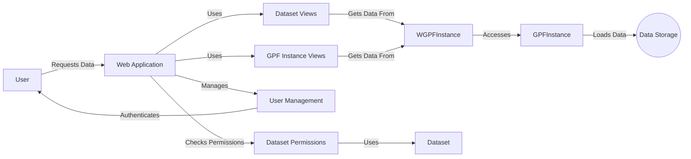

## Web Application Overview

The Web Application component provides the user interface for interacting with the data and functionalities exposed by the GPF instance. It handles user requests, retrieves data, and presents it in a user-friendly manner. The application exposes API endpoints for accessing datasets and GPF instance information.

Here's a data flow diagram illustrating the interactions between the key components:



### Component Descriptions:

*   **User:** Interacts with the system through the Web Application.

*   **Web Application:** The main entry point for user interactions. It receives requests, routes them to appropriate views, and returns responses. It uses Dataset Views and GPF Instance Views to handle specific requests. It manages user authentication through User Management and checks dataset permissions via Dataset Permissions.
    *   Relevant source files: `wdae.wdae`, `wdae.wdae.datasets_api.views`, `wdae.wdae.gpf_instance.views`

*   **Dataset Views:** Provides specific views for accessing and displaying dataset information. It retrieves data from the WGPFInstance and formats it for presentation to the user.
    *   Relevant source files: `wdae.wdae.datasets_api.views`

*   **GPF Instance Views:** Provides views for accessing GPF instance-related information, such as version and descriptions. It retrieves data from the WGPFInstance.
    *   Relevant source files: `wdae.wdae.gpf_instance.views`

*   **WGPFInstance:** Manages the GPF instance within WDAE. It provides access to genotype and phenotype data, study wrappers, and GP configurations. It extends the base GPFInstance.
    *   Relevant source files: `wdae.wdae.gpf_instance.gpf_instance`

*   **GPFInstance:** Core GPF instance from DAE. It handles genotype and phenotype data loading and management. It provides methods for accessing and retrieving data, configurations, and transcript models. It loads data from Data Storage.
    *   Relevant source files: `dae.gpf_instance.gpf_instance`

*   **Data Storage:** Stores the genotype and phenotype data used by the GPF instance.

*   **User Management:** Manages user accounts, groups, and permissions within WDAE. It handles authentication and authorization for accessing WDAE resources.
    *   Relevant source files: `wdae.wdae.users_api.models`, `wdae.wdae.users_api.serializers`

*   **Dataset Permissions:** Handles dataset permissions and access control within WDAE. It determines user access based on dataset permissions and interacts with the Dataset component to retrieve permission information.
    *   Relevant source files: `datasets_api.permissions`

*   **Dataset:** Represents a dataset and its hierarchy within WDAE. It manages permissions, metadata, and relationships between datasets.
    *   Relevant source files: `datasets_api.models`
```
