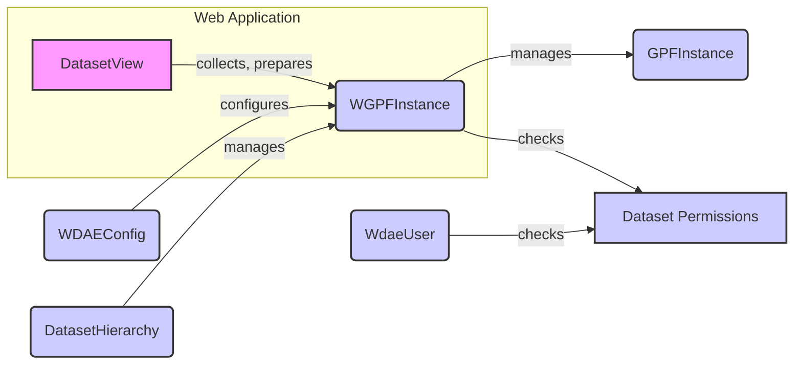

```mermaid
graph LR
    subgraph Web Application
        A[DatasetView] -- "collects, prepares" --> B(WGPFInstance)
        style A fill:#f9f,stroke:#333,stroke-width:2px
    end
    B -- "manages" --> C(GPFInstance)
    B -- "checks" --> D["Dataset Permissions"]
    E(WdaeUser) -- "checks" --> D
    F(WDAEConfig) -- "configures" --> B
    G(DatasetHierarchy) -- "manages" --> B

    style B fill:#ccf,stroke:#333,stroke-width:2px
    style C fill:#ccf,stroke:#333,stroke-width:2px
    style D fill:#ccf,stroke:#333,stroke-width:2px
    style E fill:#ccf,stroke:#333,stroke-width:2px
    style F fill:#ccf,stroke:#333,stroke-width:2px
    style G fill:#ccf,stroke:#333,stroke-width:2px


```