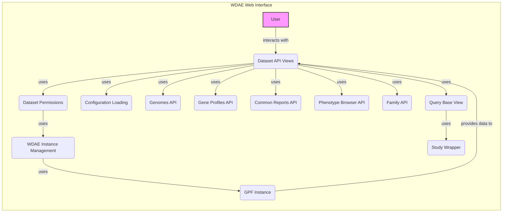

### Component Descriptions:

**1. User**
   - *Description*: Represents the end-user interacting with the WDAE web interface.
   - *Interaction*: Interacts with the Dataset API Views to request and receive data.
   - *Relevant source files*: N/A

**2. Dataset API Views**
   - *Description*: Provides API endpoints for accessing dataset information, including summaries, configurations, descriptions, and hierarchies. It serves as the interface between the web application and the dataset information stored within the GPF instance.
   - *Interaction*: Receives requests from the User, uses Dataset Permissions to check access, retrieves data from GPF Instance, and returns the data to the User. It also uses other APIs like Genomes API, Gene Profiles API, Common Reports API, Phenotype Browser API and Family API to provide comprehensive data.
   - *Relevant source files*: `repos.gpf.wdae.wdae.datasets_api.views.DatasetView`, `repos.gpf.wdae.wdae.datasets_api.views.DatasetConfigView`, `repos.gpf.wdae.wdae.datasets_api.views.DatasetDescriptionView`, `repos.gpf.wdae.wdae.datasets_api.views.DatasetHierarchyView`, `repos.gpf.wdae.wdae.datasets_api.views.VisibleDatasetsView`

**3. Dataset Permissions**
   - *Description*: Manages dataset permissions, including checking user permissions, retrieving allowed datasets, and handling dataset hierarchies. It ensures that users only have access to the datasets they are authorized to view and analyze.
   - *Interaction*: Used by Dataset API Views to verify user access to datasets. It uses WDAE Instance Management to retrieve dataset configurations and user permissions.
   - *Relevant source files*: `datasets_api.permissions.IsDatasetAllowed`, `datasets_api.permissions.user_has_permission`, `datasets_api.permissions.get_allowed_genotype_studies`, `datasets_api.permissions.get_directly_allowed_genotype_data`

**4. WDAE Instance Management**
   - *Description*: Handles the creation, retrieval, and management of the WDAE GPF instance, extending the base GPF instance with WDAE-specific functionalities. It configures and manages the GPF instance for use within the WDAE web application.
   - *Interaction*: Used by Dataset Permissions to access dataset configurations and user permissions. It uses GPF Instance to retrieve and manage the core GPF instance.
   - *Relevant source files*: `gpf_instance.gpf_instance.get_wgpf_instance`, `repos.gpf.wdae.wdae.gpf_instance.gpf_instance.WGPFInstance`

**5. GPF Instance**
   - *Description*: Represents the core GPF instance, providing access to genotype and phenotype data, configurations, and transcript models. It is the central data repository and analysis engine for the WDAE system.
   - *Interaction*: Provides data to Dataset API Views and is managed by WDAE Instance Management.
   - *Relevant source files*: `dae.gpf_instance.gpf_instance.GPFInstance`

**6. Configuration Loading**
   - *Description*: Loads and prepares the WDAE configuration, including extensions and GP configurations. It ensures that the system is properly configured with the necessary parameters and settings.
   - *Interaction*: Used by Dataset API Views to load configurations.
   - *Relevant source files*: `repos.gpf.wdae.wdae.gpf_instance.apps.WDAEConfig`

**7. Genomes API**
   - *Description*: Provides API endpoints for accessing gene models and related genomic information. It allows users to retrieve information about genes, transcripts, and other genomic features.
   - *Interaction*: Used by Dataset API Views to provide genomic information.
   - *Relevant source files*: `repos.gpf.wdae.wdae.genomes_api.views.GeneModels`

**8. Gene Profiles API**
   - *Description*: Provides API endpoints for accessing gene profile configurations and data. It allows users to explore gene-specific information and identify potential disease-causing genes.
   - *Interaction*: Used by Dataset API Views to provide gene profile information.
   - *Relevant source files*: `repos.gpf.wdae.wdae.gene_profiles_api.views.ConfigurationView`, `repos.gpf.wdae.wdae.gene_profiles_api.views.ProfileView`

**9. Common Reports API**
   - *Description*: Provides API endpoints for downloading family counters and data. It allows users to generate reports on family-level data, providing insights into the prevalence of different genetic variants.
   - *Interaction*: Used by Dataset API Views to provide common reports data.
   - *Relevant source files*: `repos.gpf.wdae.wdae.common_reports_api.views.FamilyCounterDownloadView`, `repos.gpf.wdae.wdae.common_reports_api.views.FamiliesDataDownloadView`

**10. Phenotype Browser API**
   - *Description*: Provides API endpoints for accessing phenotype data and configurations. It allows users to explore phenotype data and identify correlations between genetic variants and phenotypic traits.
   - *Interaction*: Used by Dataset API Views to provide phenotype data.
   - *Relevant source files*: `repos.gpf.wdae.wdae.pheno_browser_api.views.PhenoConfigView`, `repos.gpf.wdae.wdae.pheno_browser_api.views.PhenoInstrumentsView`, `repos.gpf.wdae.wdae.pheno_browser_api.views.PhenoMeasuresView`

**11. Family API**
   - *Description*: Provides API endpoints for accessing family and member details. It allows users to retrieve information about families and their members, including their genotypes and phenotypes.
   - *Interaction*: Used by Dataset API Views to provide family data.
   - *Relevant source files*: `repos.gpf.wdae.wdae.family_api.views.ListFamiliesView`, `repos.gpf.wdae.wdae.family_api.views.FamilyDetailsView`

**12. Query Base View**
   - *Description*: Base view for handling queries, including permission checks and dataset retrieval. It provides a common framework for handling API requests and ensuring that users have the necessary permissions to access the requested data.
   - *Interaction*: Used by Dataset API Views to handle queries.
   - *Relevant source files*: `repos.gpf.wdae.wdae.query_base.query_base.QueryBaseView`

**13. Study Wrapper**
   - *Description*: Wraps study data for WDAE, providing access to genotype and phenotype information. It adapts the study data to the WDAE environment, providing a consistent interface for accessing study-related information.
   - *Interaction*: Used by Query Base View to access study data.
   - *Relevant source files*: `studies.study_wrapper.StudyWrapper`, `studies.study_wrapper.WDAEStudy`
