```mermaid
graph LR
    WGPFInstance["WGPFInstance"]
    GPFInstance["GPFInstance"]
    WDAEStudy["WDAEStudy"]
    DatasetView["DatasetView"]
    UserViewSet["UserViewSet"]
    GenotypeBrowserQueryView["GenotypeBrowserQueryView"]
    Permissions["Permissions"]
    Logger["Logger"]
    GenotypeData["GenotypeData"]
    PhenotypeData["PhenotypeData"]
    WGPFInstance -- "extends" --> GPFInstance
    WGPFInstance -- "manages" --> WDAEStudy
    GPFInstance -- "provides data to" --> WGPFInstance
    GPFInstance -- "manages" --> GenotypeData
    WDAEStudy -- "wrapped by" --> WGPFInstance
    WDAEStudy -- "wraps" --> GenotypeData
    DatasetView -- "depends on" --> WGPFInstance
    DatasetView -- "uses" --> Permissions
    UserViewSet -- "uses" --> Permissions
    UserViewSet -- "uses" --> Logger
    GenotypeBrowserQueryView -- "depends on" --> WGPFInstance
    GenotypeBrowserQueryView -- "uses" --> WDAEStudy
    Permissions -- "enforced by" --> DatasetView
    Permissions -- "enforced by" --> GenotypeBrowserQueryView
    Logger -- "used by" --> WGPFInstance
    Logger -- "used by" --> UserViewSet
    GenotypeData -- "accessed by" --> GPFInstance
    GenotypeData -- "wrapped by" --> WDAEStudy
    PhenotypeData -- "accessed by" --> GPFInstance
    PhenotypeData -- "wrapped by" --> WDAEStudy
    click WGPFInstance href "https://github.com/CodeBoarding/GeneratedOnBoardings/blob/main//gpf/WGPFInstance.md" "Details"
    click GPFInstance href "https://github.com/CodeBoarding/GeneratedOnBoardings/blob/main//gpf/GPFInstance.md" "Details"
    click WDAEStudy href "https://github.com/CodeBoarding/GeneratedOnBoardings/blob/main//gpf/WDAEStudy.md" "Details"
    click DatasetView href "https://github.com/CodeBoarding/GeneratedOnBoardings/blob/main//gpf/DatasetView.md" "Details"
    click UserViewSet href "https://github.com/CodeBoarding/GeneratedOnBoardings/blob/main//gpf/UserViewSet.md" "Details"
    click GenotypeBrowserQueryView href "https://github.com/CodeBoarding/GeneratedOnBoardings/blob/main//gpf/GenotypeBrowserQueryView.md" "Details"
    click Permissions href "https://github.com/CodeBoarding/GeneratedOnBoardings/blob/main//gpf/Permissions.md" "Details"
    click GenotypeData href "https://github.com/CodeBoarding/GeneratedOnBoardings/blob/main//gpf/GenotypeData.md" "Details"
    click PhenotypeData href "https://github.com/CodeBoarding/GeneratedOnBoardings/blob/main//gpf/PhenotypeData.md" "Details"
```

## Component Details

This subsystem provides the web-based user interface and API endpoints for interacting with the GPF system. It is responsible for managing user authentication, authorization, user groups, and dataset-level permissions, ensuring secure and controlled access to data and functionalities.

### WGPFInstance
The central orchestrator for the WDAE web application, extending the core `GPFInstance`. It manages web-specific configurations, initializes and caches `WDAEStudy` wrappers for datasets, and prepares gene profile configurations for the UI, including person set statistics. It acts as the primary entry point for accessing GPF data within the web context.

**Related Classes/Methods**:

- <a href="https://github.com/iossifovlab/gpf/blob/master/wdae/wdae/gpf_instance/gpf_instance.py#L0-L0" target="_blank" rel="noopener noreferrer">`gpf/wdae/wdae/gpf_instance/gpf_instance.py` (0:0)</a>

### GPFInstance
The foundational GPF instance that manages core GPF configurations, genotype data, and phenotype data. It provides fundamental methods for accessing and building the GPF environment, which `WGPFInstance` extends and utilizes. It is crucial as the source of all underlying GPF data.

**Related Classes/Methods**:

- `core_gpf_module.py` (0:0)

### WDAEStudy
A web-specific wrapper class for individual studies or study groups, encapsulating `GenotypeData` and `PhenotypeData`. It provides methods to build web-friendly configurations, retrieve column sources, and execute variant queries, often caching phenotype values for performance. It bridges the gap between raw GPF data and the web UI's requirements.

**Related Classes/Methods**:

- `wdae_study_wrapper_module.py` (0:0)

### DatasetView
Handles API requests related to datasets. It provides endpoints for retrieving summaries of all available datasets and detailed configurations for specific datasets. It applies user permissions and group-based augmentations to ensure secure and controlled access to dataset metadata.

**Related Classes/Methods**:

- <a href="https://github.com/iossifovlab/gpf/blob/master/wdae/wdae/datasets_api/views.py#L0-L0" target="_blank" rel="noopener noreferrer">`gpf/wdae/wdae/datasets_api/views.py` (0:0)</a>

### UserViewSet
Manages user-related API operations, including listing, creating, retrieving, updating, and deleting user accounts. It also provides functionalities for password resets and streaming search for users. It enforces administrative permissions for most operations, making it central to user management.

**Related Classes/Methods**:

- <a href="https://github.com/iossifovlab/gpf/blob/master/wdae/wdae/users_api/views.py#L0-L0" target="_blank" rel="noopener noreferrer">`gpf/wdae/wdae/users_api/views.py` (0:0)</a>

### GenotypeBrowserQueryView
Processes complex genotype browsing queries from the web interface. It parses query parameters, validates user permissions for the requested dataset, expands gene sets and symbols, and dispatches queries to the underlying `WDAEStudy` wrappers for variant data retrieval. It supports both previewing and downloading variant data.

**Related Classes/Methods**:

- <a href="https://github.com/iossifovlab/gpf/blob/master/wdae/wdae/genotype_browser/views.py#L0-L0" target="_blank" rel="noopener noreferrer">`gpf/wdae/wdae/genotype_browser/views.py` (0:0)</a>

### Permissions
This component is responsible for enforcing access control and filtering data based on user permissions for datasets and other resources within the web application. It is critical for maintaining data security and user-specific data visibility.

**Related Classes/Methods**:

- `common_permissions_module.py` (0:0)

### Logger
A utility component responsible for logging API request information, operational messages, and errors throughout the web application. It is essential for monitoring, debugging, and auditing system behavior.

**Related Classes/Methods**:

- `common_logger_module.py` (0:0)

### GenotypeData
Represents the raw genotype data for a study or dataset, providing the underlying data structures and methods for variant retrieval and analysis. It is the direct source of genetic information.

**Related Classes/Methods**:

- `core_gpf_data_module.py` (0:0)

### PhenotypeData
Represents the raw phenotype data associated with a study or dataset, offering access to phenotypic information for individuals. It complements genotype data by providing clinical and demographic context.

**Related Classes/Methods**:

- `core_gpf_data_module.py` (0:0)

### [FAQ](https://github.com/CodeBoarding/GeneratedOnBoardings/tree/main?tab=readme-ov-file#faq)