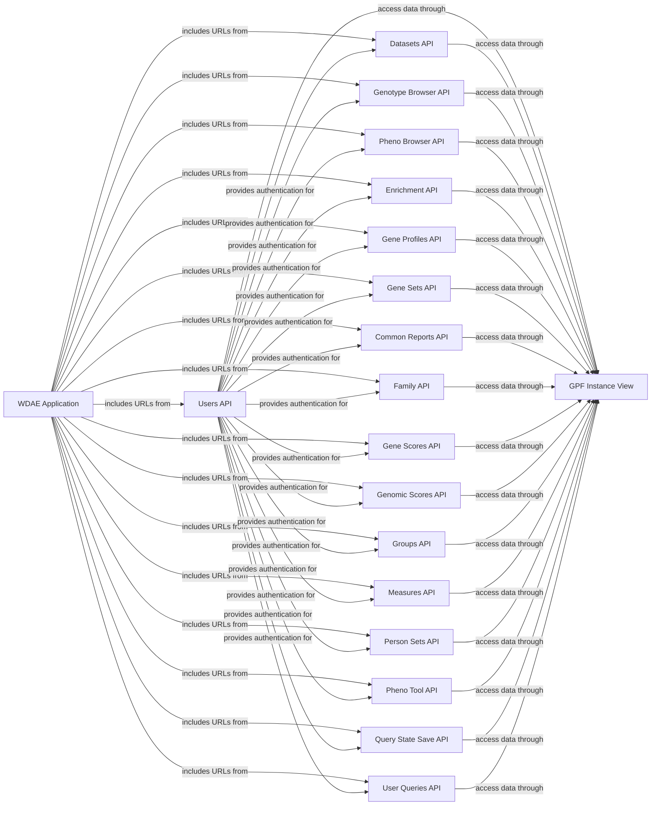

## Details

An analysis of the `gpf/wdae` subsystem reveals a modular architecture built around a central Django application that integrates multiple specialized APIs to provide a comprehensive web-based interface for genomic data analysis.

### WDAE Application
The core Django project that orchestrates the web application. It defines global settings, includes URL configurations from all other API components, and serves as the main container for the system.

**Related Classes/Methods**:

- `gpf.wdae.wdae.urls` (1:1)
- `gpf.wdae.wdae.settings` (1:1)

### GPF Instance View
A critical bridge component that initializes and provides a singleton `GPFInstance` object. This object is the main entry point for all data queries and interactions with the GPF core engine.

**Related Classes/Methods**:

- <a href="https://github.com/iossifovlab/gpf/blob/master/wdae/wdae/gpf_instance/gpf_instance.py#L1-L1" target="_blank" rel="noopener noreferrer">`gpf.wdae.wdae.gpf_instance.gpf_instance` (1:1)</a>

### Users API
Manages user accounts, groups, and permissions. It handles authentication (login, registration) and authorization, which are cross-cutting concerns applied across other APIs to secure access to data and features.

**Related Classes/Methods**:

- <a href="https://github.com/iossifovlab/gpf/blob/master/wdae/wdae/users_api/views.py#L1-L1" target="_blank" rel="noopener noreferrer">`gpf.wdae.wdae.users_api.views` (1:1)</a>
- <a href="https://github.com/iossifovlab/gpf/blob/master/wdae/wdae/users_api/urls.py#L1-L1" target="_blank" rel="noopener noreferrer">`gpf.wdae.wdae.users_api.urls` (1:1)</a>
- <a href="https://github.com/iossifovlab/gpf/blob/master/wdae/wdae/utils/authentication.py#L1-L1" target="_blank" rel="noopener noreferrer">`gpf.wdae.wdae.utils.authentication` (1:1)</a>

### Datasets API
Exposes REST endpoints for browsing and managing genomic datasets, including metadata, access permissions, and hierarchies.

**Related Classes/Methods**:

- <a href="https://github.com/iossifovlab/gpf/blob/master/wdae/wdae/datasets_api/views.py#L1-L1" target="_blank" rel="noopener noreferrer">`gpf.wdae.wdae.datasets_api.views` (1:1)</a>
- <a href="https://github.com/iossifovlab/gpf/blob/master/wdae/wdae/datasets_api/urls.py#L1-L1" target="_blank" rel="noopener noreferrer">`gpf.wdae.wdae.datasets_api.urls` (1:1)</a>

### Genotype Browser API
Provides the backend for querying genetic variants. It supports complex filtering based on genomic location, variant properties, and family structure.

**Related Classes/Methods**:

- <a href="https://github.com/iossifovlab/gpf/blob/master/wdae/wdae/genotype_browser/views.py#L1-L1" target="_blank" rel="noopener noreferrer">`gpf.wdae.wdae.genotype_browser.views` (1:1)</a>
- <a href="https://github.com/iossifovlab/gpf/blob/master/wdae/wdae/genotype_browser/urls.py#L1-L1" target="_blank" rel="noopener noreferrer">`gpf.wdae.wdae.genotype_browser.urls` (1:1)</a>

### Pheno Browser API
Provides REST access to phenotype data, allowing users to browse, filter, and query observable traits associated with individuals.

**Related Classes/Methods**:

- <a href="https://github.com/iossifovlab/gpf/blob/master/wdae/wdae/pheno_browser_api/views.py#L1-L1" target="_blank" rel="noopener noreferrer">`gpf.wdae.wdae.pheno_browser_api.views` (1:1)</a>
- <a href="https://github.com/iossifovlab/gpf/blob/master/wdae/wdae/pheno_browser_api/urls.py#L1-L1" target="_blank" rel="noopener noreferrer">`gpf.wdae.wdae.pheno_browser_api.urls` (1:1)</a>

### Enrichment API
Supports gene enrichment analysis by providing endpoints to perform and retrieve statistical enrichment tests on gene sets.

**Related Classes/Methods**:

- <a href="https://github.com/iossifovlab/gpf/blob/master/wdae/wdae/enrichment_api/views.py#L1-L1" target="_blank" rel="noopener noreferrer">`gpf.wdae.wdae.enrichment_api.views` (1:1)</a>
- <a href="https://github.com/iossifovlab/gpf/blob/master/wdae/wdae/enrichment_api/urls.py#L1-L1" target="_blank" rel="noopener noreferrer">`gpf.wdae.wdae.enrichment_api.urls` (1:1)</a>

### Gene Profiles API
Provides REST endpoints for retrieving detailed gene-related information, such as gene scores and expression data.

**Related Classes/Methods**:

- <a href="https://github.com/iossifovlab/gpf/blob/master/wdae/wdae/gene_profiles_api/views.py#L1-L1" target="_blank" rel="noopener noreferrer">`gpf.wdae.wdae.gene_profiles_api.views` (1:1)</a>
- <a href="https://github.com/iossifovlab/gpf/blob/master/wdae/wdae/gene_profiles_api/urls.py#L1-L1" target="_blank" rel="noopener noreferrer">`gpf.wdae.wdae.gene_profiles_api.urls` (1:1)</a>

### Gene Sets API
Manages collections of genes (gene sets) that can be used in various analyses. It provides endpoints for creating, querying, and managing these sets.

**Related Classes/Methods**:

- <a href="https://github.com/iossifovlab/gpf/blob/master/wdae/wdae/gene_sets/views.py#L1-L1" target="_blank" rel="noopener noreferrer">`gpf.wdae.wdae.gene_sets.views` (1:1)</a>
- <a href="https://github.com/iossifovlab/gpf/blob/master/wdae/wdae/gene_sets/urls.py#L1-L1" target="_blank" rel="noopener noreferrer">`gpf.wdae.wdae.gene_sets.urls` (1:1)</a>

### Common Reports API
Generates and provides access to common study reports, such as study statistics and variant distributions.

**Related Classes/Methods**:

- <a href="https://github.com/iossifovlab/gpf/blob/master/wdae/wdae/common_reports_api/views.py#L1-L1" target="_blank" rel="noopener noreferrer">`gpf.wdae.wdae.common_reports_api.views` (1:1)</a>
- <a href="https://github.com/iossifovlab/gpf/blob/master/wdae/wdae/common_reports_api/urls.py#L1-L1" target="_blank" rel="noopener noreferrer">`gpf.wdae.wdae.common_reports_api.urls` (1:1)</a>

### Family API
Exposes endpoints for querying and retrieving data about families within the loaded studies.

**Related Classes/Methods**:

- <a href="https://github.com/iossifovlab/gpf/blob/master/wdae/wdae/family_api/views.py#L1-L1" target="_blank" rel="noopener noreferrer">`gpf.wdae.wdae.family_api.views` (1:1)</a>
- <a href="https://github.com/iossifovlab/gpf/blob/master/wdae/wdae/family_api/urls.py#L1-L1" target="_blank" rel="noopener noreferrer">`gpf.wdae.wdae.family_api.urls` (1:1)</a>

### Gene Scores API
Provides access to precomputed gene scores (e.g., RVIS, LGD) that can be used for filtering and analysis.

**Related Classes/Methods**:

- <a href="https://github.com/iossifovlab/gpf/blob/master/wdae/wdae/gene_scores/views.py#L1-L1" target="_blank" rel="noopener noreferrer">`gpf.wdae.wdae.gene_scores.views` (1:1)</a>
- <a href="https://github.com/iossifovlab/gpf/blob/master/wdae/wdae/gene_scores/urls.py#L1-L1" target="_blank" rel="noopener noreferrer">`gpf.wdae.wdae.gene_scores.urls` (1:1)</a>

### Genomic Scores API
Exposes endpoints for accessing genomic scores, which are annotations for specific genomic positions (e.g., conservation scores).

**Related Classes/Methods**:

- <a href="https://github.com/iossifovlab/gpf/blob/master/wdae/wdae/genomic_scores_api/views.py#L1-L1" target="_blank" rel="noopener noreferrer">`gpf.wdae.wdae.genomic_scores_api.views` (1:1)</a>
- <a href="https://github.com/iossifovlab/gpf/blob/master/wdae/wdae/genomic_scores_api/urls.py#L1-L1" target="_blank" rel="noopener noreferrer">`gpf.wdae.wdae.genomic_scores_api.urls` (1:1)</a>

### Groups API
Manages user-defined groups and their associated metadata.

**Related Classes/Methods**:

- <a href="https://github.com/iossifovlab/gpf/blob/master/wdae/wdae/groups_api/views.py#L1-L1" target="_blank" rel="noopener noreferrer">`gpf.wdae.wdae.groups_api.views` (1:1)</a>
- <a href="https://github.com/iossifovlab/gpf/blob/master/wdae/wdae/groups_api/urls.py#L1-L1" target="_blank" rel="noopener noreferrer">`gpf.wdae.wdae.groups_api.urls` (1:1)</a>

### Measures API
Provides access to phenotype measures available in the loaded datasets.

**Related Classes/Methods**:

- <a href="https://github.com/iossifovlab/gpf/blob/master/wdae/wdae/measures_api/views.py#L1-L1" target="_blank" rel="noopener noreferrer">`gpf.wdae.wdae.measures_api.views` (1:1)</a>
- <a href="https://github.com/iossifovlab/gpf/blob/master/wdae/wdae/measures_api/urls.py#L1-L1" target="_blank" rel="noopener noreferrer">`gpf.wdae.wdae.measures_api.urls` (1:1)</a>

### Person Sets API
Manages collections of individuals (person sets) for use in targeted queries and analyses.

**Related Classes/Methods**:

- <a href="https://github.com/iossifovlab/gpf/blob/master/wdae/wdae/person_sets_api/views.py#L1-L1" target="_blank" rel="noopener noreferrer">`gpf.wdae.wdae.person_sets_api.views` (1:1)</a>
- <a href="https://github.com/iossifovlab/gpf/blob/master/wdae/wdae/person_sets_api/urls.py#L1-L1" target="_blank" rel="noopener noreferrer">`gpf.wdae.wdae.person_sets_api.urls` (1:1)</a>

### Pheno Tool API
Provides backend support for the interactive pheno tool, which allows for building and testing complex phenotype queries.

**Related Classes/Methods**:

- <a href="https://github.com/iossifovlab/gpf/blob/master/wdae/wdae/pheno_tool_api/views.py#L1-L1" target="_blank" rel="noopener noreferrer">`gpf.wdae.wdae.pheno_tool_api.views` (1:1)</a>
- <a href="https://github.com/iossifovlab/gpf/blob/master/wdae/wdae/pheno_tool_api/urls.py#L1-L1" target="_blank" rel="noopener noreferrer">`gpf.wdae.wdae.pheno_tool_api.urls` (1:1)</a>

### Query State Save API
Allows users to save and restore the state of their queries, enabling them to resume work later.

**Related Classes/Methods**:

- <a href="https://github.com/iossifovlab/gpf/blob/master/wdae/wdae/query_state_save/views.py#L1-L1" target="_blank" rel="noopener noreferrer">`gpf.wdae.wdae.query_state_save.views` (1:1)</a>
- <a href="https://github.com/iossifovlab/gpf/blob/master/wdae/wdae/query_state_save/urls.py#L1-L1" target="_blank" rel="noopener noreferrer">`gpf.wdae.wdae.query_state_save.urls` (1:1)</a>

### User Queries API
Manages and stores user-defined queries for reuse.

**Related Classes/Methods**:

- <a href="https://github.com/iossifovlab/gpf/blob/master/wdae/wdae/user_queries/views.py#L1-L1" target="_blank" rel="noopener noreferrer">`gpf.wdae.wdae.user_queries.views` (1:1)</a>
- <a href="https://github.com/iossifovlab/gpf/blob/master/wdae/wdae/user_queries/urls.py#L1-L1" target="_blank" rel="noopener noreferrer">`gpf.wdae.wdae.user_queries.urls` (1:1)</a>

### [FAQ](https://github.com/CodeBoarding/GeneratedOnBoardings/tree/main?tab=readme-ov-file#faq)