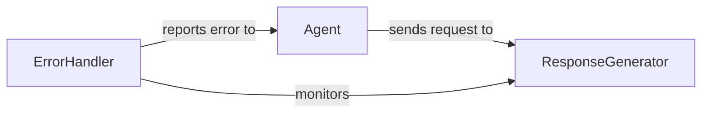

## Details

This system represents a conversational agent architecture that has encountered a failure in generating a response. The main flow involves the Agent receiving a user query and delegating to the ResponseGenerator to create an appropriate response. When the ResponseGenerator fails, the ErrorHandler captures this failure and reports back to the Agent, which then informs the user of the failure with the message "Could not get response from the agent." This indicates a breakdown in the response generation process that could be due to various issues such as connectivity problems, model limitations, or internal processing errors.

### Agent
The main component responsible for processing user queries and generating responses. It likely handles the orchestration of the conversation flow.

**Related Classes/Methods**:

- `langchain.agents.agent`

### ResponseGenerator
Component that generates the actual text responses based on the agent's processing. It appears to be failing in this case.

**Related Classes/Methods**:

- `langchain.chains.llm`

### ErrorHandler
Component responsible for catching and managing errors that occur during the agent's processing or response generation.

**Related Classes/Methods**:

- `langchain.callbacks.manager`

### [FAQ](https://github.com/CodeBoarding/GeneratedOnBoardings/tree/main?tab=readme-ov-file#faq)