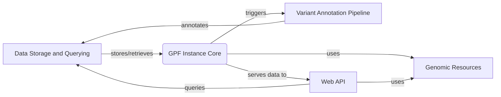

## GPF: Genomic Data Analysis Platform

GPF (Genomic Population Finder) is a platform designed for storing, querying, and analyzing large-scale genomic data. It provides tools for variant annotation, pedigree management, and genomic resource management, enabling researchers to explore and understand the genetic basis of diseases.

## Data Flow Diagram

## Component Descriptions

*   **Data Storage and Querying:** This component is responsible for storing and retrieving variant data from different storage backends (e.g., Impala, GCP, DuckDB). It provides an abstraction layer for querying data, allowing other components to access variant information without needing to know the underlying storage details. It interacts with the GPF Instance Core to receive queries and return results, and it is annotated by the Variant Annotation Pipeline.

*   **GPF Instance Core:** This component acts as the central point for accessing and coordinating different functionalities within GPF. It manages the configuration of the system and provides access to other components like Genomic Resources, Pedigree Management, and the Data Storage and Querying. It triggers the Variant Annotation Pipeline and serves data to the Web API.

*   **Genomic Resources:** This component manages and provides access to genomic resources such as reference genomes, gene models, and annotation scores. It allows other components, like the Variant Annotation Pipeline and Web API, to retrieve and utilize these resources for annotation and analysis. It is used by the GPF Instance Core and the Web API.

*   **Pedigree Management:** This component loads, represents, and manipulates pedigree data, providing family relationships and individual information. It is used for family-based analysis and variant filtering. It is used by the GPF Instance Core and the Web API.

*   **Variant Annotation Pipeline:** This component annotates genetic variants with functional effects and other relevant information using configurable annotation pipelines. It enriches variant data with annotations from various sources and stores the annotated data back into the Data Storage and Querying component. It is triggered by the GPF Instance Core.

*   **Web API:** This component provides API endpoints for accessing and querying data, generating reports, and managing users. It serves as the interface between the backend and the frontend, enabling data exploration and analysis. It queries the Data Storage and Querying component and uses Genomic Resources and Pedigree Management to serve the requests.
