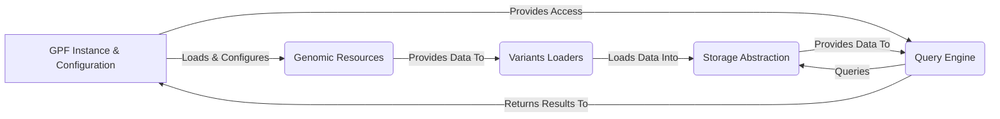

## GPF: Genomic Data Analysis Platform

GPF (Genomic Data Analysis Platform) is a comprehensive platform designed for managing, analyzing, and querying large-scale genomic data. It provides tools for data loading, storage, variant annotation, and querying, with a focus on supporting research in genetics and genomics.

## Data Flow Diagram

## Component Descriptions

**1. GPF Instance & Configuration:**
This component serves as the central access point for the entire GPF system. It manages the loading and configuration of datasets, genomic resources, and storage connections. It provides a unified interface for accessing data and functionalities, orchestrating the interactions between other components. It loads genomic resources to be used by the Variants Loaders and provides access to the Query Engine for querying data.

**2. Genomic Resources:**
This component handles the storage, retrieval, and management of genomic resources such as reference genomes, gene models, and other annotation data. It provides the necessary data for variant annotation and interpretation. It is loaded and configured by the GPF Instance and Configuration component and provides data to the Variants Loaders for data transformation and annotation.

**3. Variants Loaders:**
This component is responsible for loading variant data from various file formats (e.g., VCF, DAE, Parquet) into a unified internal representation. It handles the parsing, validation, and transformation of raw data into a format suitable for querying and analysis. It uses Genomic Resources for annotation and loads the transformed data into the Storage Abstraction layer.

**4. Query Engine:**
This component provides the functionality to query and retrieve variants based on specified criteria. It translates high-level queries into efficient database queries and returns the results in a structured format. It receives queries from the GPF Instance and Configuration component and retrieves data from the Storage Abstraction layer.

**5. Storage Abstraction:**
This component abstracts the underlying storage implementation, allowing the system to support different storage formats (e.g., Parquet, Impala, DuckDB) without modifying the core logic. It provides a consistent interface for accessing and manipulating variant data, regardless of the storage format. It receives data from the Variants Loaders and provides data to the Query Engine.