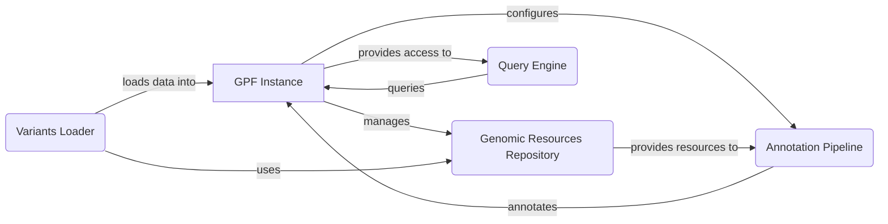

# GPF Project Overview

GPF (Genomic Prediction Framework) is a comprehensive framework designed for managing, analyzing, and querying large-scale genomic data. It provides tools for data loading, annotation, storage, and querying, enabling researchers to explore and understand complex genetic variations and their impact on phenotypes.

## Data Flow Diagram

## Component Descriptions

**GPF Instance:** This is the central hub of the GPF framework. It manages access to genomic data, resources, and analysis configurations. The GPF Instance is configured by the Variants Loader, which loads data into it. It manages the Genomic Resources Repository and configures the Annotation Pipeline. The Query Engine queries the GPF Instance to retrieve data.

**Genomic Resources Repository:** This component manages access to genomic resources such as reference genomes, gene models, and annotation scores. It provides these resources to the Annotation Pipeline and is used by the Variants Loader to understand the genomic context of the data being loaded.

**Variants Loader:** This component is responsible for loading variant data from various file formats and transforming it into a unified internal representation. It loads data into the GPF Instance and uses the Genomic Resources Repository to understand the genomic context of the data.

**Annotation Pipeline:** This component annotates genetic variants with functional and genomic information. It is configured by the GPF Instance and uses resources from the Genomic Resources Repository to perform the annotation.

**Query Engine:** This component provides the ability to query and filter variants based on various criteria. It queries the GPF Instance to retrieve data based on user-defined criteria.
