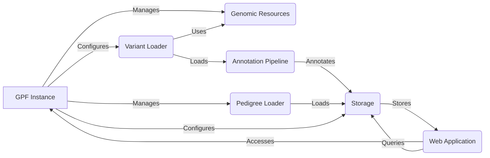

## GPF Project: Data Flow Overview

GPF (Genomic Prediction Framework) is a comprehensive platform designed for managing, analyzing, and storing genomic data. It facilitates the study of genetic variations and their impact on human health by providing tools for data loading, annotation, storage, and analysis through a user-friendly web interface.

## Component Descriptions

**GPF Instance:** This is the central component that orchestrates the entire data flow. It manages the configuration of the system, including access to genomic resources, pedigree data, and variant datasets. It provides the necessary context for other components to operate correctly and is accessed by the Web Application to serve data to the user.

**Genomic Resources:** This component manages access to genomic resources such as reference genomes and gene models. It provides the necessary data for variant loading and annotation. The Variant Loader uses Genomic Resources to correctly interpret and process variant data.

**Pedigree Loader:** This component is responsible for loading and managing pedigree data, which represents family relationships and individual attributes. The loaded pedigree data is then stored in the Storage component and used by the Variant Loader to associate variants with specific individuals and families.

**Variant Loader:** This component loads variant data from various sources, such as VCF files. It uses genomic resources to interpret the variant data and pedigree information to associate variants with individuals and families. The loaded variants are then passed to the Annotation Pipeline for further processing.

**Annotation Pipeline:** This component annotates variants with functional and genomic information, enriching the data with relevant annotations. It receives variant data from the Variant Loader and passes the annotated data to the Storage component.

**Storage:** This component stores variant and pedigree data in a persistent storage solution, such as Impala or Google Cloud Platform. It receives annotated variant data from the Annotation Pipeline and pedigree data from the Pedigree Loader. The Web Application queries the Storage component to retrieve data for analysis and visualization.

**Web Application:** This component provides a user interface for accessing and analyzing the data stored in the system. It accesses the GPF Instance for configuration and dataset information and queries the Storage component to retrieve variant and pedigree data for display and analysis.