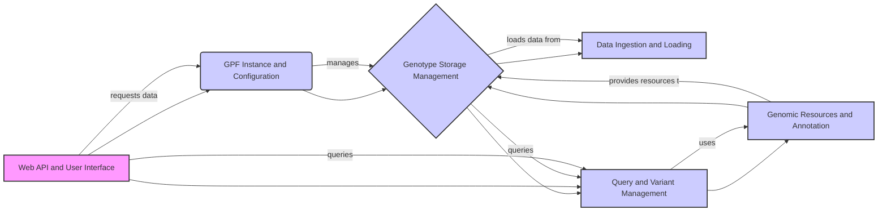

Okay, I will generate an onboarding document that describes the GPF project and its components, including a data flow diagram in Mermaid format.

**1. Project Description**

GPF (Genomic Population Finder) is a comprehensive platform designed for the analysis and exploration of genomic data. It provides tools for storing, querying, and analyzing genetic variants, with a focus on population-level studies. GPF supports various data formats, storage backends, and analysis methods, offering a flexible and scalable solution for researchers and clinicians working with genomic information. The platform includes a web-based user interface and API for easy access and integration with other systems.

**2. Data Flow Diagram (Mermaid Format)**

**3. Component Descriptions**

*   **Web API and User Interface:** This component provides the entry point for users to interact with GPF. It handles user authentication, authorization, and presents data and analysis results through a web-based interface. It *requests data* from the `GPF Instance and Configuration` component and *queries* the `Query and Variant Management` component to display relevant information to the user.

*   **GPF Instance and Configuration:** This component manages the overall GPF instance, including loading configurations, managing datasets, and providing access to various GPF resources. It acts as a central hub for accessing and managing genomic data and related functionalities. It *manages* the `Genotype Storage Management` component, providing it with the necessary configurations and dataset information.

*   **Genotype Storage Management:** This component handles the registration, configuration, and access to different genotype storage backends. It provides an abstraction layer for querying variant data from various storage systems. It *loads data from* the `Data Ingestion and Loading` component and *queries* the `Query and Variant Management` component to retrieve variant data. It *uses* `Genomic Resources and Annotation` to annotate the data.

*   **Data Ingestion and Loading:** This component is responsible for loading and transforming data from various formats into a unified representation suitable for analysis. It handles pedigree loading, variant annotation during import, and project configuration. It *provides data to* the `Genotype Storage Management` component, which stores the loaded and transformed data.

*   **Query and Variant Management:** This component provides the functionality to construct and execute queries against the stored variant data. It includes query builders, query runners, and result processing, supporting different query languages and storage backends. It *uses* the `Genomic Resources and Annotation` component to enhance query results with annotation information. The `Web API and User Interface` component *queries* this component to retrieve data for display.

*   **Genomic Resources and Annotation:** This component manages genomic resources like reference genomes, gene models, and annotation scores, and provides annotation capabilities for genetic variants. It builds annotation pipelines and annotates variants with effects and scores. It *provides resources to* the `Genotype Storage Management` component and is *used by* the `Query and Variant Management` component to enhance query results.