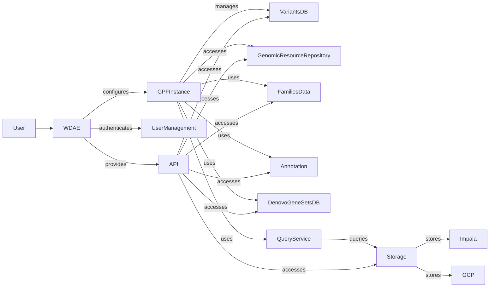

Okay, I will generate an onboarding document for the `gpf` project based on the provided information.

**Project Description**

The Genomic Platform (GPF) project provides a comprehensive framework for managing, analyzing, and visualizing genomic data. It offers a web-based interface (WDAE) for exploring variant data, genomic resources, and phenotype information, facilitating research in genetics and genomics. GPF supports various data storage solutions, including Impala and Google Cloud Platform, and provides APIs for accessing its functionalities programmatically. It incorporates tools for variant annotation, denovo gene set analysis, and user management, making it a versatile platform for genomic studies.

**Flow Diagram**

**Component Descriptions**

*   **User:** Represents the end-user interacting with the system, typically through the WDAE web interface or API.

*   **WDAE:** The web-based data exploration and analysis environment, providing a user interface for accessing and visualizing genomic data. It configures the GPF instance and provides access to various APIs.

*   **GPFInstance:** The central component that manages the configuration and access to various genomic resources, datasets, and functionalities within the GPF framework. It acts as a container for all other components.

*   **VariantsDB:** Provides access to variant data, including summary and family variants, enabling querying and retrieval of variant information. It serves as an abstraction layer for accessing variant data from different storage backends.

*   **GenomicResourceRepository:** Manages genomic resources such as reference genomes, gene models, and annotation files, handling and organizing these resources for genomic analysis.

*   **FamiliesData:** Represents pedigree information for families, essential for understanding relationships between individuals in a study and performing family-based analyses.

*   **Annotation:** Handles the annotation of variants, adding relevant information such as gene effects and population frequencies through annotation pipelines. It enriches variant data with functional and biological context.

*   **DenovoGeneSetsDB:** Provides access to denovo gene sets, allowing for the analysis of genes that are newly mutated in individuals and potentially associated with specific phenotypes.

*   **QueryService:** Handles user queries and interacts with the data access layer to retrieve and process variant data. It translates user requests into database queries and returns results in a structured format.

*   **Storage:** Abstracts genotype storage implementations, handling data upload, import, and loading from various sources like Impala and Google Cloud Platform. It provides a unified interface for accessing genotype data regardless of the underlying storage technology.

*   **Impala:** A distributed SQL query engine used for storing and querying large-scale genomic data. It provides fast and efficient access to variant data.

*   **GCP:** Google Cloud Platform, used for storing and processing genomic data in the cloud. It offers scalable and cost-effective storage and compute resources.

*   **UserManagement:** Handles user creation, authentication, authorization, and profile management within the WDAE application. It ensures secure access to the system and manages user permissions.

*   **API:** Provides API endpoints for accessing various functionalities, including datasets, gene profiles, genomic scores, and phenotype data. It allows programmatic access to GPF's features and data.